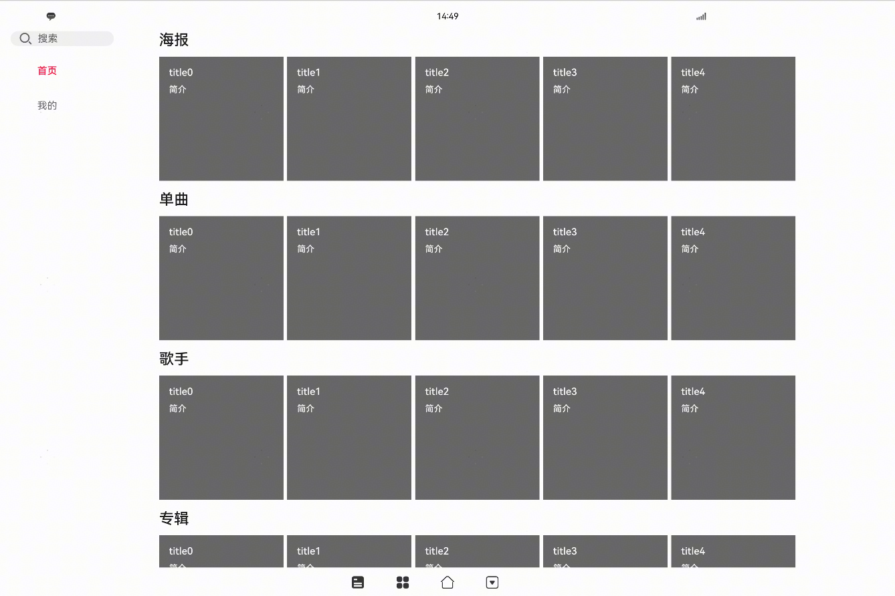

# 音频模板——控制方（仅对系统应用开放）

### 介绍

本示例主要展示了音频模板（模板控制方）的相关功能，使用[@ohos.multimedia.avMusicTemplate](https://gitee.com/openharmony/docs/blob/master/zh-cn/application-dev/reference/apis-avsession-kit/arkts-apis-avsession-AVMusicTemplateController.md)等接口实现音频模板提供方与音频模板控制方自定义信息的交互功能。

> 注意：
> 此示例中音频模板控制方所使用的能力仅对系统应用开放，更多信息请参见[约束与限制](#约束与限制)。
> 此示例仅展示音频模板控制方的相关功能，如果需要音频模板提供的完整的自定义信息交互功能，请将本示例与[音频模板提供方示例](https://gitee.com/openharmony/applications_app_samples/tree/master/code/BasicFeature/Media/AVSession/TemplateProvider)共同使用。

### 效果预览

| 主页                                   |
| -------------------------------------- |
|  |

#### 使用说明（需与音频模板提供方一起使用）

1. 打开音频模板控制方示例应用。
2. 获取所有的音频模板描述。获取目标应用的sessionId，创建控制器（AVMusicTemplateController）。
3. 通过控制器查询主标签列表。需要提供方注册对应的监听。
4. 根据标签的tabId，查询标签内容数据。约定个人页面的tabId单独处理。需要提供方注册对应的监听。
5. 根据需要注册事件监听。


### 工程目录

给出项目中关键的目录结构并描述它们的作用，示例如下：

```
entry/src/main/ets/
|---components
|---|---MainLeftComponent.ets             // 主界面左边的组件，包括tab分类。
|---|---MineContentComponent.ets          // 个人页面标签页内容。
|---|---TabContentComponent.ets           // 其余页面的标签页内容。
|---|---UserCardInfoComponent.ets         // 用户卡片信息。
|---entryAbility
|---|---EntryAbility.ets                  // 主界面入口。
|---manager
|---|---ControllerManager.ets             // 逻辑实现。
|---pages
|---|---Index.ets                         // 界面实现
```

### 具体实现

* 逻辑相关的实现都封装在manager/ControllerManager.ets下，源码参考：[manager/ControllerManager.ets](./entry/src/main/ets/manager/ControllerManager.ets)
    * 获取音频模板描述，关键代码段：

      ```ts
      import { avMusicTemplate } from '@kit.AVSessionKit';
      
      public createAvMusicTemplateController(bundleName: string) {
        if (this.isStringEmpty(bundleName)) {
          console.warn(TAG, 'createAvMusicTemplateController: bundleName is empty');
          return;
        }
        this.currentBundleName = bundleName;
        try {
          // 该方法需要权限ohos.permission.MANAGE_MEDIA_RESOURCES
          let descriptors: avMusicTemplate.AVMusicTemplateDescriptor[] = avMusicTemplate.getAllAVMusicTemplateDescriptors();
          if (this.isEmptyArray(descriptors)) {
            console.info(TAG, 'createAvMusicTemplateController: descriptors is empty');
            return;
          }
          for (let descriptor of descriptors) {
            console.warn(TAG, `createAvMusicTemplateController: bundleName: ${descriptor.bundleName}`);
            if (this.currentBundleName === descriptor.bundleName) {
              this.createController(descriptor.sessionId);
              return;
            }
          }
        } catch (e) {
          console.error(TAG, `getAllAVMusicTemplateDescriptors failed, errCode: ${e?.code}`);
        }
      };
      ```

      或者

      ```ts
      private templateCreateCallback: Callback<avMusicTemplate.AVMusicTemplateDescriptor> =
          (descriptor: avMusicTemplate.AVMusicTemplateDescriptor) => {
            if (this.isInvalid(descriptor)) {
              console.warn(TAG, 'templateCreateCallback: descriptor is invalid');
              return;
            }
            if (this.isStringEmpty(this.currentBundleName)) {
              console.warn(TAG, 'templateCreateCallback: current bundleName is empty');
              return;
            }
            if (this.currentBundleName !== descriptor.bundleName) {
              console.warn(TAG, 'templateCreateCallback: not current bundleName');
              return;
            }
            console.info(TAG, `templateCreateCallback, bundleName: ${descriptor.bundleName}`);
            this.createController(descriptor.sessionId);
          };
      
      /**
       * 注册模板监听
       */
      public registerAVMusicTemplateListener() {
        try {
          // 该方法需要权限ohos.permission.MANAGE_MEDIA_RESOURCES
          avMusicTemplate.onAVMusicTemplateCreate(this.templateCreateCallback);
      
          // 该方法需要权限ohos.permission.MANAGE_MEDIA_RESOURCES
          avMusicTemplate.onAVMusicTemplateDestroy(this.templateDestroyCallback);
        } catch (e) {
          console.error(TAG, `registerAVMusicTemplateListener: errCode: ${e?.code}`);
        }
      }
      ```

    * 创建音频模板控制器对象，关键代码段：

      ```js
      import { avMusicTemplate } from '@kit.AVSessionKit';
      
      private createController(sessionId: string) {
        if (sessionId === null || sessionId === undefined) {
          console.warn(TAG, 'createController:sessionId is null');
          return;
        }
        try {
          this.controller = avMusicTemplate.createAVMusicTemplateController(sessionId);
          console.info(TAG, `createController success, bundleName: ${this.currentBundleName}`);
          this.registerListener();
        } catch (e) {
          console.error(TAG, `createController: errCode: ${e?.code}`);
        }
      }
      
      ```

    * 查询音频模板提供方的相关数据用于界面展示。需要音频模板提供方先注册监听。

        queryMainTabs：查询主标签。

        queryMediaTabContent：查询媒体标签内容。

        queryMediaEntity：查询媒体实体。

        queryCompilation：查询合集。

        queryPlaylist：查询播放列表。

        queryCurrentSingle：查询当前单曲。

        queryCompilationByKeyword：按关键字查询合集。

        queryMediaEntityByKeyword：按关键字查询媒体实体。

        queryRecommendMediaEntityList：查询推荐的媒体实体列表。

        queryHotWords：查询热词。

        querySearchHistory：查询搜索历史。

        queryMemberPurchase：查询购买会员的情况。

        queryCustomContent：查询自定义内容。

    * 接受音频模板提供方主动更新的数据。

        onUserInfoChange：用户信息变化事件。

        onDialogCommandChange：对话框命令变化事件。

        onCurrentSingleChange：当前单曲变化事件。

        onMediaEntitiesChange：媒体实体变化事件。

        onTabContentChange：标签页内容变化事件。

        onPlaylistChange：播放列表变化事件。

        onDownloadMediaEntityStatusChange：下载媒体状态变化事件。

        onCustomElementsChange：自定义元素变化事件。

        onSettingsChange：设置变化事件。

        onReportExecuteAction：上报执行动作事件。

        onExtensionAbilityChange：Ability变化事件。

    * 事件触发调用。需要提供方先注册监听。

        clearSearchHistory：清除搜索历史。

        updateSettings：更新设置信息。

        reportProblemAndAdvice：报告问题和建议。

        login：登录。

        requestDialogInfo：请求对话框信息。

        handleMemberPurchase：处理购买会员情况。

        downloadMediaEntity：下载媒体实体。

        playForSearch：搜播。

        executeAction：执行动作。

        playMediaEntity：播放媒体。

        favoriteMediaEntity：收藏媒体。


### 相关权限

#### 系统应用权限

因为音频模板控制方相关接口仅对系统应用开放，开发媒体控制方应用前需要确认是否是系统应用。

#### 网络权限（可选）

如果需要展示媒体提供方提供的网络资源（例如：Url形式的图片），需要获取网络权限[ohos.permission.INTERNET](https://gitee.com/openharmony/docs/blob/master/zh-cn/application-dev/security/AccessToken/permissions-for-all.md#ohospermissioninternet)

请在需要获取网络权限的Ability的`module.json5`中添加以下配置：

```json5
{
  "module": {
      "requestPermissions": [
        {
          "name": "ohos.permission.INTERNET"
        }
      ]
  }
}
```

#### Bundle相关权限（可选）

如果需要通过媒体提供方的包名来获取媒体提供方的应用名与应用图标，需要申请Bundle权限[ohos.permission.GET_BUNDLE_INFO_PRIVILEGED](https://gitee.com/openharmony/docs/blob/master/zh-cn/application-dev/security/AccessToken/permissions-for-system-apps.md#ohospermissionget_bundle_info_privileged)

请在需要获取Bundle信息权限的Ability的`module.json5`中添加以下配置：

```json5
{
  "module": {
      "requestPermissions": [
        {
          "name": "ohos.permission.GET_BUNDLE_INFO_PRIVILEGED"
        }
      ]
  }
}
```

#### 媒体资源管理相关权限

如果需要获取当前设备正在播放的媒体资源，并对其进行管理，需要申请媒体资源管理权限[ohos.permission.MANAGE_MEDIA_RESOURCES](https://gitee.com/openharmony/docs/blob/master/zh-cn/application-dev/security/AccessToken/permissions-for-system-apps.md#ohospermissionmanage_media_resources)

请在需要获取Bundle信息权限的Ability的`module.json5`中添加以下配置：

```json5
{
  "module": {
      "requestPermissions": [
        {
          "name": "ohos.permission.MANAGE_MEDIA_RESOURCES"
        }
      ]
  }
}
```

### 依赖

此示例仅展示音频模板控制方的相关功能，如果需要音频模板提供的完整的自定义信息交互功能，请将本示例与[音频模板提供方示例](https://gitee.com/openharmony/applications_app_samples/tree/master/code/BasicFeature/Media/AVSession/TemplateProvider)](https://gitee.com/openharmony/applications_app_samples/tree/master/code/BasicFeature/Media/AVSession/TemplateProvider)共同使用。

### 约束与限制

1. 本示例仅支持标准系统上运行，支持设备：智选车。

2. 本示例为Stage模型，支持API23版本SDK，SDK版本号(API Version 23 Release),镜像版本号(6.1 Release)

3. 本示例需要使用DevEco Studio 版本号(6.1 Release)及以上版本才可编译运行。

4. 本示例涉及系统接口，需要配置系统应用签名，可以参考[特殊权限配置方法](https://gitee.com/openharmony/docs/blob/master/zh-cn/device-dev/subsystems/subsys-app-privilege-config-guide.md) ，把配置文件中的“app-feature”字段信息改为“hos_system_app”。

### 下载

如需单独下载本工程，执行如下命令：

```
git init
git config core.sparsecheckout true
echo code/SystemFeature/Media/AVSession/TemplateController > .git/info/sparse-checkout
git remote add origin https://gitee.com/openharmony/applications_app_samples.git
git pull origin master
```