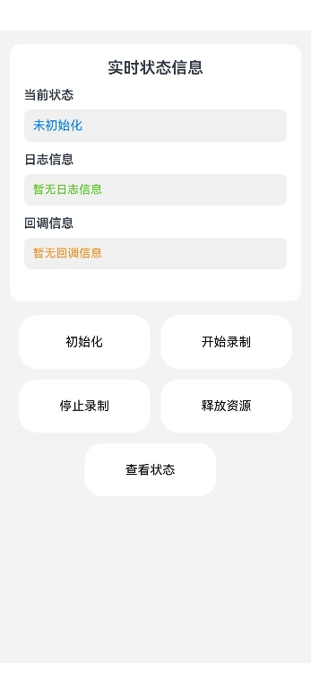

# 实现音频录制功能

## 介绍

本示例基于AudioRender、AudioCapturer、AVPlayer以及CallServiceKit等能力，实现了音频录制、管理麦克风、音频录制流管理以及音频低时延耳返等功能，包含了功能调用接口的完整链路。

## 效果图预览

**图1**：首页

选择跳转到对应功能页面。

 

**图2**：音频录制页

- 依次点击'初始化'、'开始录制'按钮，即可开始录制音频。
- 点击'停止录制'、'释放资源'按钮，即可结束录制。
- 点击'查看状态'按钮，即可在日志信息下方打印当前录制流的状态。

  

**图3**：管理麦克风页

- 点击'创建音量组管理器'按钮，即可注册麦克风状态监听，事件触发后日志在回调信息下方打印。
- 点击'查询麦克风是否静音'按钮，即可查询麦克风状态，查询结果在日志信息下方打印。

   

**图4**：音频录制流管理页

点击'获取当前录制流信息'按钮，即可进行录制流更改事件监听、获取当前录制流信息以及注销监听操作，其中获取到的录制流信息会在日志信息中打印。

 

**图5**：实现音频低时延耳返页

- 依次点击'创建音频低时延耳返实例'、'设置音频返听音量'、'设置混响模式'、'设置均衡器类型'，'启用音频返听'按钮，即可实现音频低时延耳返的配置。
- 点击'禁用音频返听'按钮，即可实现低时延耳返的停用。
- 点击查询相关按钮，返回信息会在日志信息下方打印。

   

## 工程结构&模块类型

```
├───entry/src/main/ets
│   ├───pages                               
│   │   └───Index.ets                       // 首页。
│   │   └───AudioCapture.ets                // 使用AudioCapturer开发音频录制功能页。
│   │   └───AudioLoopback.ets               // 实现音频低时延耳返页。
│   │   └───MacManager.ets                  // 音频录制流管理页。
│   │   └───AudioStreamManager.ets          // 管理麦克风页。
└───entry/src/main/resources                // 资源目录。
```

## 具体实现

### 使用AudioCapturer开发音频录制功能
- 源码参考：[AudioCapture.ets](entry/src/main/ets/pages/AudioCapture.ets)  
- 使用流程：
  - 需申请`ohos.permission.MICROPHONE`权限来获取麦克风权限保证录音可以正常起流。当获取权限成功后，后续再使用麦克风权限的接口时不需要重复申请该权限。
  - 点击'初始化'按钮，开始配置`AudioCapturerOptions`内容，包括采样率、通道数、采样格式、编码格式、音源类型以及采集器标志，接着配置读入数据回调并订阅监听，然后注册录制状态变化回调来监听流事件信息，最后调用`audio.createAudioCapturer`创建录制实例。
  - 点击'开始录制'按钮，调用`audioCapturer.start`，开始录制。
  - 点击'停止录制'按钮，调用`audioCapturer.stop`，停止录制。
  - 点击'释放资源'按钮，调用`audioCapturer.release`，释放音频流资源并注销回调。
  - 点击'获取状态'按钮，通过获取`audioCapturer.state`信息查看当前音频流状态。

### 管理麦克风状态
- 源码参考：[MacManager.ets](entry/src/main/ets/pages/MacManager.ets)  
- 使用流程：
  - 点击'创建音量组管理器'按钮，调用`audio.getAudioManager().getVolumeManager().getVolumeGroupManager()`创建`AudioVolumeGroupManager`实例并设置监听，对麦克风静音状态变化进行响应。
  - 点击'查询麦克风是否静音'按钮，调用`audioVolumeGroupManager.isMicrophoneMute`查询当前麦克风是否静音。

### 音频录制流管理
- 源码参考：[AudioStreamManager.ets](entry/src/main/ets/pages/AudioStreamManager.ets)  
- 使用流程：
  点击'获取当前录制流信息'按钮，处理流程如下。
  - 通过`audioManager.getStreamManager`创建`audioStreamManager`实例，再通过`on('audioCapturerChange')`监听音频录制流变更时间相应流状态以及设备变化事件。
  - 通过调用`audioStreamManager.getCurrentAudioCapturerInfoArray`获取当前录制流信息，包括音频录制流的唯一ID、音频采集器信息以及音频录制设备信息。
  - 通过`off('audioCapturerChange')`注销监听音频录制流变化。

### 实现音频低时延耳返
- 源码参考：[AudioLoopback.ets](entry/src/main/ets/pages/AudioLoopback.ets)  
- 使用流程：
  - 需要申请`ohos.permission.MICROPHONE`权限，如果前面使用过录音功能则这里无需再次申请麦克风权限。
  - 点击'创建音频低时延耳返实例'按钮，先调用`audio.getAudioManager().getStreamManager().isAudioLoopbackSupported(mode)`查询当前录制流是否支持低时延耳返，若支持低时延耳返功能，则接着调用`audio.createAudioLoopback`创建实例。
  - 点击'设置音频返听音量'按钮，调用`audioLoopback.setVolume`来设置音频返听的音量为0.5。音量取值范围为[0, 1]。
  - 点击'设置混响模式'按钮，调用`audioLoopback.setReverbPreset`来设置音频返听的混响模式为`audio.AudioLoopbackReverbPreset.THEATER`。
  - 点击'设置均衡器类型'按钮，调用`audioLoopback.setEqualizerPreset`来设置音频返听的均衡器类型为`audio.AudioLoopbackEqualizerPreset.FULL`。
  - 点击'查询返听状态'按钮，调用`audioLoopback.getStatus`来获取当前流音频返听的状态。
  - 点击'查询混响模式'按钮，调用`audioLoopback.getReverbPreset`来获取当前流音频返听的混响模式。
  - 点击'查询均衡器类型'按钮，调用`audioLoopback.getEqualizerPreset`来获取当前流音频返听的均衡器类型。
  - 点击'启用音频返听'按钮，调用`audioLoopback.enable`，配置参数为true，将当前流音频返听状态设置为启用。
  - 点击'禁用音频返听'按钮，调用`audioLoopback.enable`，配置参数为false，将当前流音频返听状态设置为禁用。
## 相关权限

麦克风使用权限：ohos.permission.MICROPHONE

## 模块依赖

不涉及。

## 约束与限制

1.  本示例支持在标准系统上运行，支持设备：RK3568。

2.  本示例支持API version 21，版本号： 6.0.1.112。

3.  本示例已支持使Build Version: 6.0.1.112, built on November 20, 2025。

4.  高等级APL特殊签名说明：无。