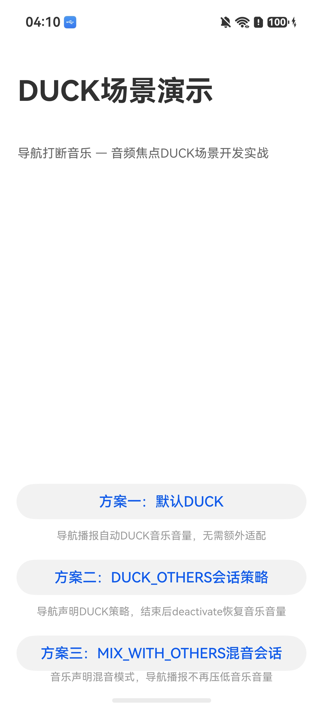
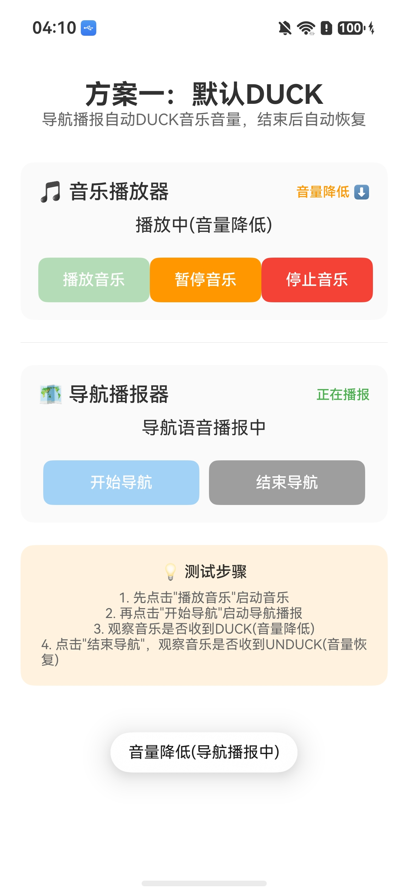
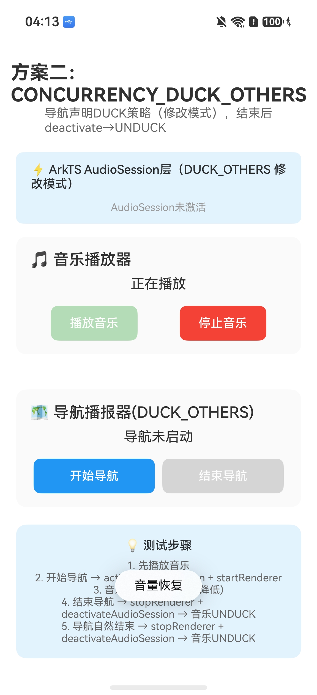
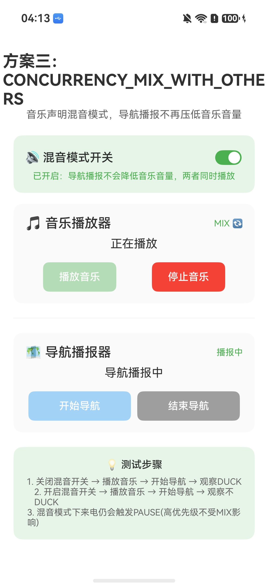

# DuckApplication —导航打断音乐（DUCK 场景）
## 介绍

本示例演示 OpenHarmony 系统上**导航打断音乐**的DUCK 音频焦点场景，提供三种方案的完整实现，帮助开发者理解和掌握音频焦点与音频会话的开发方法。
场景描述：音乐应用正在播放音乐，导航应用开始播报语音，系统自动将音乐音量降至20%（DUCK），导航播报结束后音乐音量自动恢复（UNDUCK）。
本示例使用了以下主要包：

| 包名 | 功能 | 链接 |
|------|------|------|
| @ohos.multimedia.audio | 音频会话管理. 支持 AudioSession 激活、停用、策略配置. | [AudioKit 介绍](https://gitee.com/openharmony/docs/blob/master/zh-cn/application-dev/media/audio/audio-kit-introduction.md) |
| OHAudio C API | 音频渲染播放. 支持 OH_AudioRenderer 创建、启动、中断回调. | [OHAudio C API 播放](https://gitee.com/openharmony/docs/blob/master/zh-cn/application-dev/media/audio/using-ohaudio-in-c-for-playback.md) |
| libuv | 异步回调传递。C 层中断回调通过 uv_queue_work 传递到 ArkTS 主线程 | [NAPI 开发指导](https://gitee.com/openharmony/docs/blob/master/zh-cn/application-dev/napi/napi-guidelines.md) |

三种方案对比：
| 方案 | 策略 | 音乐应用 | 导航应用 | 效果 |
|------|------|---------|---------|------|
| 方案一 | 默认焦点策略 | 监听 DUCK/UNDUCK 更新 UI | 设置 STREAM_USAGE_NAVIGATION | 导航播报时音乐音量降低、结束后恢复 |
| 方案二 | CONCURRENCY_DUCK_OTHERS（修改模式） | 同方案一 | 激活 AudioSession DUCK 策略（不调setAudioSessionScene）| 效果相同. AudioSession 不持有焦点、deactivate 发UNDUCK |
| 方案三 | CONCURRENCY_MIX_WITH_OTHERS（申请模式） | 激活 AudioSession MIX 策略（调 setAudioSessionScene，提供开关） | 同方案一 | 导航播报不再降低音乐音量. 两者同时播放 |

## 效果预览

| 主页入口 | 方案一：导航播报时 DUCK |
|---------|------------------------|
|  |  |

| 方案二：导航结束后 UNDUCK 恢复 | 方案三：MIX 混音开关开启 |
|-------------------------------|-------------------------|
|  |  |

### 使用说明

1. 使用 DevEco Studio 打开本项目
2. 连接 OpenHarmony 设备（API 12+）
3. 编译运行.
4. 进入主页选择方案：
   - 方案一：先播放音乐 → 开始导航 → 观察音量降低 → 结束导航 → 观察音量恢复.
   - 方案二：先播放音乐 → 开始导航（自动激活 DUCK_OTHERS 修改模式）→ 结束导航（stop + deactivate 发UNDUCK）
   - 方案三：开启混音开关 → 播放音乐 → 开始导航 → 观察音量不降低

## 工程目录

```
DuckApplication/
├── AppScope/
│   └── app.json5                                       # 应用全局配置
├── entry/
│   ├── src/main/
│   │   ├── module.json5                                # 模块配置. backgroundModes=audioPlayback. 无MICROPHONE 权限
│   │   ├── cpp/
│   │   │   ├── CMakeLists.txt                          # C++ 构建配置. 编译 music+nav renderer. 链接 ohaudio+uv+napi
│   │   │   ├── audio.cpp                               # NAPI 桥接层. 导出 23 个函数供 ArkTS 调用 C++ 渲染器
│   │   │   └── types/libentry/Index.d.ts               # NAPI 类型定义. 23 个导出声明
│   │   │   └── renderer/
│   │   │       ├── oh_audio_music_renderer.h/cpp       # 音乐播放器. StreamUsage=MUSIC. InterruptMode=INDEPENDENT_MODE
│   │   │       └── oh_audio_nav_renderer.h/cpp         # 导航播放器. StreamUsage=NAVIGATION. INDEPENDENT_MODE + DUCK Session
│   │   ├── ets/
│   │   │   ├── entryability/
│   │   │   │   └── EntryAbility.ets                    # 应用入口 Ability
│   │   │   ├── pages/
│   │   │   │   └── Index.ets                           # 主页入口页面. 3 个按钮跳转 3 种方案页面
│   │   │   ├── duck/pages/                             # DUCK 场景业务页面
│   │   │   │   ├── DuckPage.ets                        # 方案一页面. 默认 DUCK 焦点策略（已真机验证）
│   │   │   │   ├── DuckSessionPage.ets                 # 方案二页面 CONCURRENCY_DUCK_OTHERS 修改模式（已真机验证）
│   │   │   │   └── MixSessionPage.ets                  # 方案三页面 CONCURRENCY_MIX_WITH_OTHERS 申请模式
│   │   │   └── common/
│   │   │       ├── constants/AudioConstants.ets        # 常量定义. DUCKED/UNDUCKED 状态. StreamUsage 与 时长常量
│   │   │       └── utils/
│   │   │           ├── Logger.ets                       # 日志工具类
│   │   │           └── mediautils/
│   │   │               ├── DuckSessionController.ets   # ArkTS AudioSession DUCK_OTHERS 修改模式管理
│   │   │               ├── MixSessionController.ets    # ArkTS AudioSession MIX_WITH_OTHERS 申请模式管理
│   │   │               ├── MusicController.ets         # 音乐播放控制（依赖 NAPI libentry.so）
│   │   │               └── NavigationController.ets   # 导航播报控制（依赖 NAPI libentry.so）
│   └── resources/
│       ├── base/                                   # 基础资源. string.json. color.json. float.json. main_pages.json
│       └── rawfile/
│           ├── music_sample.pcm                    # 音乐 PCM 文件. 44100Hz 双声道30s 和弦旋律 (~5.04MB)
│           └── nav_sample.pcm                      # 导航 PCM 文件. 16000Hz 单声道8s ding-dong 提示音(~250KB)
├── images/                                             # 架构图和效果截图
└── README.md
```

## 具体实现

### 项目架构

采用 4 层架构：

```
UI层(Pages) → Controller层 → NAPI桥接层(audio.cpp) → OHAudio C Engine层(Renderer)
```

中断回调链路：
```
OHAudio C API callback (static function)
    → Singleton instance function pointer + context
        → NAPI bridge (InterruptCallback with uv_queue_work)
            → ArkTS controller (onMusicInterrupt / onNavInterrupt)
                → Controller acts on interrupt + notifies UI
                    → UI updates @State variables + shows toast
```

### 独立焦点模式（INDEPENDENT_MODE）
同一应用内两条播放流（音乐、导航）默认使用SHARE_MODE，不触发焦点策略. 要模拟跨应用的DUCK 行为，必须为两条流设置INDEPENDENT_MODE.

C++ 层实现（[oh_audio_music_renderer.cpp](entry/src/main/cpp/renderer/oh_audio_music_renderer.cpp)）：
```cpp
OH_AudioStreamBuilder_SetRendererInterruptMode(rendererBuilder_,
    AUDIOSTREAM_INTERRUPT_MODE_INDEPENDENT);
```

ArkTS 层实现（[MusicController.ets](entry/src/main/ets/common/utils/mediautils/MusicController.ets)）：
```typescript
audioRenderer.setInterruptMode(audio.InterruptMode.INDEPENDENT_MODE);
```

### DUCK/UNDUCK 中断处理

DUCK 场景的核心事件是 DUCK（音量降低）和UNDUCK（音量恢复），不是PAUSE/STOP. 关键规则：
- **DUCK/UNDUCK 的forceType 为INTERRUPT_FORCE**：系统已强制调整音量. 应用只需更新 UI 状态.
- **不要在DUCK 时调用stop/pause**：DUCK 是音量降低不是暂停、误调 stop/pause 会导致导航结束后音乐无法恢复.
- **务必完整处理所有InterruptHint**：同一应用可能收到多种中断事件. DUCK（导航提示音降低）、PAUSE（来电暂停）、STOP（短视频停止）

中断处理核心代码（[MusicController.ets](entry/src/main/ets/common/utils/mediautils/MusicController.ets)）：
```typescript
switch (hintType) {
  case INTERRUPT_HINT_TYPE.INTERRUPT_HINT_DUCK:
    this.isPlaying = true;
    // 此句为简化处理，代表应用切换至音量降低状态的若干操作.
    if (this.notifyStateChangeCallback) {
      this.notifyStateChangeCallback(AUDIO_STATE.DUCKED, true);
    }
    break;
  case INTERRUPT_HINT_TYPE.INTERRUPT_HINT_UNDUCK:
    // 此句为简化处理，代表应用切换至正常音量播放状态的若干操作.
    if (this.notifyStateChangeCallback) {
      this.notifyStateChangeCallback(AUDIO_STATE.UNDUCKED, true);
    }
    break;
  // PAUSE, RESUME, STOP 也必须处理}
```

### AudioSession 修改模式 vs 申请模式

方案二和方案三的核心区别：
| 模式 | 调用方式 | AudioSession 是否持有焦点 | deactivate 对被 DUCK 流发出 | 适用场景 |
|------|---------|------------------------|----------------------------|---------|
| 修改模式 | 只调 `activateAudioSession(strategy)`、**不调 `setAudioSessionScene()`** | 不持有焦点、焦点由renderer INDEPENDENT_MODE 管理 | **UNDUCK**（音量恢复） | 方案二 DUCK_OTHERS |
| 申请模式 | 先调 `setAudioSessionScene()` 再调 `activateAudioSession(strategy)` | 持有焦点 | **STOP**（停止播放） | 方案三 MIX_WITH_OTHERS |

**方案二使用修改模式的原因**（[DuckSessionController.ets](entry/src/main/ets/common/utils/mediautils/DuckSessionController.ets)）：
- DUCK_OTHERS 的效果由 renderer INDEPENDENT_MODE + StreamUsage 组合决定（导航自动DUCK 音乐、AudioSession DUCK_OTHERS 策略只是声明意图.
- 修改模式下deactivateAudioSession 发UNDUCK（恢复音量），符合DUCK 场景预期.
- 申请模式下deactivateAudioSession 发STOP（停止播放），不符合 DUCK 场景预期.
- renderer stop 不触发额外焦点事件（→stop →release），系统发UNDUCK.

**方案三使用申请模式的原因**（[MixSessionController.ets](entry/src/main/ets/common/utils/mediautils/MixSessionController.ets)）：
- MIX_WITH_OTHERS 需要AudioSession 持有焦点才能真正生效（防止被 DUCK）
- 申请模式下deactivateAudioSession 发STOP. 关闭混音后音乐停止（合理）

### 方案二：CONCURRENCY_DUCK_OTHERS（修改模式）

导航应用通过 ArkTS AudioSession 显式声明 DUCK 策略，使用修改模式

ArkTS AudioKit 实现（[DuckSessionController.ets](entry/src/main/ets/common/utils/mediautils/DuckSessionController.ets)）：
```typescript
let audioSessionManager = audio.getAudioManager().getSessionManager();
// 修改模式：不调setAudioSessionScene()
let strategy: audio.AudioSessionStrategy = {
  concurrencyMode: audio.AudioConcurrencyMode.CONCURRENCY_DUCK_OTHERS
};
await audioSessionManager.activateAudioSession(strategy);
```

> 注意：C++ `InitRendererWithDuckSession` 使用申请模式（调用了 `OH_AudioSessionManager_SetScene`），但方案二页面不调用此函数. 方案二的 AudioSession 由ArkTS DuckSessionController 管理.

结束导航的正确顺序（修改模式）：
1. `renderer stop` → 系统对音乐发 UNDUCK（音量恢复）.
2. `deactivateAudioSession` → 清理策略配置（修改模式下不会额外发STOP）

```typescript
// ArkTS (DuckSessionPage)
await NavigationController.getInstance().stop();
DuckSessionController.getInstance().deactivateDuckSession();
```

### 方案三：CONCURRENCY_MIX_WITH_OTHERS（申请模式）

音乐应用提供用户开关，开启后导航播报不再压低音乐音量. 使用申请模式.

关键规则：
- MIX_WITH_OTHERS 提供用户开关、不能默认开启（参考系统音乐设置）.
- MIX_WITH_OTHERS 下来电等高优先级音频仍可能触发PAUSE. 仍需完整处理 audioInterrupt.
- 必须在音频流 start() 之前激活AudioSession.

ArkTS 实现（[MixSessionController.ets](entry/src/main/ets/common/utils/mediautils/MixSessionController.ets)）：
```typescript
audioSessionManager.setAudioSessionScene(audio.AudioSessionScene.AUDIO_SESSION_SCENE_MEDIA);
let strategy: audio.AudioSessionStrategy = {
  concurrencyMode: audio.AudioConcurrencyMode.CONCURRENCY_MIX_WITH_OTHERS
};
await audioSessionManager.activateAudioSession(strategy);
```

### PCM 示例文件

项目内置两个 PCM 文件用于测试：
| 文件 | 采样率 | 声道 | 位深 | 时长 | 内容 | 大小 |
|------|--------|------|------|------|------|------|
| music_sample.pcm | 44100Hz | 双声道 | S16LE | 30s | 和弦旋律 | 5292000 bytes (~5.04MB) |
| nav_sample.pcm | 16000Hz | 单声道 | S16LE | 8s | ding-dong 提示音 | 256000 bytes (~250KB) |

PCM 文件从rawfile 读取后写入应用filesDir，然后通过 fd 传递给 OHAudio Renderer.

> 重要：写 PCM 文件必须用WRITE_ONLY 模式打开. 用READ_ONLY 重新打开读fd（READ_ONLY 模式下write 无效）；第二次播放前必须调用 resetFileOffset（lseek 回起始位置）.

### 音频流类型选择

| 播放器 | StreamUsage | 值 | 说明 |
|--------|------------|---|------|
| 音乐播放器 | STREAM_USAGE_MUSIC | 1 | 媒体类流. 被导航DUCK |
| 导航播报器 | STREAM_USAGE_NAVIGATION | 9 | 导航类流. 对音乐触发DUCK |

### 与CapturerApplication 的关键差异
| 对比项 | CapturerApplication | DuckApplication |
|--------|---------------------|-----------------|
| 音频流数量 | 1 Capturer + 1 Renderer | 2 Renderer (Music + Nav) |
| 焦点模式 | 未设置（默认 SHARE）| **INDEPENDENT_MODE** |
| StreamUsage | 未显式设置 | Music=1. Nav=9 |
| 中断状态 | PAUSED/STOPPED/MUTED/UNMUTED | 增加 **DUCKED/UNDUCKED** |
| AudioSession | 未使用 | 方案二（修改模式）方案三（申请模式）|
| PCM 来源 | Capturer 录音生成 | rawfile 内置示例 |
| 权限 | MICROPHONE + BACKGROUND | 仅BACKGROUND |
| NAPI 函数数 | ~15 | 23 |

### Best Practices
1. **DUCK/UNDUCK 不需要手动调音量**：系统已强制执行（forceType 为INTERRUPT_FORCE），应用可选择更新 UI.
2. **不要在DUCK 时暂停播放**：误调stop/pause 会导致导航结束后音乐无法恢复.
3. **务必完整处理所有InterruptHint**：可能收到DUCK. PAUSE. STOP 等多种事件
4. **AudioSession 必须在播放前激活**：activateAudioSession 必须在start() 之前调用.
5. **播放结束后应停用 AudioSession**：方案二 stop + deactivate（修改模式发 UNDUCK），方案三用户关闭开关后 deactivate（申请模式发 STOP）
6. **不要在播放时 release renderer**：OH_AudioRenderer_Release 会导致同应用内的其余音频流收到 STOP interrupt. →stop →release.
7. **MIX_WITH_OTHERS 提供用户开关**：不能默认开启，应由用户手动选择.
8. **修改模式 vs 申请模式**：方案二 DUCK_OTHERS 使用修改模式（不调setAudioSessionScene，AudioSession 不持有焦点，deactivate 发UNDUCK）；方案三MIX_WITH_OTHERS 使用申请模式（调 setAudioSessionScene，AudioSession 持有焦点，deactivate 发STOP）
9. **第二次播放必须resetFileOffset**：PCM 播放结束后文件偏移量在末尾、需要lseek 回起始才能再次播放
10. **Controller 所有主动操作必须通知 UI**：start/pause/stop 用用 notifyStateChangeCallback. interrupt callback 中直接调 NAPI 函数不走 start()/stop()（避免双重通知）

## 相关权限

| 权限名 | 级别 | 说明 | 链接 |
|--------|------|------|------|
| ohos.permission.KEEP_BACKGROUND_RUNNING | normal | 后台长时播放权限. 允许应用在后台持续播放音频 | [权限说明](https://gitee.com/openharmony/docs/blob/master/zh-cn/application-dev/security/AccessToken/permissions-for-all-users.md) |

本示例不使用 MICROPHONE 权限. 模块配置中backgroundModes 设置为audioPlayback，支持后台音频播放

## 依赖

本示例不依赖 external samples.

## 约束与限制
### 8.1 支持的设备
本示例仅支持标准系统上运行，支持设备：RK3568.

### 8.2 API/SDK 版本

本示例仅支持 API 12 版本 SDK，版本号5.0.0(12).

### 8.3 IDE 版本

本示例需要使用DevEco Studio 5.0+ 才可编译运行.

### 8.4 高等级APL 签名说明

本示例涉及的 KEEP_BACKGROUND_RUNNING 权限为normal 级别，无需配置高权限签名

## 下载

如需单独下载本工程，执行如下命令：
```text
git init
git config core.sparsecheckout true
echo audio/DuckApplication/ > .git/info/sparse-checkout
git remote add origin https://gitcode.com/openharmony/applications_app_samples.git
git pull origin master
```
