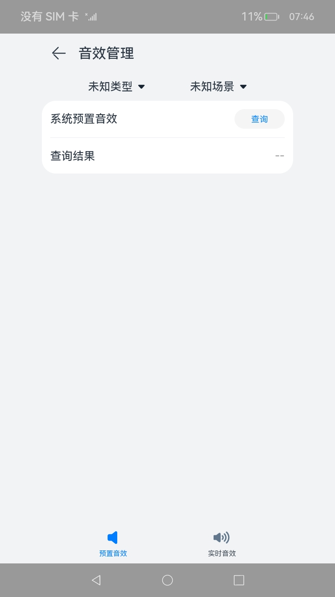

# 音效管理

### 介绍

本示例主要展示了音效管理功能，包括预置音效查询和实时音效设置。

### 效果预览

| 主页                                   | 预置音效查询页面                                     | 实时音效设置页面                                             |
| -------------------------------------- | ---------------------------------------------------- | ------------------------------------------------------------ |
|  |  |  |

使用说明

1. 在主界面点击“音效管理”按钮，进入预置音效查询页面
2. 在预置音效查询页面，选择内容类型和场景后，点击“查询”按钮，预置音效模式会显示在下方查询结果中
3. 在预置音效查询页面，重新修改内容类型和场景，查询结果会重置
4. 在预置音效查询页面，点击右下方”实时音效设置“按钮，进入实时音效设置页面
5. 在实时音效设置页面，选择内容类型和场景后，点击播放按钮，音频流开始播放，同时内容类型和场景选择框被置灰
6. 在实时音效设置页面，点击”查询“按钮，当前音频流音效模式会显示在下方的查询结果中
7. 在实时音效设置页面，点击暂停按钮，音频流暂停，内容类型和场景选择框使能
8. 在实时音效设置页面，修改内容类型与场景选择，查询结果被重置
9. 在实时音效设置页面，再次点击播放按钮，音频流开始播放，点击”查询“按钮，结果显示在查询结果内
10. 在实时音效设置页面，在”音频流音效模式设置“选择框中选择另一种与上次查询结果不同的音效模式，可以听到音频流出现变化
11. 在实时音效设置页面，再次点击”查询“按钮，查询结果与上一步设置的模式相同
12. 在实时音效设置页面，点击左上方返回图标，回到主页
13. 在实时音效设置页面，点击左下方”预置音效查询“按钮，回到预置音效查询页面

### 工程目录

```
entry/src/main/
|---ets
|---|---entryability
|---|---|---EntryAbility.ets
|---|---pages
|---|---|---Index.ets						// 首页
|---|---|---PresetEffect.ets				// 音效管理页面-预置音效查询
|---|---|---RealtimeEffect.ets				// 音效管理页面-实时音效设置
|---resources								// 静态资源
|---ohosTest
|---|---ets
|---|---|---tests
|---|---|---|---Ability.test.ets            // 自动化测试用例
library/
|---Logger.ts                               // 日志打印封装
```

### 具体实现

- 预置音效查询功能都封装在PresetEffect, 源码参考：[PresetEffect.ets](entry/src/main/ets/pages/PresetEffect.ets)
  - 在选择框中的类型和场景映射为数字后, 作为之后调用的getAudioEffectInfoArray(content type:number, stream usage:number)的两个入参
  - 点击”查询“按钮后, 使用audio.getAudioManager()获取音频管理对象audioManager, 再通过audioManager.getStreamManager()对象获取audioStreamManager
  - 使用audioStreamManager.getAudioEffectInfoArray()获取当前的预置音效模式, api返回数字, 映射后显示在查询结果一栏
- 实时音效设置功能都封装在RealtimeEffect, 源码参考：[RealtimeEffect.ets](entry/src/main/ets/pages/RealtimeEffect.ets)
  - 点击播放调用createAudioRenderer(audioRendererOptions),其中的audioRendererOptions使用了在选择框中的类型和场景映射成的数字
  - 使用audioRenderer.start()方法和audioRenderer.write()进行音频的播放处理, 写入字节的长度由audioRenderer.getBufferSize()接口来决定
  - 使用resourceManager.getRawFd()接口加载工程里面的resources\rawfile下面的音频文件资源获取对应的文件描述对象fileDescriptor
  - 使用audioRenderer.pause()方法暂停音频流, 使用audioRenderer.stop()和audioRenderer.release()方法释放当前audioRenderer
  - 点击查询按钮, 调用audioRenderer.getAudioEffectMode()方法查询当前音频流的音效模式, 显示在查询结果内
  - 点击”音频流音效模式设置“选项, 调用audioRenderer.setAudioEffectMode()方法,设置要用的音效模式
  - 通过三个选择框的更新, audioRenderer的state和播放按钮状态的监视, 来触发UI状态的更新
  - 调用组件的.enabled(enabled: boolean)方法控制其置灰与使能

### 相关权限

无。

### 依赖

不涉及。

### 约束与限制

1. 本示例仅支持标准系统上运行，支持设备：RK3568；
2. 本示例仅支持API12版本SDK，SDK版本号(API Version 12 Release),镜像版本号(5.0Release)；
3. 本示例需要使用DevEco Studio 版本号(5.0Release)才可编译运行；

### 下载

如需单独下载本工程，执行如下命令：

```
git init
git config core.sparsecheckout true
echo code/DocsSample/Media/Audio/AudioEffectManagement > .git/info/sparse-checkout
git remote add origin https://gitee.com/openharmony/applications_app_samples.git
git pull origin ***(分支名)
```