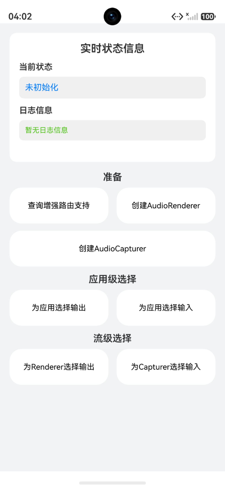

# 增强路由设备选择功能示例（C版本）

## 介绍

本示例基于OH_AudioDeviceEnhanceManager C API，实现了查询增强路由支持、为应用选择输出/输入设备、为Renderer/Capturer选择输出/输入设备等功能，包含了功能调用接口的完整链路。

## 使用说明

1. 安装编译生成的hap包，并打开应用；
2. 点击'查询增强路由支持'按钮，查询系统是否支持增强路由功能；
3. 点击'创建AudioRenderer'按钮，创建AudioRenderer实例，为流级设备选择做准备；
4. 点击'创建AudioCapturer'按钮，授权麦克风后创建AudioCapturer实例，为流级设备选择做准备；
5. 在应用级选择区域，点击'为应用选择输出/输入'按钮，弹出设备列表，选择目标设备完成应用级路由选择；
6. 在流级选择区域，点击'为Renderer选择输出/为Capturer选择输入'按钮，弹出设备列表，选择目标设备完成流级路由选择。

## 效果图预览

**图1**：主界面



- 点击'查询增强路由支持'按钮，调用`OH_AudioDeviceEnhanceManager_IsEnhancedRoutingSupported`查询系统是否支持增强路由功能。
- 点击'创建AudioRenderer'按钮，调用ArkTS `audio.createAudioRenderer`创建AudioRenderer实例，为流级设备选择提供Renderer对象。
- 点击'创建AudioCapturer'按钮，请求麦克风权限后调用ArkTS `audio.createAudioCapturer`创建AudioCapturer实例，为流级设备选择提供Capturer对象。
- 点击'为应用选择输出'按钮，弹出可选输出设备列表，选中后调用`OH_AudioDeviceEnhanceManager_SelectOutputDevice`为应用选择输出设备。
- 点击'为应用选择输入'按钮，弹出可选输入设备列表，选中后调用`OH_AudioDeviceEnhanceManager_SelectInputDevice`为应用选择输入设备。
- 点击'为Renderer选择输出'按钮，弹出可选输出设备列表，选中后调用`OH_AudioDeviceEnhanceManager_SelectOutputDeviceForAudioRenderer`为指定播放流选择输出设备（需先创建AudioRenderer）。
- 点击'为Capturer选择输入'按钮，弹出可选输入设备列表，选中后调用`OH_AudioDeviceEnhanceManager_SelectInputDeviceForAudioCapturer`为指定录制流选择输入设备（需先创建AudioCapturer）。

## 工程结构&模块类型

```
├───entry/src/main/ets
|   ├───cpp
|   |   ├───types/libentry
|   |   |   └───Index.d.ts                      //NAPI接口声明
|   |   ├───CMakeLists.txt                      //CMake编译配置文件
|   |   └───EnhancedDeviceRouting.cpp           //NAPI接口配置
|   ├───ets
│       ├───entryability                        
│       │   └───EntryAbility.ets                // Ability的生命周期回调内容。
│       ├───entrybackupability                  
│       │   └───EntryBackupAbility.ets          // BackupAbility的生命周期回调内容。
│       ├───pages                               
│           └───Index.ets                       // 主界面。
└───entry/src/main/resources                    // 资源目录。
```
### 具体实现

### 增强路由设备选择功能
- 源码参考：[EnhancedDeviceRouting.cpp](entry/src/main/cpp/EnhancedDeviceRouting.cpp)
- 使用流程：
  - 点击'查询增强路由支持'按钮，首先通过`OH_AudioManager_GetAudioDeviceEnhanceManager`获取AudioDeviceEnhanceManager实例，然后调用`OH_AudioDeviceEnhanceManager_IsEnhancedRoutingSupported`查询系统是否支持增强路由功能。
  - 点击'为应用选择输出'按钮，首先获取AudioDeviceEnhanceManager实例，检查增强路由是否支持，然后通过`OH_AudioRoutingManager_GetAvailableDevices`获取可用输出设备列表，根据deviceId匹配目标设备描述符，调用`OH_AudioDeviceEnhanceManager_SelectOutputDevice`为应用选择输出设备。
  - 点击'为应用选择输入'按钮，流程同上，通过`OH_AudioRoutingManager_GetAvailableDevices`获取可用输入设备列表，调用`OH_AudioDeviceEnhanceManager_SelectInputDevice`为应用选择输入设备。
  - 点击'为Renderer选择输出'按钮，首先创建AudioRenderer实例，通过`OH_AudioRoutingManager_GetAvailableDevices`获取可用输出设备列表并匹配目标设备描述符，然后调用`OH_AudioDeviceEnhanceManager_SelectOutputDeviceForAudioRenderer`为指定播放流选择输出设备。
  - 点击'为Capturer选择输入'按钮，首先创建AudioCapturer实例，通过`OH_AudioRoutingManager_GetAvailableDevices`获取可用输入设备列表并匹配目标设备描述符，然后调用`OH_AudioDeviceEnhanceManager_SelectInputDeviceForAudioCapturer`为指定录制流选择输入设备。

## 相关权限

麦克风使用权限：ohos.permission.MICROPHONE

## 模块依赖

不涉及。

## 约束与限制

1.  本示例支持在标准系统上运行，支持设备：RK3568。

2.  本示例支持API version 26，版本号： 7.0.0.43。

3.  本示例已支持使Build Version: 7.0.0.43, built on August 24, 2025。

4.  高等级APL特殊签名说明：无。

## 下载

如需单独下载本工程，执行如下命令：

```
git init
git config core.sparsecheckout true
echo code/DocsSample/Media/Audio/AudioEnhanceDeviceSampleC/ > .git/info/sparse-checkout
git remote add origin https://gitcode.com/openharmony/applications_app_samples.git
git pull origin master
```
