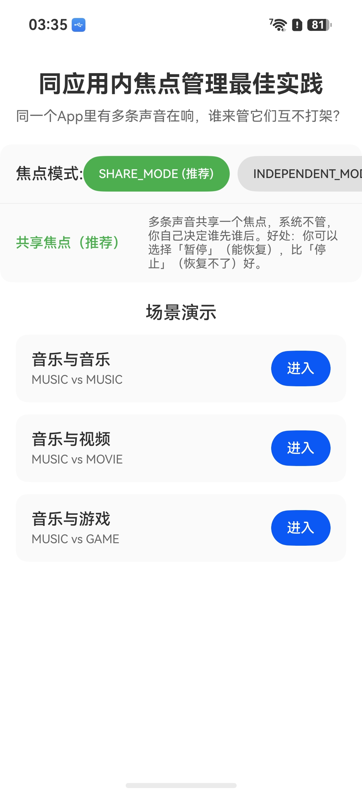
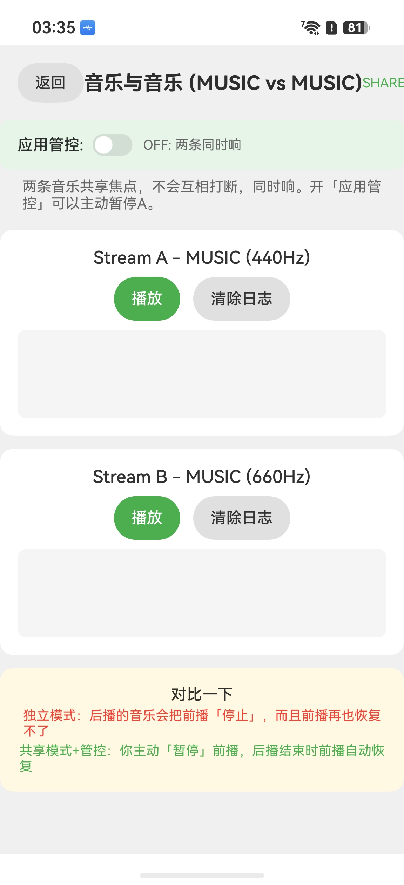
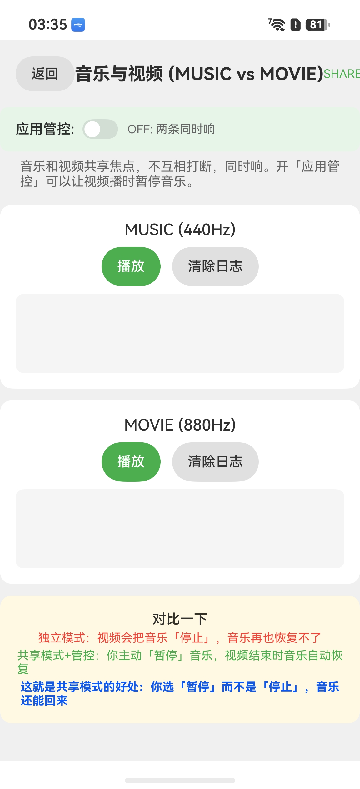
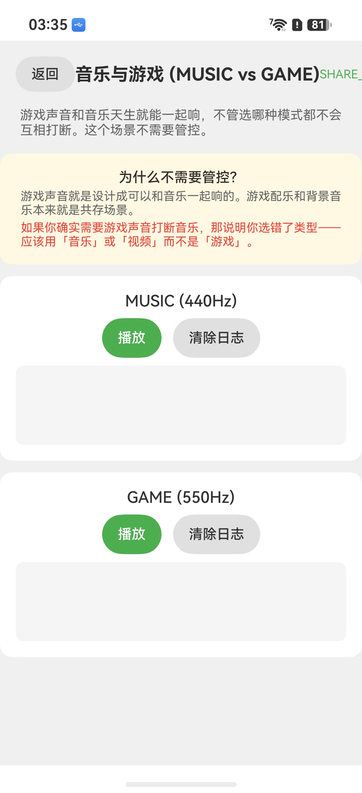

# 同应用内音频焦点管理

## 介绍

本示例展示了同应用内多条音频流之间的焦点管理推荐做法. 通过对比 SHARE_MODE 与 INDEPENDENT_MODE 的行为差异, 说明 SHARE_MODE + 应用主动管控(PAUSE → RESUME)策略优于 INDEPENDENT_MODE 的系统自动 STOP(不恢复)策略. 示例覆盖音乐与音乐、音乐与视频、音乐与游戏三种典型场景, 并提供"应用管控"开关供开发者实时对比两种模式的效果.

使用的主要 API 如下:

- [AudioRenderer](https://docs.openharmony.cn/pages/v5.0/zh-CN/application-dev/media/audio/audio-renderer.md): 音频播放的核心类, 用于创建音频流、播放控制及中断模式设置.
- [InterruptMode](https://docs.openharmony.cn/pages/v5.0/zh-CN/application-dev/media/audio/audio-interrupt.md): 音频中断模式枚举, 包括 SHARE_MODE 与 INDEPENDENT_MODE.
- [StreamUsage](https://docs.openharmony.cn/pages/v5.0/zh-CN/application-dev/media/audio/audio-stream-usage.md): 音频流使用类型枚举, 如 MUSIC、MOVIE、GAME 等.
- [router](https://docs.openharmony.cn/pages/v5.0/zh-CN/application-dev/ui/arkts/arkts-navigation.md): 页面路由导航.
- [UIAbility](https://docs.openharmony.cn/pages/v5.0/zh-CN/application-dev/application-models/uiability.md): 应用主Ability生命周期管理.
- [hilog](https://docs.openharmony.cn/pages/v5.0/zh-CN/application-dev/tools/hilog.md): 日志打印工具.

## 效果预览

| 主页面 | 音乐与音乐场景 | 音乐与视频场景 | 音乐与游戏场景 |
|-------|------------|------------|------------|
|  |  |  |  |

> 截图将在真机测试后补充.

## 使用说明

1. 在 DevEco Studio 中打开本工程, 连接设备后点击运行.
2. 在主页选择中断模式: 推荐选择 **SHARE_MODE**.
3. 点击场景卡片进入对应场景页面.
4. 在场景页面中开启"应用管控"开关(默认关闭).
5. 点击"播放 Stream A"按钮启动第一条音频流, 再点击"播放 Stream B"按钮启动第二条音频流.
6. 观察: 开启管控时, A 被 PAUSE 暂停, B 播放; B 停止后 A 自动 RESUME 恢复.
7. 切换到 INDEPENDENT_MODE 重复上述操作, 对比: A 被 STOP, B 停止后 A 不恢复.

## 工程目录

```
entry/src/main/ets/
|--- common/constants/AudioConstants.ets          # 音频枚举定义及场景列表
|--- common/constants/CommonConstants.ets         # 应用通用常量
|--- common/utils/Logger.ets                      # 日志工具
|--- common/utils/AudioStreamController.ets       # 音频播放控制器, 封装 AudioRenderer 创建、中断处理及正弦波生成
|--- pages/Index.ets                              # 主页面, 提供场景入口及中断模式选择
|--- pages/MusicVsMusicPage.ets                   # MUSIC vs MUSIC 场景页面
|--- pages/MusicVsVideoPage.ets                   # MUSIC vs MOVIE 场景页面
|--- pages/MusicVsGamePage.ets                    # MUSIC vs GAME 场景页面
|--- entryability/EntryAbility.ets                # Ability 生命周期管理
|--- entrybackupability/EntryBackupAbility.ets    # 备份扩展能力
```

## 具体实现

- **中断模式设置**: 在 AudioStreamController.ets 中, 通过 [AudioRenderer.setInterruptMode()](https://docs.openharmony.cn/pages/v5.0/zh-CN/application-dev/media/audio/audio-interrupt.md) 设置 SHARE_MODE 或 INDEPENDENT_MODE. SHARE_MODE 下同应用内多条流不打断, 可同时播放, 由应用自行管控; INDEPENDENT_MODE 下系统自动处理, 后播流 STOP 前播流且不恢复.
- **应用管控逻辑**: 各场景页面(MusicVsMusicPage.ets、MusicVsVideoPage.ets、MusicVsGamePage.ets)中实现 PAUSE → RESUME 策略. 当 B 流开始播放时, 应用主动 PAUSE 暂停 A 流; 当 B 流停止时, 应用主动 RESUME 恢复 A 流. 使用 `pausedByApp` 标记区分"应用管控暂停"与"用户手动暂停", 仅恢复被管控暂停的流.
- **音频播放控制**: AudioStreamController.ets 封装了 AudioRenderer 的创建、start、pause、stop 操作及正弦波数据生成, 提供统一的播放控制接口.
- **场景对比**: MUSIC vs MUSIC 场景演示同类流间的管控; MUSIC vs MOVIE 场景演示不同媒体流间的管控; MUSIC vs GAME 场景说明 GAME 与所有媒体类流默认并发混音(MIX), 不需要管控.
- **日志输出**: Logger.ets 基于 hilog 实现单例日志工具, 用于调试和追踪焦点交互过程.
- **Ability生命周期**: EntryAbility.ets 管理应用主Ability的创建与销毁, EntryBackupAbility.ets 提供备份扩展能力.

## 相关权限

| 权限名 | 权限等级 | 说明 |
|-------|--------|------|
| [ohos.permission.KEEP_BACKGROUND_RUNNING](https://docs.openharmony.cn/pages/v5.0/zh-CN/application-dev/security/permissions/permission-list.md#ohospermissionkeep_background_running) | normal | 允许应用在后台继续播放音频 |

## 依赖

不依赖其余示例工程.

## 约束与限制

- 支持设备类型: 手机、平板、2in1 设备.
- OpenHarmony SDK: 5.0.0(12)(开源版本).
- DevEco Studio: 5.0+.
- 本示例未使用系统 API, 无需 Full SDK, 使用 Public SDK 即可编译运行.
- 本示例仅包含播放场景的焦点管控演示, 内录(PlaybackCapture)相关 API 需要 API 26+ 支持, 当前 SDK 版本下不包含录制代码.
- 运行前需完成设备签名配置: 开发阶段使用调试签名, 发布前需配置正式签名.

## 下载

如需单独下载本工程, 执行如下命令:

```
git init
git remote add origin https://gitcode.com/openharmony/applications_app_samples.git
git config core.sparseCheckout true
echo code/DocsSample/Media/Audio/IntraAppFocusDemo/ >> .git/info/sparse-checkout
git pull origin master
```
