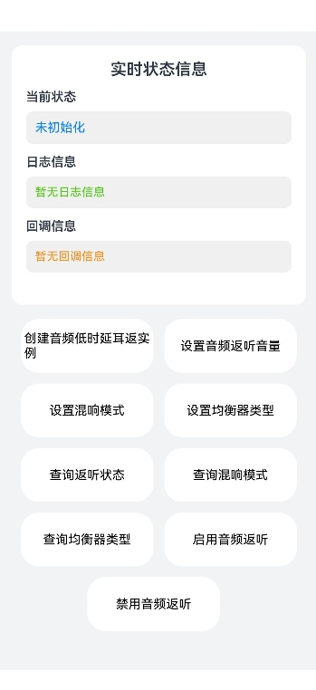

# 实现音频低时延耳返（ArkTS静态模式）

## 介绍

本示例基于 `@ohos.multimedia.audio` 的 AudioLoopback 能力，在 ArkTS 静态模式（Sta）下实现了音频低时延耳返（返听）的完整调用链路，包含创建返听实例、设置与查询返听音量、混响模式、均衡器类型，启用与禁用返听，以及查询返听器调试信息（DFX）等功能。

## 效果图预览

**图1**：主界面

依次点击"创建音频低时延耳返实例"、"设置音频返听音量"、"设置混响模式"、"设置均衡器类型"、"启用音频返听"等按钮，完成音频低时延耳返的配置；点击查询类按钮，返回信息在"日志信息"区域打印；点击"查询返听器调试信息"按钮，将返听器的 DFX 调试信息输出到 hilog 与文件。



## 工程结构&模块类型

```
├───entry/src/main/ets
│   ├───entryability
│   │   └───EntryAbility.ets                // Ability生命周期管理。
│   └───pages
│       └───Index.ets                        // 音频低时延耳返主页面，包含返听实例的创建、配置、启用与调试信息查询。
└───entry/src/main/resources                // 资源目录。
```

## 具体实现

源码参考：[Index.ets](entry/src/main/ets/pages/Index.ets)

- 需申请 `ohos.permission.MICROPHONE` 权限以保证麦克风正常起流。
- 点击"创建音频低时延耳返实例"按钮，先调用 `audio.getAudioManager().getStreamManager().isAudioLoopbackSupported(mode)` 查询当前是否支持低时延耳返，若支持则调用 `audio.createAudioLoopback` 创建返听实例。
- 点击"设置音频返听音量"按钮，调用 `audioLoopback.setVolume` 设置返听音量，取值范围为 [0, 1]。
- 点击"设置混响模式"按钮，调用 `audioLoopback.setReverbPreset` 设置混响模式，如 `audio.AudioLoopbackReverbPreset.THEATER`。
- 点击"设置均衡器类型"按钮，调用 `audioLoopback.setEqualizerPreset` 设置均衡器类型，如 `audio.AudioLoopbackEqualizerPreset.FULL`。
- 点击"查询返听状态"按钮，调用 `audioLoopback.getStatus` 获取当前返听状态。
- 点击"查询混响模式"按钮，调用 `audioLoopback.getReverbPreset` 获取当前混响模式。
- 点击"查询均衡器类型"按钮，调用 `audioLoopback.getEqualizerPreset` 获取当前均衡器类型。
- 点击"启用音频返听"按钮，调用 `audioLoopback.enable(true)` 启用返听。
- 点击"禁用音频返听"按钮，调用 `audioLoopback.enable(false)` 禁用返听。
- 点击"查询返听器调试信息"按钮，调用 `audio.getAudioManager().getDebuggingManager().printLoopbackInfo(audioLoopback, fd)`，将返听器的 DFX 调试信息分别输出到 hilog（fd 为 -1）与文件（fd 为文件描述符）。

## 相关权限

麦克风使用权限：ohos.permission.MICROPHONE

## 模块依赖

不涉及。

## 约束与限制

1. 本示例支持在标准系统上运行，支持设备：RK3568。

2. 本示例支持 API version 24 及以上版本。

3. 本示例采用 ArkTS 静态模式（Sta）。

## 下载

如需单独下载本工程，执行如下命令：

```
git init
git config core.sparsecheckout true
echo code/DocsSample/Media/Audio/AudioLoopbackDebugInfo_Sta/ > .git/info/sparse-checkout
git remote add origin https://gitcode.com/openharmony/applications_app_samples.git
git pull origin master
```
