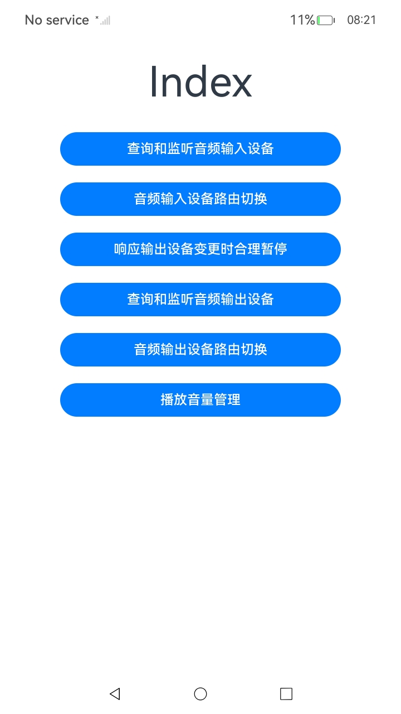
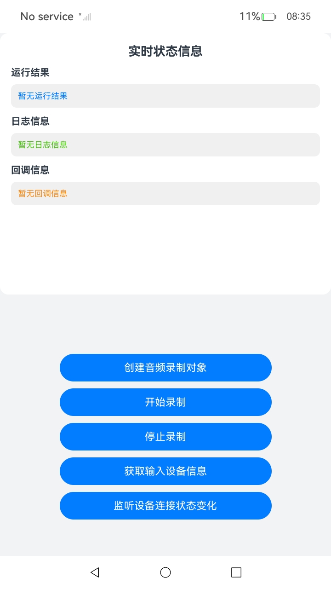
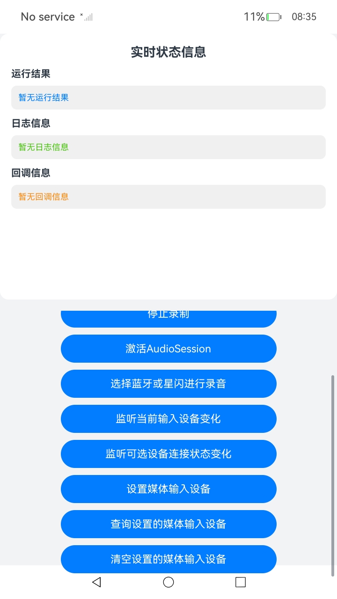
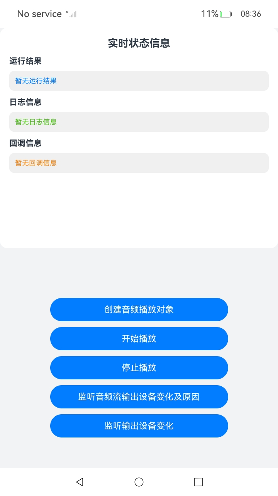
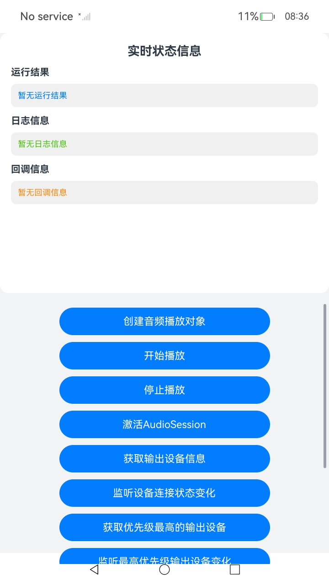
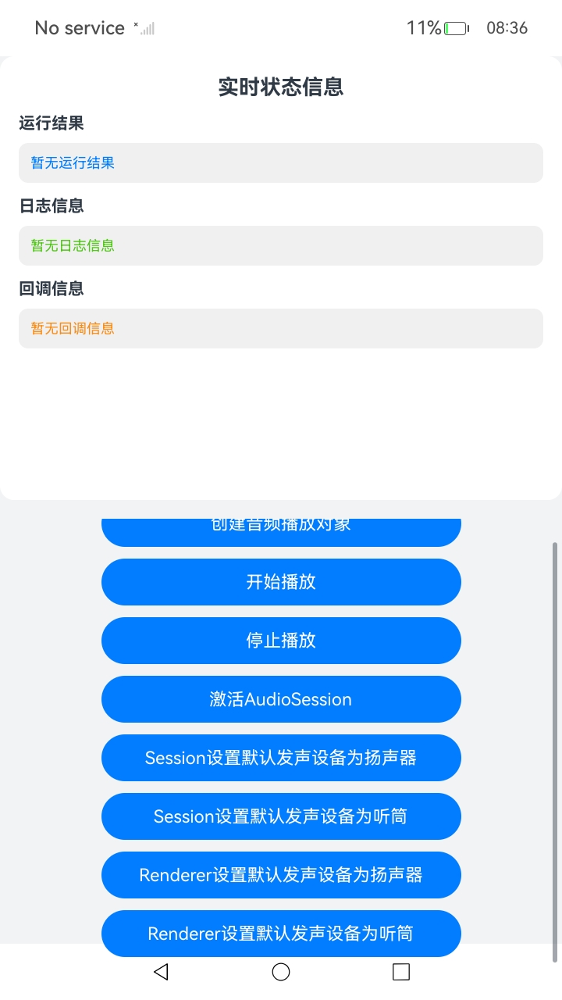
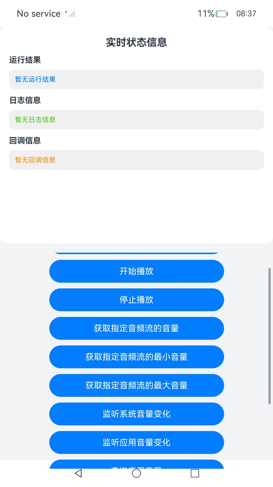

# 音频设备路由管理功能示例

## 介绍

本示例基于AudioRender和AudioCapturer能力，实现了查询和监听音频输入设备、查询和监听音频输出设备、实现音频输入设备路由切换、实现音频输出设备路由切换、响应输出设备变更时合理暂停、音量管理等功能，包含了功能调用接口的完整链路。

## 效果图预览

**图1**：首页



**图2**：查询和监听音频输入设备页AudioInputDeviceManagement

  

**图3**：音频输入设备路由切换页AudioInputDeviceSwitcher

  

**图4**：响应输出设备变更时合理暂停页AudioOutputDeviceChange

  

**图5**：查询和监听音频输出设备页AudioOutputDeviceManagement

  

**图6**：音频输出设备路由切换页AudioOutputDeviceSwitcher

  

**图6**：播放音量管理页VolumeManagement

  

## 工程结构&模块类型

```
├───entry/src/main/ets
│   ├───pages                               
│   │   └───Index.ets                             // 首页。
│   │   └───AudioInputDeviceManagement.ets        // 查询和监听音频输入设备页面。
│   │   └───AudioInputDeviceSwitcher.ets          // 音频输入设备路由切换页面。
│   │   └───AudioOutputDeviceChange.ets           // 响应输出设备变更时合理暂停页面。
│   │   └───AudioOutputDeviceManagement.ets       // 查询和监听音频输出设备页面。
│   │   └───AudioOutputDeviceSwitcher.ets         // 音频输出设备路由切换页面。
│   │   └───VolumeManagement.ets                  // 播放音量管理页面。
└───entry/src/main/resources                      // 资源目录。         
```
### 具体实现

### 查询和监听音频输入设备
- 源码参考：[AudioInputDeviceManagement.ets](entry/src/main/ets/pages/AudioInputDeviceManagement.ets)
- 使用流程：
  - 点击'创建音频录制对象'按钮，调用`audio.createAudioCapturer`创建音频录制对象。
  - 点击'开始录制'按钮，调用`audioCapturer.start`开始录制。
  - 点击'获取输入设备信息'按钮，调用`audioRoutingManager.getDevices`获取输入设备信息。
  - 点击'监听设备连接状态变化'按钮，调用`audioRoutingManager.onDeviceChange`监听输入设备连接状态变化。
  - 点击'停止录制'按钮，调用`audioCapturer.stop`停止录制。

### 音频输入设备路由切换
- 查询和监听音频输出设备：[AudioInputDeviceSwitcher.ets](entry/src/main/ets/pages/AudioInputDeviceSwitcher.ets)
- 使用流程：
  - 点击'创建音频录制对象'按钮，调用`audio.createAudioCapturer`创建音频录制对象。
  - 点击'开始录制'按钮，调用`audioCapturer.start`开始录制。
  - 点击'激活AudioSession'按钮，调用`audioSessionManager.activateAudioSession`激活AudioSession。
  - 点击'选择蓝牙或星闪进行录音'按钮，调用`audioSessionManager.setBluetoothAndNearlinkPreferredRecordCategory`设置在使用蓝牙或星闪进行录音时，应用程序的设备偏好分类。
  - 点击'监听当前输入设备变化'按钮，调用`audioSessionManager.onCurrentInputDeviceChanged`监听当前输入设备变化。
  - 点击'监听可选设备连接状态变化'按钮，调用`audioSessionManager.onAvailableDeviceChange`监听可选设备连接状态变化。
  - 点击'设置媒体输入设备'按钮，调用`audioSessionManager.selectMediaInputDevice`设置媒体输入设备。
  - 点击'查询设置的媒体输入设备'按钮，调用`audioSessionManager.getSelectedMediaInputDevice`查询设置的媒体输入设备。
  - 点击'清空设置的媒体输入设备'按钮，调用`audioSessionManager.clearSelectedMediaInputDevice`清空设置的媒体输入设备。
  - 点击'停止录制'按钮，调用`audioCapturer.stop`停止录制。

### 响应输出设备变更时合理暂停
- 源码参考：[AudioOutputDeviceChange.ets](entry/src/main/ets/pages/AudioOutputDeviceChange.ets)
- 使用流程：
  - 点击'创建音频播放对象'按钮，调用`audio.createAudioRenderer`创建音频播放对象。
  - 点击'开始播放'按钮，调用`audioRenderer.start`开始播放。
  - 点击'监听音频流输出设备变化及原因'按钮，调用`audioRenderer.onOutputDeviceChangeWithInfo`监听音频流输出设备变化及原因。
  - 点击'监听输出设备变化'按钮，调用`audioSessionManager.onCurrentOutputDeviceChanged`监听输出设备变化。
  - 点击'停止播放'按钮，调用`audioRenderer.stop`停止播放。

### 查询和监听音频输出设备
- 源码参考：[AudioOutputDeviceManagement.ets](entry/src/main/ets/pages/AudioOutputDeviceManagement.ets)
- 使用流程：
  - 点击'创建音频播放对象'按钮，调用`audio.createAudioRenderer`创建音频播放对象。
  - 点击'开始播放'按钮，调用`audioRenderer.start`开始播放。
  - 点击'激活AudioSession'按钮，调用`audioSessionManager.activateAudioSession`激活AudioSession。
  - 点击'获取输出设备信息'按钮，调用`audioRoutingManager.getDevices`获取输出设备信息。
  - 点击'监听设备连接状态变化'按钮，调用`audioRoutingManager.onDeviceChange`监听输出设备连接状态变化。
  - 点击'获取优先级最高的输出设备'按钮，调用`audioRoutingManager.getPreferOutputDeviceForRendererInfo`获取优先级最高的输出设备。
  - 点击'监听最高优先级输出设备变化'按钮，调用`audioRoutingManager.onPreferOutputDeviceChangeForRendererInfo`监听最高优先级输出设备变化。
  - 点击'设置默认发声设备为扬声器'按钮，调用`audioSessionManager.setDefaultOutputDevice`设置默认发声设备为扬声器。
  - 点击'设置默认发声设备为听筒'按钮，调用`audioSessionManager.setDefaultOutputDevice`设置默认发声设备为听筒。
  - 点击'获取设置的默认发声设备'按钮，调用`audioSessionManager.getDefaultOutputDevice`获取设置的默认发声设备。
  - 点击'监听输出设备变化'按钮，调用`audioSessionManager.onCurrentOutputDeviceChanged`监听输出设备变化。
  - 点击'停止播放'按钮，调用`audioRenderer.stop`停止播放。

### 音频输出设备路由切换
- 源码参考：[AudioOutputDeviceSwitcher.ets](entry/src/main/ets/pages/AudioOutputDeviceSwitcher.ets)
- 使用流程：
  - 点击'创建音频播放对象'按钮，调用`audio.createAudioRenderer`创建音频播放对象。
  - 点击'开始播放'按钮，调用`audioRenderer.start`开始播放。
  - 点击'激活AudioSession'按钮，调用`audioSessionManager.activateAudioSession`激活AudioSession。
  - 点击'Session设置默认发声设备为扬声器'按钮，调用`audioSessionManager.setDefaultOutputDevice`设置默认发声设备为扬声器。
  - 点击'Session设置默认发声设备为听筒'按钮，调用`audioSessionManager.setDefaultOutputDevice`设置默认发声设备为听筒。
  - 点击'Renderer设置默认发声设备为扬声器'按钮，调用`audioRenderer.setDefaultOutputDevice`设置默认发声设备为扬声器。
  - 点击'Renderer设置默认发声设备为听筒'按钮，调用`audioRenderer.setDefaultOutputDevice`设置默认发声设备为听筒。
  - 点击'停止播放'按钮，调用`audioRenderer.stop`停止播放。

### 播放音量管理
- 源码参考：[VolumeManagement.ets](entry/src/main/ets/pages/VolumeManagement.ets)
- 使用流程：
  - 点击'创建音频播放对象'按钮，调用`audio.createAudioRenderer`创建音频播放对象。
  - 点击'开始播放'按钮，调用`audioRenderer.start`开始播放。
  - 点击'获取指定音频流的音量'按钮，调用`audioVolumeManager.getVolumeByStream`获取指定音频流的音量。
  - 点击'获取指定音频流的最小音量'按钮，调用`audioVolumeManager.getMinVolumeByStream`获取指定音频流的最小音量。
  - 点击'获取指定音频流的最大音量'按钮，调用`audioVolumeManager.getMaxVolumeByStream`获取指定音频流的最大音量。
  - 点击'监听系统音量变化'按钮，调用`audioVolumeManager.onStreamVolumeChange`监听系统音量变化。
  - 点击'监听应用音量变化'按钮，调用`audioVolumeManager.onAppVolumeChange`监听应用音量变化。
  - 点击'查询应用音量'按钮，调用`audioVolumeManager.getAppVolumePercentage`查询应用音量。
  - 点击'设置应用的音量'按钮，调用`audioVolumeManager.setAppVolumePercentage`设置应用的音量。
  - 点击'查询音频流音量'按钮，调用`audioRenderer.getVolume`查询音频流音量。
  - 点击'设置音频流音量'按钮，调用`audioRenderer.setVolume`监听输出设备变化。
  - 点击'停止播放'按钮，调用`audioRenderer.stop`停止播放。

## 相关权限

音频录制涉及的权限包括：

允许应用使用麦克风：[ohos.permission.MICROPHONE]

## 模块依赖

不涉及。

### 约束与限制

1.本示例仅支持标准系统上运行，支持设备：RK3568;

2.本示例仅支持API26版本SDK，SDK版本号(API Version 26 Beta)，镜像版本号(7.0Beta);

3.本示例需要使用DevEco Studio 6.0.0 Canary1 (Build Version: 6.0.0.94SP4, built on April 8, 2026)及以上版本才可编译运行。

### 下载

如需单独下载本工程，执行如下命令：

```
git init  
git config core.sparsecheckout true  
echo code/DocsSample/Media/Audio/AudioRoutingAndVolumeManagerSample-Sta/ > .git/info/sparse-checkout  
git remote add origin https://gitcode.com/openharmony/applications_app_samples.git  
git pull origin master
```