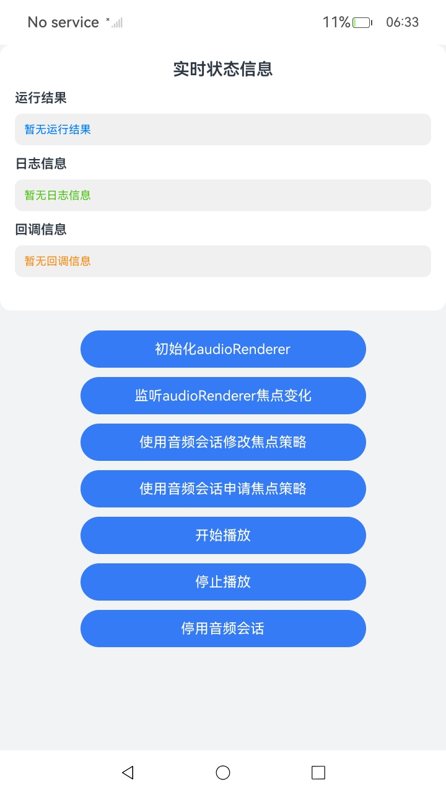

# 实现音频焦点功能

## 介绍

本示例基于AudioSessionManager提供的能力，实现了通过AudioSession主动管理应用内音频流的焦点、自定义本应用音频流的焦点策略、调整本应用音频流释放音频焦点的时机等功能，包含了功能调用接口的完整链路。

## 效果图预览

**图1**：主界面



- 依次点击'初始化audioRenderer'、'监听audioRenderer焦点变化'、'开始播放'按钮，即可使用默认焦点策略播放音频。
- 依次点击'初始化audioRenderer'、'监听audioRenderer焦点变化'、'使用音频会话修改焦点策略'、'开始播放'按钮，即可使用音频会话修改焦点策略并播放音频。
- 依次点击'初始化audioRenderer'、'使用音频会话申请焦点策略'、'开始播放'按钮，即可使用音频会话申请焦点策略并播放音频。
- 播放时依次点击'停止播放'、'停用音频会话'按钮，即可结束本次会话。

## 工程结构&模块类型

```
├───entry/src/main/ets
│   ├───entryability                        
│   │   ├───EntryAbility.ets                // Ability的生命周期回调内容。
│   ├───entrybackupability                  
│   │   └───EntryBackupAbility.ets          // BackupAbility的生命周期回调内容。
│   ├───pages                               
│       └───Index.ets                       // 主界面。
└───entry/src/main/resources                // 资源目录。
```
### 具体实现

### 使用 AudioSession 管理应用音频焦点
- 源码参考：[Index.ets](entry/src/main/ets/pages/Index.ets)  
- 使用流程：
  - 点击'初始化audioRenderer'按钮，调用`audio.createAudioRenderer`创建audioRenderer对象。
  - 点击'监听audioRenderer焦点变化'按钮，调用`audioRenderer.on('audioInterrupt')`注册监听焦点变化。
  - 点击'使用音频会话修改焦点策略'按钮，首先配置焦点策略为`CONCURRENCY_MIX_WITH_OTHERS`，接着调用`audioSessionManager.activateAudioSession`激活音频焦点，然后通过`audioSessionManager.on('audioSessionDeactivated')`监听音频会话停用事件。
  - 点击'使用音频会话申请焦点策略'按钮，首先设置音频会话场景为`AUDIO_SESSION_SCENE_MEDIA`并配置焦点策略为`CONCURRENCY_MIX_WITH_OTHERS`，接着调用`audioSessionManager.enableMuteSuggestionWhenMixWithOthers`接口后调用`audioSessionManager.activateAudioSession`激活音频焦点，然后通过`audioSessionManager.on('audioSessionStateChanged')`监听AudioSession焦点和状态变化事件。
  - 点击'开始播放'按钮，调用`audioRenderer.start`开始播放音频。
  - 点击'停止播放'按钮，调用`audioRenderer.stop`停止播放音频。
  - 点击'停用音频会话'按钮，首先调用`audioSessionManager.off`来取消所有监听事件，再调用`audioSessionManager.deactivateAudioSession`结束当前应用的音频会话。


## 相关权限

不涉及。

## 模块依赖

不涉及。

## 约束与限制

1.  本示例支持在标准系统上运行，支持设备：RK3568。

2.  本示例支持API version 20，版本号： 6.0.0.43。

3.  本示例已支持使Build Version: 6.0.0.43, built on August 24, 2025。

4.  高等级APL特殊签名说明：无。