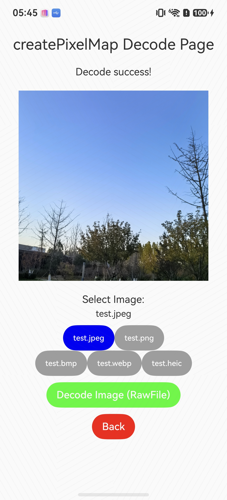
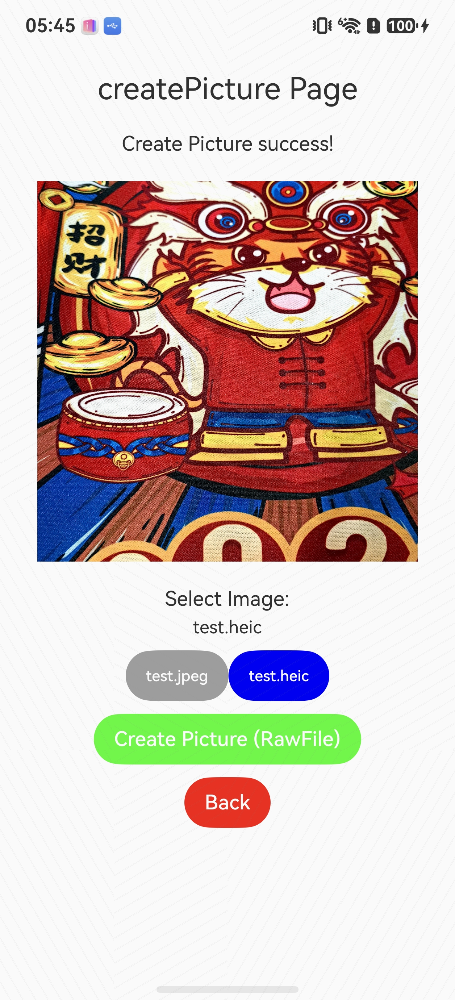

# Image开发指导(ArkTS静态模式)

### 介绍

此Sample为开发指南中图片 **开发指导(ArkTS静态模式)** 章节中部分示例代码的工程。包含图片解码为PixelMap以及图片解码为Picture的相关操作，使用ArkTS静态模式（'use static'）实现。

### 效果预览

| index页面                         | 图片解码页面示例                                     | 创建Picture页面示例                                     |
| --------------------------------- |----------------------------------------------|----------------------------------------------|
|  |  |  |

使用说明：

1.安装应用后，进入主页面，根据需要点击按钮跳转到不同功能的界面。

2.从菜单页面，点击"Go to Decode Page"按钮，进入图片解码页面，首先选择解码图片类型（支持jpeg、png、bmp、webp、heic），然后点击"Decode Image (RawFile)"按钮进行解码，解码成功后显示解码后的图片。

3.从菜单页面，点击"Go to Picture Page"按钮，进入创建Picture页面，首先选择解码图片类型（支持jpeg、heic），然后点击"Create Picture (RawFile)"按钮创建Picture对象，创建成功后显示主PixelMap图片。

### 工程目录

```shell
├── AppScope
├── README.md
├── build-profile.json5
├── entry
│   ├── build-profile.json5
│   ├── hvigorfile.ts
│   ├── oh-package.json5
│   └── src
│       ├── main
│       │   ├── ets
│       │   │   ├── entryability
│       │   │   │   └── EntryAbility.ts
│       │   │   └── pages
│       │   │       └── Index.ets  // 菜单页面。
│       │   │       └── DecodeToPixelMap.ets // 图片解码为PixelMap页面。
│       │   │       └── DecodeToPicture.ets // 图片解码为Picture页面。
│       │   ├── module.json5
│       │   └── resources
│       │       ├── base
│       │       ├── dark
│       │       ├── rawfile
│       │       │   ├── test.jpeg // 测试用的JPEG图片。
│       │       │   ├── test.png // 测试用的PNG图片。
│       │       │   ├── test.bmp // 测试用的BMP图片。
│       │       │   ├── test.webp // 测试用的WEBP图片。
│       │       │   ├── test.heic // 测试用的HEIC图片。
│       │       │   ├── test.svg // 测试用的SVG图片。
│       │       │   └── test.ico // 测试用的ICO图片。
│       └── ohosTest
│           ├── ets
│           │   ├── test
│           │   │   ├── Ability.test.ets
│           │   │   └── List.test.ets
│           ├── module.json5
│           └── test
│               ├── List.test.ets
│               └── LocalUnit.test.ets
├── hvigor
│   ├── hvigor-config.json5
├── hvigorfile.ts
├── oh-package.json5
└── screenshots
```

### 具体实现

+ 图片解码为PixelMap功能在DecodeToPixelMap页面中实现，通过createPixelMap接口将图片解码为PixelMap对象，源码参考[DecodeToPixelMap.ets](./entry/src/main/ets/pages/DecodeToPixelMap.ets)。
+ 图片解码为Picture功能在DecodeToPicture页面中实现，通过createPicture接口将图片解码为Picture对象，并通过getMainPixelmap获取主PixelMap进行显示，源码参考[DecodeToPicture.ets](./entry/src/main/ets/pages/DecodeToPicture.ets)。

### 相关权限

不涉及。

### 依赖

不涉及。

### 约束与限制

1. 本示例仅支持标准系统上运行，支持设备：RK3568；

2. 本示例为Stage模型，仅支持API 26版本SDK，SDK版本号(API Version 26.0.0)，镜像版本号(7.0)；

3. 本示例需要使用DevEco Studio 版本号(7.0)版本才可编译运行；

4. 运行本示例需要设备连接USB虚拟串口设备或具备板载串口。

### 下载

如需单独下载本工程，执行如下命令：

```shell
git init
git config core.sparsecheckout true
echo code/DocsSample/Media/Image/ImageArkTSSampleStatic/ > .git/info/sparse-checkout
git remote add origin https://gitcode.com/openharmony/applications_app_samples.git
git pull origin master
```