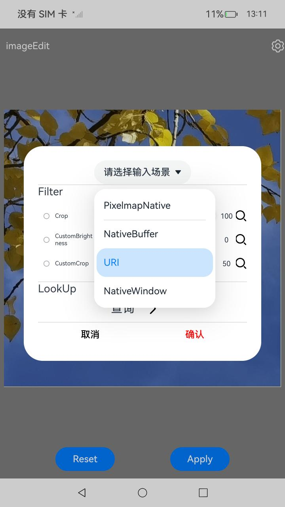
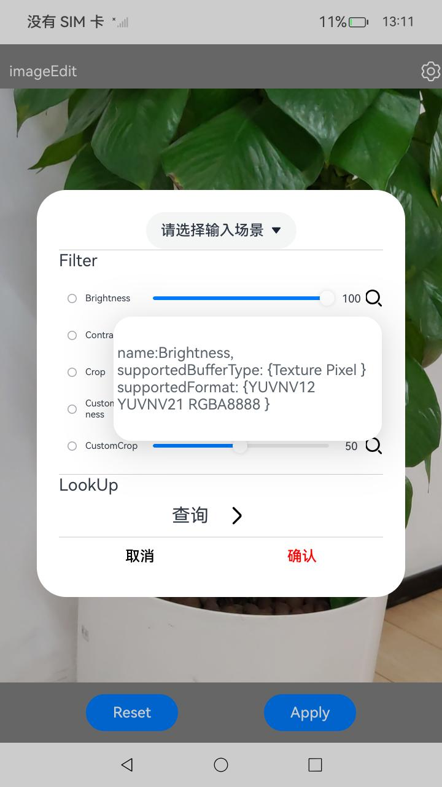

# ImageEffect

## 介绍

本示例依照指南 媒体->Image Kit(图片处理服务)->图片开发指导(C/C++)->[使用ImageEffect编辑图片](https://docs.openharmony.cn/pages/v5.0/zh-cn/application-dev/media/image/image-effect-guidelines.md)进行编写。

本示例主要功能如下：
- 通过ImageEffect提供的Native API接口添加滤镜或滤镜链，对输入图像应用滤镜效果。
- 注册实现了自定义亮度滤镜与自定义裁剪滤镜。
- 通过ImageEffect提供的Native API接口快速实现单个滤镜的处理效果。
- 通过ImageEffect提供的Native API接口查询滤镜能力信息。

## 效果预览

| 主界面                                                              | 设置滤镜                                                                     | 选择输入类型                                                                         | 查询滤镜信息                                                               |
|------------------------------------------------------------------|--------------------------------------------------------------------------|--------------------------------------------------------------------------------|----------------------------------------------------------------------|
|  |  |  |  |


使用说明：
1. 输入类型选择：在参数设置页面中，选择输入类型，显示区域将切换为对应的输入类型。
2. 调整滤镜参数：在参数设置页面中，选择所需的滤镜选项，并通过拖动滑动条来调节各个滤镜算子的参数。
3. 滤镜算子选择：可以选择裁剪、缩放、旋转等内置的算子，或选择自定义亮度、自定义剪裁滤镜。本示例允许同时选择多个滤镜以形成滤镜链。
4. 确认与保存设置：调整完毕后，点击确认按钮以保存所设置的滤镜参数。
5. 应用滤镜效果：返回图片展示页面后，点击Apply按钮，系统将展现经过滤镜处理后的图片效果。
6. 重置图片效果：如需撤销所做改动，点击Reset按钮，图片将恢复至调整前状态。
7. 查看滤镜详细信息：在参数设置页面，点击滑块旁的搜索图标，系统将展示一个详细信息页面，提供所选滤镜相关信息。
8. 查询滤镜信息：点击查询按钮并选择查询参数来获取滤镜信息页面，该页面将显示所应用的滤镜个数和名称信息。

## 工程目录

```
ImageEffect
entry/src/main/cpp/
├── CMakeLists.txt（CMake构建配置文件）
├── backend
│   ├── image_edit.cpp(图片编辑)
│   └── image_edit.h
├── logging.h(Log相关定义声明)
├── napi_init.cpp(图片处理功能注册)
└── utils
    ├── common_utils.cpp(字符处理工具函数)
    ├── common_utils.h
    ├── json_utils.cpp(json格式处理工具函数)
    ├── json_utils.h
    ├── pixelmap_helper.cpp(图片解码)
    └── pixelmap_helper.h
entry/src/main/ets/
├── pages
│   └── ImageEditPage.ets(图片显示、设置页面)
└── utils
    └── ImageUtils.ets（图片资源获取处理）
entry/src/ohosTest/ets/
└── test
    ├── Ability.test.ets (UI测试代码)
    └── List.test.ets (测试套件列表)
```

## 具体实现

+ 图片编辑功能在ImageEditPage中实现，源码参考ImageEditPage.ets:
    + 输入类型选择：在图片展示页面点击设置按钮弹出设置页面，选择输入类型。
    + 滤镜选择：在图片展示页面点击设置按钮弹出设置页面，选择滤镜并设置参数，点击确认按钮保存滤镜参数选择。
    + 滤镜生效：点击Apply按钮，展示经过滤镜处理后的图片效果，点击Reset按钮，图片恢复至调整前状态。
    + 滤镜查询：点击滑动条后面的查询图标可查询单个滤镜信息，点击下方查询按钮可查询对应条件的滤镜信息。

+ native接口在image_edit中实现，源码参考image_edit.cpp:
    - 应用滤镜：应用滤镜处理需要加载libimage_effect.so，对传入的输入类型进行处理，使用Brightness对图像进行亮度处理使用Contrast对图像进行对比度处理，使用Crop对图像进行裁剪处理，也可以自定义滤镜对图像进行处理。
    - 滤镜查询：接口实现对滤镜的查询功能，通过OH_EffectFilter_LookupFilterInfo接口方法查询单个滤镜的详细信息，通过OH_EffectFilter_LookupFilters接口方法查询指定条件下的滤镜数量以及信息。

## 相关权限

[ohos.permission.CAMERA](https://gitee.com/openharmony/docs/blob/master/zh-cn/application-dev/security/AccessToken/permissions-for-all-user.md#ohospermissioncamera)

## 依赖

不涉及。

## 约束和限制

1. 本示例支持标准系统上运行，支持设备：RK3568;
2. 本示例支持API12版本SDK，版本号：5.0.0.71；
3. 本示例已支持使DevEco Studio 5.0.1 Release (构建版本：5.0.5.306，构建 2024年12月6日)编译运行
4. 本示例涉及系统相机，由相机功能异常导致的OHNativeWindow场景无画面问题，可通过更换相机功能正常的镜像解决。
5. 本示例在RK3568开发板API14及以上版本的镜像中，存在界面卡顿现象，实际功能与自动化测试用例均可正常运行。

## 下载

如需单独下载本工程，执行如下命令：

```
git init
git config core.sparsecheckout true
echo code/DocsSample/Media/Image/ImageEffect/ > .git/info/sparse-checkout
git remote add origin OpenHarmony/applications_app_samples
git pull origin master
```