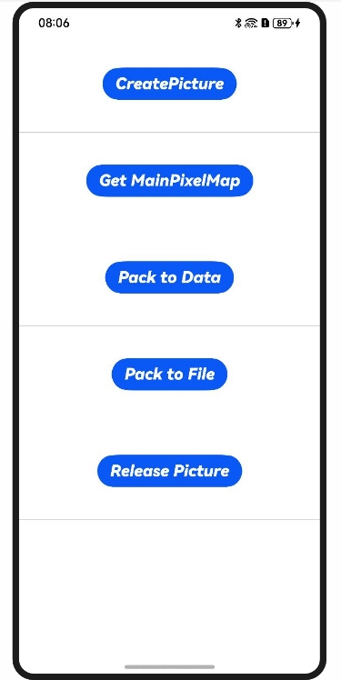

# NdkPicture

## 介绍
本示例主要实现了基于Picture的图片解码、主图获取、图片编码等功能。

## 效果预览

| 主界面                                         |
| ---------------------------------------------- |
|  |

使用说明：

1. 点击'Create Picture'按钮，解码图片，并以弹窗的形式通知结果（是否解码成功）。
2. 点击'Get MainPixelMap'按钮，从解码的Picture中获取主图，并以弹窗的形式通知结果。
3. 点击'Pack To Data'按钮或'Pack To File'按钮，将Picture编码到缓冲区或图片文件，并以弹窗的形式通知结果。
4. 点击'Realease Picture'按钮，释放Picture对象。

## 工程目录

```
NdkPicture
entry/src/main/cpp/
├── types
│   └── libentry 
│       └── Index.d.ts (声明Napi接口，供ts调用)
├── CMakeLists.txt (CMake编译配置文件)
└── napi_init.cpp (初始化Napi接口)
entry/src/main/ets/
├── utils
│   └── Logger.ets (logger日志类)
│   └── MyButton.ets (自定义Button按钮类)
│   └── PictureFunctions.ets (Picture函数类)
└── pages
    └── Index.ets (UI界面)
entry/src/main/resources/
└── rawfile
    └── test.jpg(图片资源)
entry/src/ohosTest/ets/
└── test
    ├── Ability.test.ets (UI测试代码)
    └── List.test.ets (测试套件列表)
```

## 具体实现
+ 图片解码、获取主图、图片编码等功能的CPAI封装均在napi_init中实现，源码参考[napi_init.cpp](./entry/src/main/cpp/napi_init.cpp)。

## 相关权限

不涉及

## 依赖

不涉及

## 约束和限制

1. 本示例支持标准系统上运行，支持设备：RK3568;

2. 本示例支持API15版本SDK，版本号：5.0.3.135;
   
3. 本示例已支持使DevEco Studio 5.0.3 Release (构建版本：5.0.8.300，构建 2025年3月19日)编译运行

## 下载

如需单独下载本工程，执行如下命令：

```
git init
git config core.sparsecheckout true
echo code/DocsSample/Media/Image/NdkPicture/ > .git/info/sparse-checkout
git remote add origin OpenHarmony/applications_app_samples
git pull origin master
```