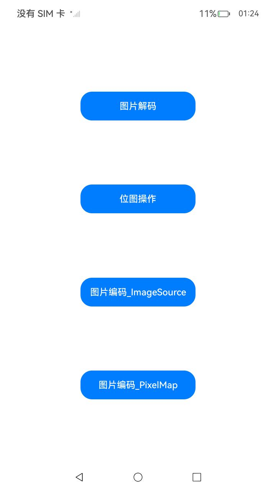

# NdkPixelMap

## 介绍

本示例主要实现了简单的图片解码、位图操作、图片编码功能。

## 效果预览

| 主界面                                         |
| ---------------------------------------------- |
|  |

使用说明：

1. 点击图片解码按钮，解码图片并以弹窗的形式显示结果。
2. 点击位图操作按钮，在Napi中对图片进行旋转、翻转裁剪等一系列操作，并以弹窗的形式显示结果。
3. 点击图片编码_ImageSource按钮，传入ImageSource将图片保存到沙箱路径并以弹窗的形式显示结果。
4. 点击图片编码_PixelMap按钮，传入PixelMap将图片保存到沙箱路径并以弹窗的形式显示结果。

## 工程目录

```
NdkPixelMap
entry/src/main/cpp/
├── types
│   ├── libimage 
│   │   ├── packer.cpp (图片编码)
│   │   ├── pixelmap.cpp (位图操作)
│   │   └── source.cpp (图片解码)
│   └── libentry 
│       └── Index.d.ts (声明Napi接口，供ts调用)
├── CMakeLists.txt (CMake编译配置文件)
└── napi_init.cpp (初始化Napi接口)
entry/src/main/ets/
├── common 
│   └── Logger.ts (logger日志类)
└── pages
    └── Index.ets (UI界面)
entry/src/main/resources/
└── rawfile
    └── test.gif(图片资源)
entry/src/ohosTest/ets/
└── test
    ├── Ability.test.ets (UI测试代码)
    └── List.test.ets (测试套件列表)
```

## 具体实现

+ 图片解码功能在source中实现，源码参考source.cpp：
    + 创建ImageSource：调用napi_get_value_string_utf8接口获取传入的文件uri，再使用OH_ImageSourceNative_CreateFromUri创建ImageSource。
    + 创建PixelMap：调用OH_DecodingOptions_Create接口创建解码参数，在使用OH_ImageSourceNative_CreatePixelmap创建PixelMap。
+ 位图操作功能在pixelmap中实现，源码参考pixelmap.cpp:
    + 创建PixelMap：使用OH_PixelmapInitializationOptions_Create创建位图参数结构体实例，并通过OH_PixelmapInitializationOptions_SetWidth等接口设置设置宽度等参数。调用OH_PixelmapNative_CreatePixelmap接口创建Pixelmap。
    + 处理PixelMap数据：通过OH_PixelmapNative_Opacity、OH_PixelmapNative_Scale、OH_PixelmapNative_Translate、OH_PixelmapNative_Rotate、OH_PixelmapNative_Flip等接口，设置PixelMap的透明度、进行缩放、偏移旋转和翻转操作。
+ 图片编码功能在packer中实现，源码参考packer.cpp:
    + 图片编码：通过OH_ImageSourceNative_CreateFromFd创建图像源对象编码参数后，调用OH_ImagePackerNative_PackFromImageSource接口将图像数据编码并到指定文件。

## 相关权限

[ohos.permission.READ_IMAGEVIDEO](https://gitee.com/openharmony/docs/blob/master/zh-cn/application-dev/security/AccessToken/permissions-for-system-apps.md#ohospermissionread_imagevideo)

[ohos.permission.WRITE_IMAGEVIDEO](https://gitee.com/openharmony/docs/blob/master/zh-cn/application-dev/security/AccessToken/permissions-for-system-apps.md#ohospermissionread_imagevideo)

## 依赖

不涉及。

## 约束和限制

1. 本示例支持标准系统上运行，支持设备：RK3568;
2. 本示例支持API14版本SDK，版本号：5.0.2.57；
3. 本示例已支持使用DevEco Studio 5.0.1 Release (构建版本：5.0.5.306，构建 2024年12月6日)编译运行
4. 本示例相关权限为system_basic级别，需要配置高权限签名，可参考[申请使用受控权限](https://docs.openharmony.cn/pages/v5.0/zh-cn/application-dev/security/AccessToken/declare-permissions-in-acl.md)

## 下载

如需单独下载本工程，执行如下命令：

```
git init
git config core.sparsecheckout true
echo code/DocsSample/Media/Image/NdkPixelMap/ > .git/info/sparse-checkout
git remote add origin OpenHarmony/applications_app_samples
git pull origin master
```