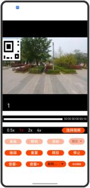

# LowPowerAVSinkSample

### 介绍
LowPoweAVSink 部件示例 Sample，提供基础的视频播放的功能。
- 视频播放的主要流程是将视频文件通过解封装->解码->送显/播放。
### 效果预览



### 使用说明

#### 播放

1. 点击选择视频按钮，从文件管理或从图库选取视频，点击确定。
2. 点击准备，将进行播放前的准备
3. 点击解码，将启动解码器
4. 点击首帧，将解码器输出的首帧上屏
5. 点击音视频，将进行视频播放
6. 播放过程中可以点击暂停/继续，或者拖动进度条选择播放进度，设置倍速以及音量
7. 停止播放，可以点击停止，重置，释放操作

### 目录

仓目录结构如下：

```
lpp_demo-sample/entry/src/main/          
├── cpp                                # Native层
│   ├── capabilities                   # 能力接口和实现
│   │   ├── include                    # 能力接口
│   │   ├── demuxer.cpp                # 解封装实现
│   │   ├── lpp_audio_streamer.cpp     # 低功耗音频流实现
│   │   └── lpp_video_streamer.cpp     # 低功耗视频流实现
│   ├── common                         # 公共模块
│   │   ├── dfx                        # 日志
│   │   ├── lpp_callback.cpp           # 低功耗音视频回调实现   
│   │   ├── lpp_callback.h             # 低功耗音视频回调接口
│   │   └── sample_info.h              # 功能实现公共类
│   ├── render                         # 送显模块接口和实现 * window player设置
│   │   ├── include                    # 送显模块接口
│   │   ├── egl_core.cpp               # 送显参数设置 *
│   │   ├── plugin_manager.cpp         # 送显模块管理实现
│   │   └── plugin_render.cpp          # 送显逻辑实现
│   ├── sample                         # Native层
│   │   ├── player                     # Native层播放接口和实现
│   │   │   ├── Player.cpp             # Native层播放功能调用逻辑的实现
│   │   │   ├── Player.h               # Native层播放功能调用逻辑的接口
│   │   │   ├── PlayerNative.cpp       # Native层 播放的入口
│   │   │   └── PlayerNative.h         # Native层暴露上来的接口
│   ├── types                          # 
│   │   └── libplayer                  # 播放模块暴露给UI层的接口
│   └── CMakeLists.txt                 # 编译入口
├── ets                                # UI层
│   ├── common                         # 公共模块
│   │   ├── utils                      # 共用的工具类
│   │   │   ├── DateTimeUtils.ets      # 获取当前时间
│   │   │   └── Logger.ts              # 日志工具
│   |   └───CommonConstants.ets        # 参数常量
│   ├── entryability                   # 应用的入口
│   │   └── EntryAbility.ts            # 申请权限弹窗实现
│   ├── pages                          # EntryAbility 包含的页面
│   │   └── Index.ets                  # 首页/播放页面
├── resources                          # 用于存放应用所用到的资源文件
│   ├── base                           # 该目录下的资源文件会被赋予唯一的ID
│   │   ├── element                    # 用于存放字体和颜色 
│   │   ├── media                      # 用于存放图片
│   │   └── profile                    # 应用入口首页
│   ├── en_US                          # 设备语言是美式英文时，优先匹配此目录下资源
│   └── zh_CN                          # 设备语言是简体中文时，优先匹配此目录下资源
└── module.json5                       # 模块配置信息
```

### 具体实现

播放流程包含：创建（created）、初始化（initialized）、就绪（ready）、解码（decoding）和渲染（rendering）五个阶段。

应用通过调用CreateByMime初始化创建解码器实例。完成解码器参数配置Configure，切换到initialized（已初始化）状态。

在初始化完成的状态下，完成解码器资源预加载（Prepare），视频进入准备就绪状态（ready）。然后启动解码流程（StartDecode），切换到解码（decoding）状态，触发首帧渲染（RenderFirstFrame）。最后启动渲染（StartRender）流程，切换到渲染（rendering）状态。

在渲染过程中，遇到暂停（Pause）会切换到paused状态，此时解码与渲染被临时挂起，资源未释放。当恢复渲染（Resume）时，视频将恢复并回到渲染（rendering）状态。当遇到停止（Stop）时，会切换到stopped状态，该状态代表解码器已停止工作，但实例仍存在。当渲染过程中流结束（EoS）时，会切换到eos状态。

在播放过程中，如果遇到错误（OnError），会出现异常，需要重置或进入释放阶段（released）销毁解码器实例，释放所有资源。

当播放处于ready/decoding/rendering/paused/stopped状态时，播放引擎此时处于工作状态会占用较多的系统资源。当暂停使用播放器时，可调用reset或destroy回收资源。

### 相关权限
不涉及

### 依赖
不涉及。

### 约束与限制

1.本示例仅支持在nashville芯片手机平台上运行;

2.本示例仅支持 API20 及以上版本SDK, SDK版本号(API Version 20 Release)；

3.本示例需要使用DevEco Studio 5.0 才可编译运行。

### 下载

如需单独下载本工程，执行如下命令：

```
git init
git config core.sparsecheckout true
echo code/DocsSample/Media/LowPowerAVSInk/lowPowerAVSinkSample/ > .git/info/sparse-checkout
git remote add origin https://gitcode.com/openharmony/applications_app_samples.git
git pull origin master
```