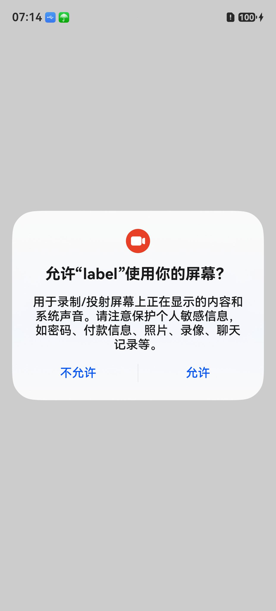
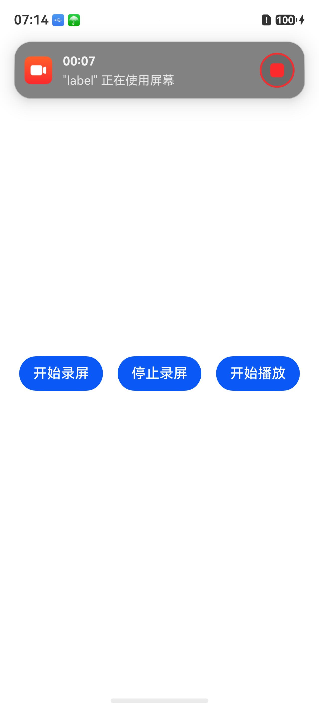

# 录屏Sample

## 介绍
录屏Sample调用了媒体AVScreenCapture组件提供的接口能力，提供屏幕捕获的功能，包含：
- 录屏存js文件

## 效果预览
| 隐私弹窗                 | 录制过程界面               |
|----------------------|----------------------|
|  |  |

使用说明

1. 启动应用。
2. 点击开始录屏按钮，启动屏幕录制。
3. 启动录制后会弹出隐私弹窗，告知用户将被录屏。
4. 选择允许后，启动录制后会弹出录制悬浮胶囊，并显示录制时间计时，此时可以操作屏幕，屏幕上的操作过程会被录制下来。
5. 需要停止录屏时，点击应用停止按钮或点击悬浮半透明的红色按钮，屏幕录制停止。
6. 录屏存储的文件保存在沙箱目录，录制结果与设备支持的编码格式有关。

## 工程目录

仓目录结构如下：

```
entry/src/main          # 录屏Sample业务代码
│  module.json5             # 编译相关文件
├─ets                       # 页面相关实现
│  ├─common
│  │  └─constants
│  │       CommonConstants.ets
│  ├─entryability
│  ├─model
│  │       MyAVScreenCapture.ets    # 录屏存文件js接口
│  └─pages                      # ets页面实现
│          Index.ets                # 录屏操作页面
│
└─resources                 # 资源文件
```
### 具体实现

1. 使用createAVScreenCaptureRecorder创建录屏实例。
2. 使用init初始化录屏参数，然后使用startRecording开始录屏。
3. 在开始录屏后，可以分别使用stopRecording和release进行停止录屏和释放实例。

## 相关权限

[ohos.permission.MICROPHONE](https://gitcode.com/openharmony/docs/blob/master/zh-cn/application-dev/security/AccessToken/permissions-for-all-user.md#ohospermissionmicrophone)

[ohos.permission.KEEP_BACKGROUND_RUNNING]
(https://gitcode.com/openharmony/docs/blob/master/zh-cn/application-dev/security/AccessToken/permissions-for-all.md#ohospermissionkeep_background_running)

## 依赖

不涉及

## 约束和限制

1. 本示例支持标准系统上运行，支持设备：RK3568;

2. 本示例支持API26版本SDK;

3. 本示例已支持使DevEco Studio 6.0.94 Release

## 下载

如需单独下载本工程，执行如下命令：

```
git init
git config core.sparsecheckout true
echo code/DocsSample/Media/ScreenCapture/ScreenCapyureSample-sta/ > .git/info/sparse-checkout
git remote add origin https://gitcode.com/openharmony/applications_app_samples.git
git pull origin master
```