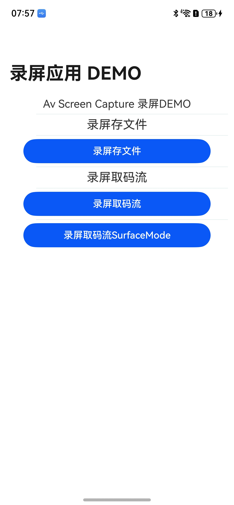
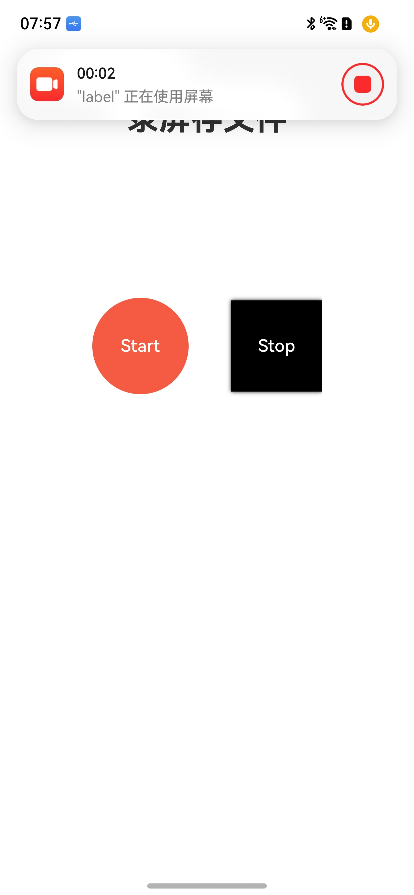

# 录屏Sample

## 介绍
录屏Sample调用了媒体AVScreenCapture组件提供的接口能力，提供屏幕捕获的功能，包含：
- 录屏存文件
- 录屏取原始码流
- 录屏取原始码流Surface模式

## 效果预览
| 获取录音权限               | 应用主界面                | 隐私弹窗                 | 录制过程界面               |
|----------------------|----------------------|----------------------|----------------------|
|  |  |  |  |

使用说明

1. 启动应用，首次启动需要用户授予访问麦克风的权限。
2. 选择对应的功能页签，点击Start按钮，启动屏幕录制。
3. 启动录制后会弹出隐私弹窗，告知用户将被录屏。
4. 选择允许后，启动录制后会弹出录制悬浮胶囊，并显示录制时间计时，此时可以操作屏幕，屏幕上的操作过程会被录制下来。
5. 需要停止录屏时，点击应用停止按钮或点击悬浮半透明的红色按钮，屏幕录制停止。
6. 录屏存储的文件保存在沙箱目录，录制结果与设备支持的编码格式有关。

## 工程目录

仓目录结构如下：

```
entry/src/main          # 录屏Sample业务代码
│  module.json5             # 编译相关文件
├─cpp                       # ndk相关文件
│  │  CMakeLists.txt
│  │  main.h
│  │  napi_init.cpp
│  │  sample_callback.cpp
│  │  sample_callback.h
│  │  sample_info.h
│  └─types                      # 映射文件
│
├─ets                       # 页面相关实现
│  ├─entryability
│  ├─entrybackupability
│  └─pages                      # ets页面实现
│          Index.ets                # 首页 
│          Menu.ets                 # 列表文件
│          Scene1.ets               # 录屏存文件场景
│          Scene2.ets               # 录屏取码流场景
│          Scene3.ets               # 录屏取码流Surface场景
│          Scene4.ets               # 录屏存文件js接口
│
└─resources                 # 资源文件
```

## 相关权限

ohos.permission.MICROPHONE

ohos.permission.KEEP_BACKGROUND_RUNNING

ohos.permission.WRITE_MEDIA

## 依赖

不涉及

## 约束和限制

1. 本示例支持标准系统上运行，支持设备：RK3568;

2. 本示例支持API19版本SDK，版本号：5.1.1.62;

3. 本示例已支持使DevEco Studio 5.0.5 Beta1（构建版本：5.0.13.100，构建于：2025年4月25日）编译运行

## 下载

如需单独下载本工程，执行如下命令：

```
git init
git config core.sparsecheckout true
echo code/DocsSample/Media/ScreenCapture/ScreenCaptureSample/ > .git/info/sparse-checkout
git remote add origin https://gitee.com/openharmony/applications_app_samples.git
git pull origin master
```