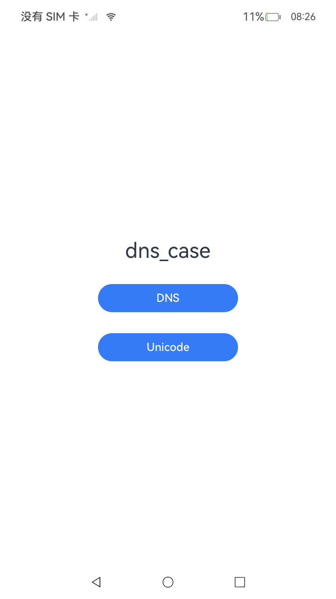
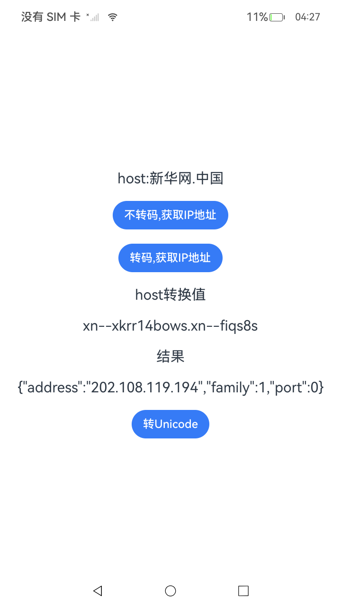

# Dns_case

### 介绍

应用通过对中文域名进行Punycode转码，实现DNS解析以获取对应的IP地址；使用当前默认网络解析主机名以获取所有IP地址，使用当前默认网络和特定网络连接，指定IP类型解析主机名以获取指定IP地址。

**注意：** 本示例使用一个实际的中文域名，方能获得通过的结果。

### 效果预览

| 程序启动                                                      | DNS接口支持配置查询类型                                     | DNS解析支持中文转码                                      |
|-----------------------------------------------------------|---------------------------------------------------|-------------------------------------------------|
|  |  |  |


使用说明

点击“Unicode”按钮，跳转到“DNS解析支持中文转码”页面

1. 前置条件：需要用户将资源文件中“value”对应的值更新为实际的中文域名。

   ```
   {
      "name": "hostName",
      "value": "示例"
    }
   ```

2. 点击 "不转码,获取IP地址" 按钮，获取中文域名对应的IP地址，未转码，获取失败。

3. 点击 "转码,获取IP地址" 按钮，将中文域名转码成Ascii编码并获取IP地址，成功获取中文域名的IP地址。

4. 点击 “转Unicode”按钮，将转码为Ascii编码的地址转成中文域名。

点击“DNS”按钮，跳转到“DNS接口支持配置查询类型”页面

1. 前置条件：连接网络，更新DNS.ets文件中的hostName参数为需要被解析的主机名。

2. 点击“getAddressByName”按钮，使用当前网络解析主机名，根据“Succeeded to get data”查看日志，返回所有IP地址。

3. 点击“getAddressesByNameWithOptions”按钮，使用当前网络，指定IP类型解析主机名，根据“Succeeded to get data”查看日志，返回指定IP地址。

4. 点击“NetHandle.getAddressesByNameWithOptions”按钮，收到网络可用事件回调后，使用当前NetHandle对应的网络解析主机名和指定的IP类型，根据“Succeeded to get data”查看日志，返回指定的IP地址。

### 工程目录

```
entry/src/main/ets/
|---common
|   |---Logger.ets                     // 日志工具
|---entryability
|   │---EntryAbility.ets
|---entrybackupability
│   |---EntryBackupAbility.ets      
|---pages
│   |---Index.ets                      // 主页
│   |---DNS.ets                        // DNS接口支持配置查询类型
│   |---Unicode.ets                    // DNS解析支持中文转码
```

### 具体实现
DNS解析支持中文转码

1. **中文域名不转码获取IP地址 (`getAddressByName`)**
   - 使用 `connection.getDefaultNet` 获取默认激活的数据网络。
   - 使用 `connection.getAddressesByName` 使用对应网络解析主机名以获取所有IP地址。
2. **中文域名转码并获取IP地址 (`getDnsAscii`)**
   - 使用 `connection.getDefaultNet` 获取默认激活的数据网络。
   - 使用 `connection.getDnsAscii` 将中文域名转换成对应的Ascii编码。
   - 使用 `connection.getAddressesByName` 使用对应网络解析主机名以获取所有IP地址。
3. **Ascii编码转Unicode编码（`getDnsUnicode`）**
    - 使用 `connection.getDnsUnicode` 将Ascii编码转成Unicode编码。
      
DNS接口支持配置查询类型
1. **使用当前网络解析主机名以获取所有IP地址 (`connection.getAddressByName`)**
   - 使用 `connection.getAddressesByName` 解析主机名以获取所有IP地址。
2. **使用当前网络，指定IP类型解析主机名以获取指定IP地址 (`connection.getAddressesByNameWithOptions`)**
   - 使用 `connection.getAddressesByNameWithOptions` 解析主机名以获取指定IP地址。
3. **使用当前NetHandle对应的网络解析主机名和指定的IP类型以获取指定的IP地址（`NetHandle.getAddressesByNameWithOptions`）**
   - 使用 `NetHandle.getAddressesByNameWithOptions` 解析主机名以获取指定IP地址。

### 相关权限

[ohos.permission.INTERNET](https://gitcode.com/openharmony/docs/blob/master/zh-cn/application-dev/security/AccessToken/permissions-for-all.md#ohospermissioninternet)<br/>
[ohos.permission.GET_NETWORK_INFO](https://gitcode.com/openharmony/docs/blob/master/zh-cn/application-dev/security/AccessToken/permissions-for-all.md#ohospermissioninternet)

### 依赖

不涉及。

### 约束与限制

1. 本示例仅支持标准系统上运行，支持设备：RK3568。
2. 本示例为Stage模型，支持API23版本SDK，版本号：6.0.0。
3. 本示例需要使用DevEco Studio Release（6.0.0.868）及以上版本才可编译运行。

### 下载

如需单独下载本工程，执行如下命令：

```
git init
git config core.sparsecheckout true
echo code/DocsSample/NetWork_Kit/NetWorkKit_Datatransmission/DNS_case/ > .git/info/sparse-checkout
git remote add origin https://gitcode.com/openharmony/applications_app_samples.git
git pull origin master
```