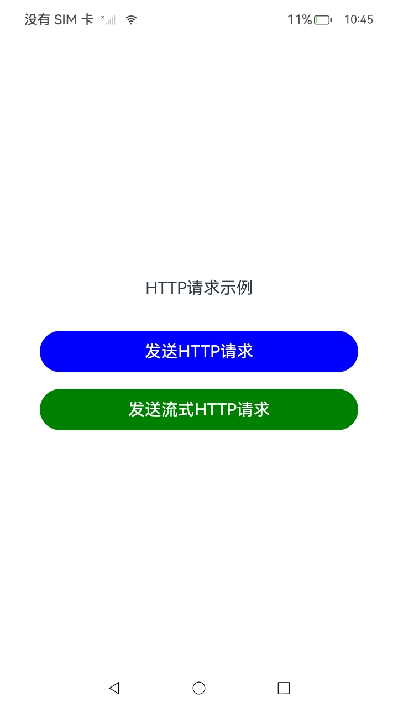
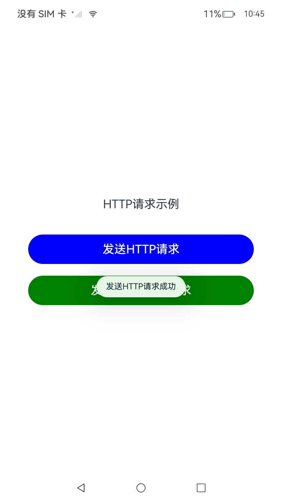
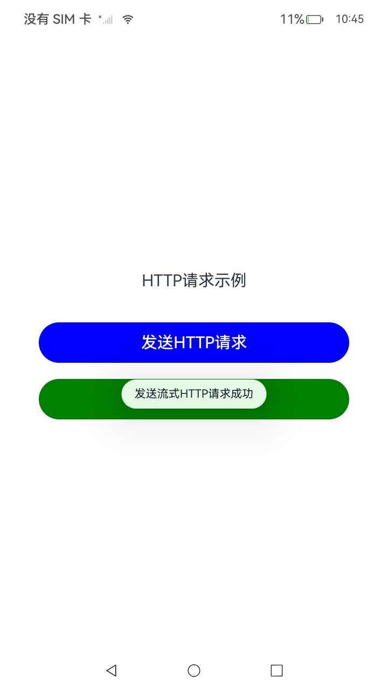

# Http_case(网络共享)

### 介绍

应用通过HTTP发起一个数据请求，支持常见的GET、POST、OPTIONS、HEAD、PUT、DELETE、TRACE、CONNECT方法。本项目的构建依据[HTTP数据请求](https://gitee.com/openharmony/docs/blob/OpenHarmony-5.0.1-Release/zh-cn/application-dev/network/http-request.md)示例代码，构建了一个HTTP数据请求的示例应用，它实现了通过按钮实现request接口开发步骤、requestInStream接口开发步骤的功能，使用了[@ohos.net.http](https://docs.openharmony.cn/pages/v5.0/zh-cn/application-dev/reference/apis-network-kit/js-apis-net-connection.md)接口。

**注意：**本示例需要用户输入一个实际的URL，方能获得通过的结果。

### 效果预览

| 程序启动                                  | 发送HTTP请求                                | 发送流式HTTP连接                                      |
| ----------------------------------------- | ------------------------------------------- | ----------------------------------------------------- |
|  |  |  |


使用说明

1. 前置条件：需要用户在

   ```
   const TARGET_URL: string = '';
   ```

   这个位置的单引号之间输入一个实际URL（参考格式：https://www.example.com/）

2. 点击 "普通 HTTP 请求" 按钮，发送一个 GET 请求到 TARGET_URL 并显示测试结果。

3. 点击 "流式 HTTP 请求" 按钮，发送一个 POST 请求到TARGET_URL，接收流式数据并显示测试结果。

   注1：日志输出使用 `Logger` 进行调试，可以查看 HTTP 请求的详细信息，包括请求头、响应数据、状态码等。

   注2：公共网址的访问不需要证书，故注释了代码中的证书部分

### 工程目录

```
entry/src/main/ets/
|---common
|   |---Logger.ets                     // 日志工具
|---entryability
|   │---EntryAbility.ets
|---entrybackupability
│   |---EntryBackupAbility.ets      
|---pages
│   |---Index.ets                      // 主页
```

### 具体实现

1. **普通 HTTP 请求 (`sendHttpRequest`)**
   - 使用 `http.createHttp()` 创建一个 HTTP 请求对象 `httpRequest`。
   - 发起 GET 请求，并设置请求头为 `Content-Type: application/json`。
   - 配置请求的超时参数：连接超时（`connectTimeout`）和读取超时（`readTimeout`）均设置为 60 秒。
   - 设置 `expectDataType: http.HttpDataType.STRING`，期望服务器返回的数据是字符串类型。
   - 配置使用缓存（`usingCache: true`）和 HTTP 协议版本为 HTTP/1.1（`usingProtocol: http.HttpProtocol.HTTP1_1`）。
   - 监听 HTTP 响应头事件（`headersReceive`），日志记录请求返回的 header 信息。
   - 在请求完成时，成功响应会将结果展示在 UI 中
   - 请求完成后销毁 `httpRequest` 实例，确保资源释放。
2. **流式 HTTP 请求 (`sendStreamHttpRequest`)**
   - 使用 `http.createHttp()` 创建一个 HTTP 请求对象 `httpRequest`，并初始化一个空的 `ArrayBuffer`（`res`）来接收流式响应数据。
   - 订阅 `headersReceive` 事件，输出响应头信息。
   - 订阅 `dataReceive` 事件，每次接收到流数据时，更新 `res`（即通过拼接 `ArrayBuffer`）以逐步存储响应内容，并记录当前接收的字节数。
   - 订阅 `dataEnd` 事件，指示流数据接收完毕，输出日志标明没有更多数据。
   - 订阅 `dataReceiveProgress` 事件，输出接收进度（已接收的数据大小和总大小）。
   - 通过 `httpRequest.requestInStream` 发送一个流式请求（POST 请求），请求体内容为 `"data to send"`。
   - 完成请求后，取消对各个事件的订阅，并销毁 `httpRequest` 实例。
3. **HTTP 请求参数配置**
   - **请求方法**：普通请求使用 `http.RequestMethod.GET`，流式请求使用 `http.RequestMethod.POST`。
   - **请求头**：两种请求都设置了 `Content-Type: application/json`，说明请求体为 JSON 数据。
   - **超时设置**：连接和读取超时均为 60 秒，防止请求长时间挂起。
   - **协议类型**：请求使用 `http.HttpProtocol.HTTP1_1`，即 HTTP 1.1 协议。
   - **缓存使用**：使用缓存（`usingCache: true`），减少重复请求时的延迟。
4. **异常处理与状态更新**
   - **普通 HTTP 请求异常处理**：在请求失败时，`err` 会被捕获，并将 UI 显示为“失败”，同时在日志中记录错误信息。
   - **流式请求异常处理**：在流式请求中，使用 `catch` 捕获错误并更新 `testResult_002` 为“失败”，并输出详细错误信息。
5. **资源释放与请求销毁**
   - 每次请求结束后，无论是普通请求还是流式请求，都调用 `httpRequest.destroy()` 销毁请求对象，释放相关资源。
   - 在流式请求中，响应数据的接收进度、完成和错误事件都通过订阅事件处理，确保最终销毁请求对象，防止内存泄漏。

### 相关权限

[ohos.permission.INTERNET](https://gitee.com/openharmony/docs/blob/OpenHarmony-5.0.1-Release/zh-cn/application-dev/security/AccessToken/permissions-for-all.md#ohospermissioninternet)

### 依赖

不涉及。

### 约束与限制

1. 本示例仅支持标准系统上运行，支持设备：RK3568。
2. 本示例为Stage模型，支持API14版本SDK，版本号：5.0.2。
3. 本示例需要使用DevEco Studio Release（5.0.5.306）及以上版本才可编译运行。

### 下载

如需单独下载本工程，执行如下命令：

```
git init
git config core.sparsecheckout true
echo code/DocsSample/NetWork_Kit/NetWorkKit_Datatransmission/HTTP_case/ > .git/info/sparse-checkout
git remote add origin https://gitee.com/openharmony/applications_app_samples.git
git pull origin master
```