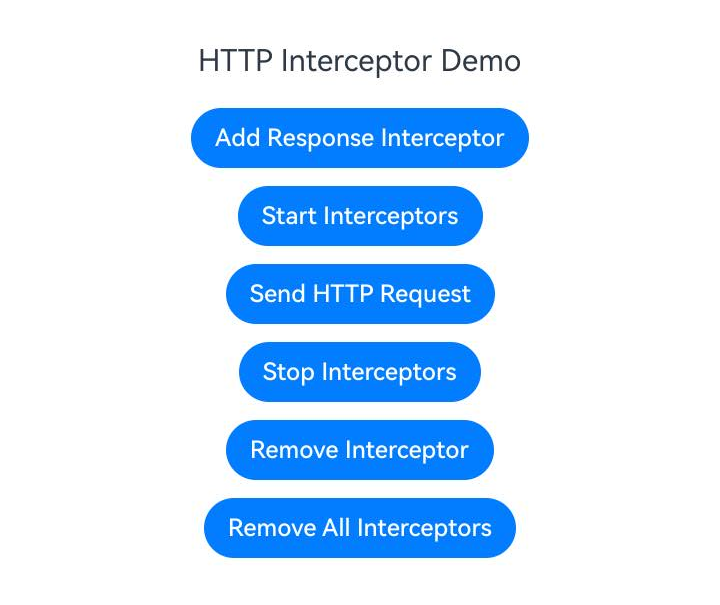

# HTTP拦截器（C/C++）

### 介绍

本示例依照指南 开发->系统->网络->Network Kit（网络服务）->[使用HTTP拦截器(C/C++)](https://gitcode.com/openharmony/docs/blob/master/zh-cn/application-dev/network/native-httpinterceptor-guidelines.md)进行编写。
本示例展示了如何使用Network Kit的HTTP拦截器功能，通过C/C++实现HTTP请求和响应的拦截处理。通过在源文件中将相关接口封装，再在ArkTS层对封装的接口进行调用，以实现添加响应拦截器、移除拦截器、启用拦截器、停用拦截器和移除所有拦截器等功能。

### 效果预览
| 程序主页                                    |
| ------------------------------------------- |
|  |

本示例提供了一个简单的界面，包含以下功能按钮：
- Add Response Interceptor：添加响应拦截器
- Remove Interceptor：移除拦截器
- Start Interceptors：启用拦截器
- Stop Interceptors：停用拦截器
- Remove All Interceptors：移除所有拦截器
- Send HTTP Request：发送HTTP请求
- Add Modify Request Interceptor：添加请求可写拦截器（OH_TYPE_MODIFY_NETWORK_KIT类型）
- Start Modify Request Interceptors：启用请求可写拦截器组
- Stop Modify Request Interceptors：停用请求可写拦截器组
- Remove Modify Request Interceptor：移除请求可写拦截器
- Remove All Modify Request Interceptors：移除所有请求可写拦截器
- Add Modify Response Interceptor：添加响应可写拦截器（OH_TYPE_MODIFY_NETWORK_KIT类型）
- Start Modify Response Interceptors：启用响应可写拦截器组
- Stop Modify Response Interceptors：停用响应可写拦截器组
- Remove Modify Response Interceptor：移除响应可写拦截器
- Remove All Modify Response Interceptors：移除所有响应可写拦截器

### 工程目录

```
entry/src/main/
│ 
│---cpp
│   │  CMakeLists.txt    
│   │  napi_init.cpp     // 链接层
│   │
│   └─types
│       └─libentry
│            Index.d.ts
│            oh-package.json5
|
|---ets
|   │---entryability
|   │   |---EntryAbility.ts
|   |---pages
|   │   |---Index.ets           // 主页
```

### 具体实现

1. 配置`CMakeLists.txt`，本模块需要用到的共享库包括`libhttp_interceptor.so`、`libnet_http.so`等。
2. 编写调用该API的代码，在C++层实现拦截器的添加、移除、启用、停用等功能。
3. 实现了两种类型的拦截器：
   - 只读拦截器（OH_TYPE_READ_ONLY）：用于读取和记录HTTP请求和响应信息
   - 可写拦截器（OH_TYPE_MODIFY_NETWORK_KIT）：用于修改HTTP请求和响应信息
4. 可写拦截器示例功能：
   - 修改请求方法（如将POST改为GET）
   - 添加自定义请求头
   - 修改请求体
   - 修改响应体
   - 添加自定义响应头
5. 在ArkTS层通过`httpInterceptor.AddResponseInterceptor()`、`httpInterceptor.AddModifyRequestInterceptor()`、`httpInterceptor.AddModifyResponseInterceptor()`等方法调用C++层封装的接口。
6. 发送HTTP请求时，响应拦截器会打印响应信息，包括响应码、响应体、响应头以及性能计时信息。
7. 可写拦截器会修改请求和响应信息，并在日志中打印修改前后的对比。

### 相关权限

[ohos.permission.INTERNET](https://gitcode.com/openharmony/docs/blob/master/zh-cn/application-dev/security/AccessToken/permissions-for-all.md#ohospermissioninternet)

### 依赖

本示例依赖以下共享库：
- libhttp_interceptor.so
- libnet_http.so
- libace_napi.z.so
- libhilog_ndk.z.so

### 约束与限制

1. 本示例仅支持标准系统上运行，支持设备：RK3568。

2. 本示例为Stage模型，支持API24版本SDK，版本号：6.0.2.57。

3. 本示例需要使用DevEco Studio Release（6.0.2 Release）及以上版本才可编译运行。

4. 本示例需要设备联网使用。


### 下载

如需单独下载本工程，执行如下命令：

```
git init
git config core.sparsecheckout true
echo code/DocsSample/NetWork_Kit/NetWorkKit_Datatransmission/HTTP_interceptor_C > .git/info/sparse-checkout
git remote add origin https://gitcode.com/openharmony/applications_app_samples.git
git pull origin master
```