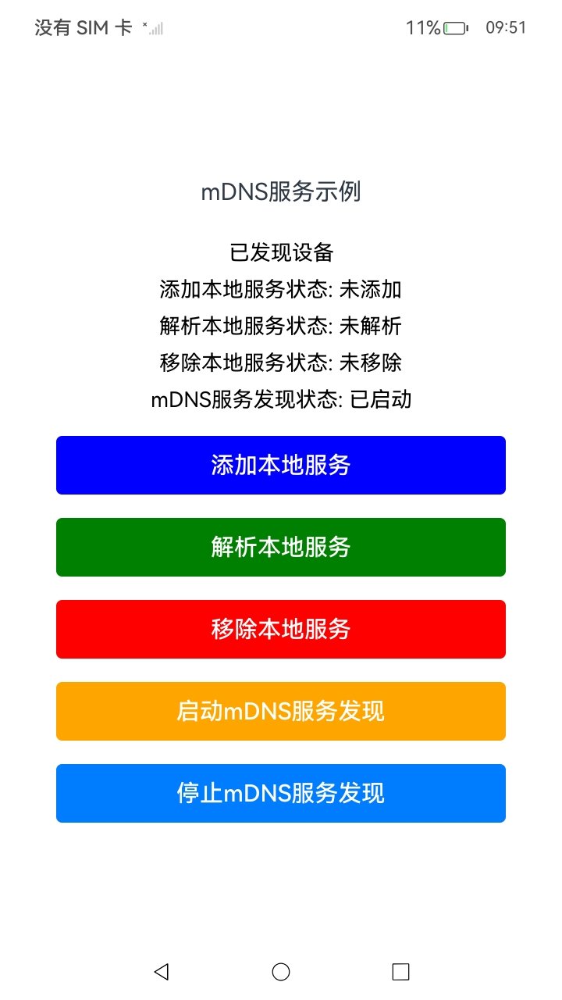
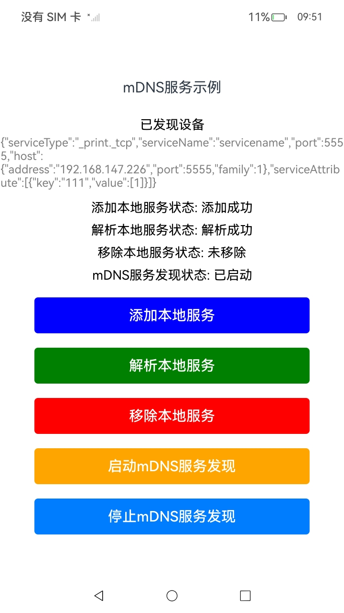
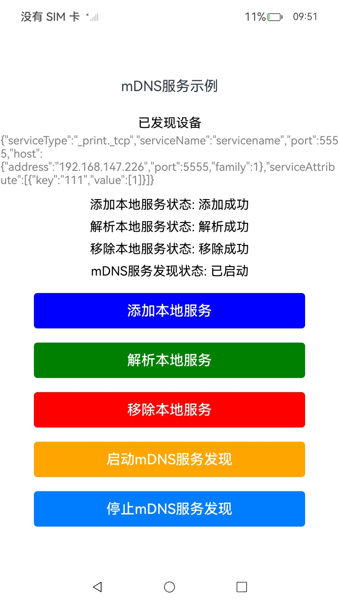

# MDNS管理

### 介绍

本项目的构建依据[MDNS](https://gitcode.com/openharmony/docs/blob/master/zh-cn/application-dev/network/net-mdns.md)示例代码,MDNS即多播DNS（Multicast DNS），提供局域网内的本地服务添加、移除、发现、解析等能力。

- 本地服务：局域网内服务的提供方，比如打印机、扫描器等。

MDNS管理的典型场景有：

- 管理本地服务，通过对本地服务的创建，删除和解析等管理本地服务。
- 发现本地服务，通过DiscoveryService对象，对指定类型的本地服务状态变化进行监听。

使用了[@ohos.net.mdns](https://gitcode.com/openharmony/docs/blob/master/zh-cn/application-dev/reference/apis-network-kit/js-apis-net-mdns.md)接口。

本应用支持在同一设备或不同设备的局域网环境中运行。在单一设备中，客户端可以注册本地服务，同时作为服务端发现局域网中的服务；在多设备环境下，一台设备充当客户端注册服务，另一台设备充当服务端进行服务发现。

### 效果预览

| 启动mDNS服务发现                                         | 添加本地服务                                  | 解析本地服务                                      | 移除本地服务                                     |
| -------------------------------------------------------- | --------------------------------------------- | ------------------------------------------------- | ------------------------------------------------ |
|  |  |  |  |

使用说明

1. 启动项目后，使用以下功能按钮：
   - **启动 mDNS 服务发现**：开始发现局域网内的服务。
   - **添加本地服务**：注册一个服务到局域网。
   - **解析本地服务**：解析并查看服务详细信息。
   - **移除本地服务**：取消注册本地服务。
   - **停止 mDNS 服务发现**：停止发现操作。


### 工程目录

```
entry/src/main/ets/
|---common
|	|---ComponentId.ets				   // 标识特定的服务状态或操作按钮
|   |---Logger.ets                     // 日志工具
|	|---ServiceOperateStatus.ets       // 标识特定的服务操作状态
|---entryability			
|   │---EntryAbility.ets
|---entrybackupability
│   |---EntryBackupAbility.ets      
|---pages
│   |---Index.ets                      // 主页
```

### 具体实现

1. **启动 mDNS 服务发现**

   - 使用 `mdns.createDiscoveryService(context, serviceType)` 创建一个 mDNS 服务发现对象 `discoveryService`。
   - 监听以下事件：
     - **`discoveryStart`**：服务发现启动事件，记录日志并输出服务发现已启动的信息。
     - **`discoveryStop`**：服务发现停止事件，记录日志并输出服务发现已停止的信息。
     - **`serviceFound`**：当发现新服务时触发，调用 `onServiceFound` 方法，解析服务并将信息添加到设备列表中。
     - **`serviceLost`**：当服务丢失时触发，调用 `onServiceLost` 方法，从设备列表中移除该服务。
   - 调用 `discoveryService.startSearchingMDNS()` 启动服务发现，若成功，更新 `discoveryStatus` 为 "已启动"。

2. **停止 mDNS 服务发现**

   - 使用 `discoveryService.stopSearchingMDNS()` 停止 mDNS 服务发现。
   - 停止后，移除以下事件监听：
     - **`discoveryStart`**
     - **`discoveryStop`**
     - **`serviceFound`**
     - **`serviceLost`**
   - 更新 `discoveryStatus` 为 "已停止"，确保 UI 显示正确状态。

3. **添加本地服务 (`addLocalService`)**

   - 调用 `mdns.addLocalService(context, localServiceInfo)` 注册本地服务。
   - 在服务添加成功时，更新状态为 "添加成功" 并记录成功日志信息。
   - 在服务添加失败时，捕获 `BusinessError`，更新状态为 "添加失败" 并记录错误日志。

4. **解析本地服务 (`resolveLocalService`)**

   - 调用 `mdns.resolveLocalService(context, localServiceInfo)` 解析指定服务信息。
   - 成功解析后，更新状态为 "解析成功"，并将解析到的服务信息添加到设备列表中。
   - 如果解析失败，捕获异常，更新状态为 "解析失败"，并输出详细错误信息。

5. **移除本地服务 (`removeLocalService`)**

   - 调用 `mdns.removeLocalService(context, localServiceInfo)` 取消注册本地服务。
   - 成功移除时，更新状态为 "移除成功"，记录日志并确认操作完成。
   - 移除失败时，捕获异常，更新状态为 "移除失败"，同时记录错误信息。

   

### 相关权限

无

### 依赖

不涉及。

### 约束与限制

1. 本示例仅支持标准系统上运行，支持设备：RK3568。
2. 本示例为Stage模型，支持API14版本SDK，版本号：5.0.2.58。
3. 本示例需要使用DevEco Studio Release（5.0.5.306）及以上版本才可编译运行。

### 下载

如需单独下载本工程，执行如下命令：

```
git init
git config core.sparsecheckout true
echo code/DocsSample/NetWork_Kit/NetWorkKit_Datatransmission/HTTP_case/ > .git/info/sparse-checkout
git remote add origin https://gitcode.com/openharmony/applications_app_samples.git
git pull origin master
```