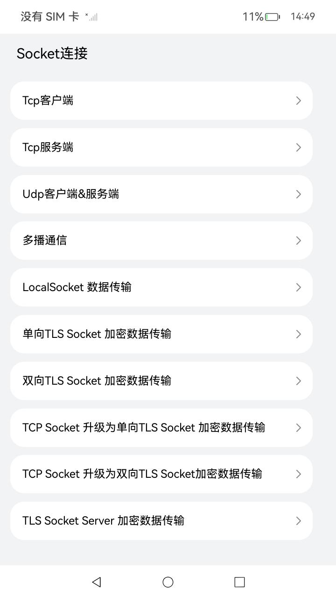
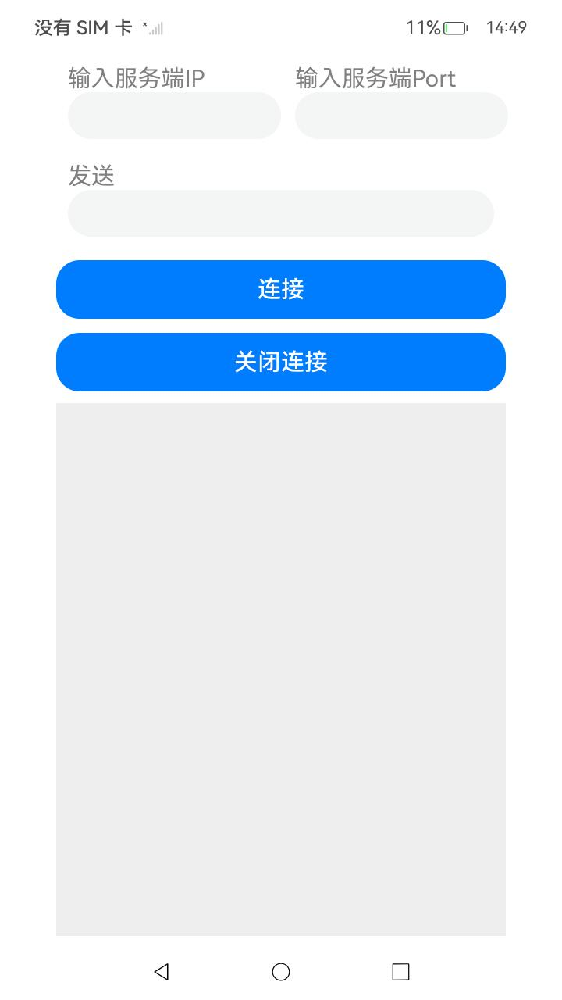
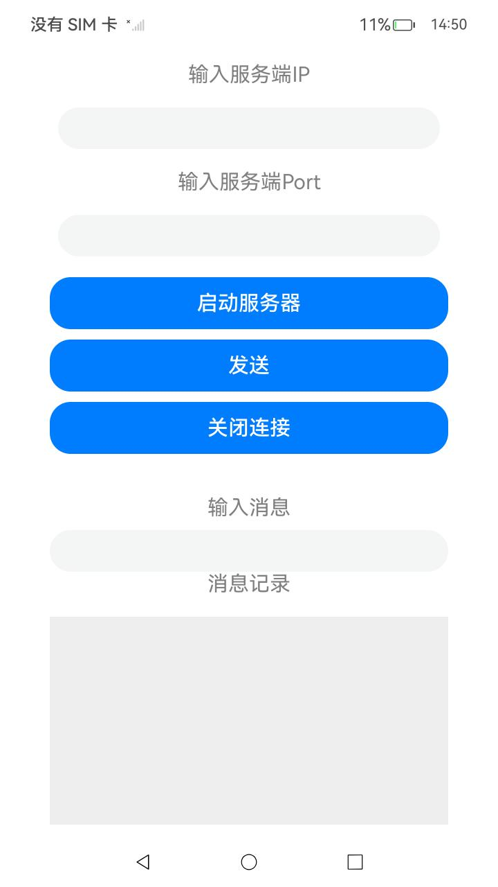
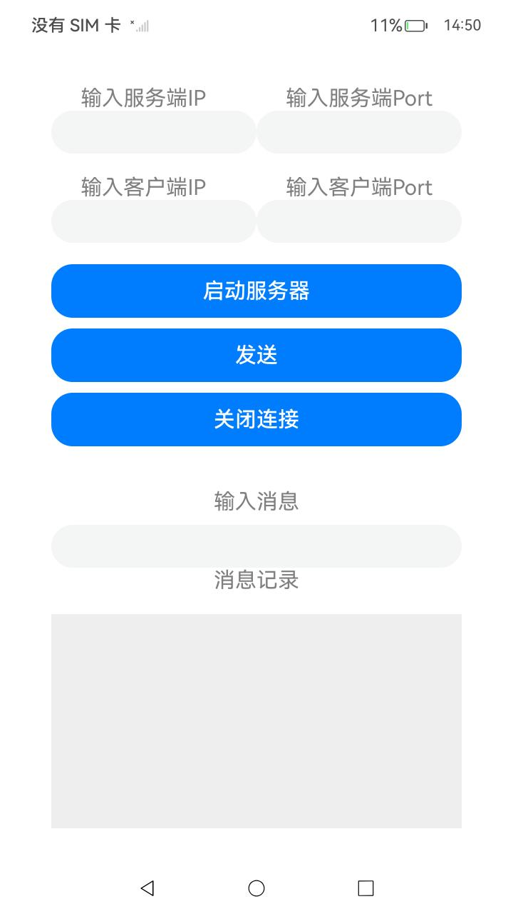

#  Socket 连接

### 介绍

本示例依据指南《开发->系统->网络->Network Kit》（网络服务->Network Kit数据传输能力->[Socket连接](https://gitee.com/openharmony/docs/blob/OpenHarmony-5.0.1-Release/zh-cn/application-dev/network/socket-connection.md)）进行编写。

Socket 连接主要是通过 Socket 进行数据传输，支持 TCP/UDP/Multicast/TLS 协议。

主要场景有：

- 应用作为TCP客户端进行数据传输

- 应用作为TCP服务端进行数据传输

- 应用作为UDP客户端&服务端进行数据传输

- 应用通过 Multicast Socket 进行数据传输

- 应用通过 Local Socket进行数据传输

- 应用通过 Local Socket Server 进行数据传输

- 应用通过 单向 TLS Socket 进行加密数据传输

- 应用通过 双向 TLS Socket 进行加密数据传输

- 应用通过将 TCP Socket 升级为 单向TLS Socket 进行加密数据传输

- 应用通过将 TCP Socket 升级为 双向TLS Socket 进行加密数据传输

- 应用通过 TLS Socket Server 进行加密数据传输

  

### 效果预览

| 主界面                              | TCP客户端                            | TCP服务端                            | UDP                            |
| ----------------------------------- | ------------------------------------ | ------------------------------------ | ------------------------------ |
|  |  |  |  |

使用说明

注：以下所有端口号默认为5555

1. Tcp客户端使用说明

   （1）需要程序启动端设备与服务端设备连接同一个热点

   （2）在服务端启动Readme同路径下的Tools（以下简称为Tools）中的Tcp_Server.py（需要在脚本中加入服务端的实际IP地址）

   （3）后启动程序作为客户端，输入服务端IP与Port以及Message，点击Connect即可连接并发送

2. Tcp服务端使用说明

   （1）需要程序启动端设备与服务端设备连接同一个热点

   （2）启动程序作为服务端，输入本地IP与Port

   （3）在另一台设备上启动Tools中的Tcp_Client.py

   （4）后去可以进行发送消息和断开连接等操作

3. Udp使用说明

   （1）需要程序启动端设备与服务端设备连接同一个热点

   （2）该功能既可作为客户端又可作为服务端，需要输入本地IP和Port，再点击Start Server，即可启动消息监听，后续选择通信对方的的IP和Port，即可发送消息

4. 多播通信使用说明

   点击按钮，即可加入到多播组并发送消息

5. Local数据传输

   点击首个按钮启动LocalSocketServer，点击次按钮启动LocalSocket客户端对象

6. 单向TLSSocket加密数据传输使用说明

   详情请参阅Tools/建立TLS单向与双向认证流程文档_zh.md

7. 双向TLSSocket加密数据传输使用说明

   详情请参阅Tools/建立TLS单向与双向认证流程文档_zh.md

8. TcpSocket升级为单向TLS Socket加密数据传输使用说明

   详情请参阅Tools/建立TLS单向与双向认证流程文档_zh.md

9. TcpSocket升级为双向TLSSocket加密数据传输使用说明

   详情请参阅Tools/建立TLS单向与双向认证流程文档_zh.md

10. TLSSocketServer加密数据传输使用说明
    详情请参阅Tools/建立TLS单向与双向认证流程文档_zh.md

### 工程目录

```
entry/src/main/
│---common
|   |---Logger.ets			// 日志组件
|---components
|   |---TitleBar.ets			// 标题栏组件
|---connect
|   |---LocalSocket.ets			// Local数据传输
|   |---Multicast.ets			// 多播通信
|   |---OneWayTls.ets			// 单向TLSSocket加密数据传输
|   |---Tcp2OneWayTls.ets			// TcpSocket升级为单向TLS Socket加密数据传输
|   |---Tcp2TwoWayTls.ets			// TcpSocket升级为双向TLSSocket加密数据传输
|   |---TcpClient.ets			// Tcp客户端
|   |---TcpServer.ets			// Tcp服务端
|   |---TlsServer.ets			// Tls服务端
|   |---TwoWayTls.ets			// 双向TLSSocket加密数据传输
|   |---UdpClient_Server.ets			// Udp客户端、服务端
|---entryability
|   │---EntryAbility.ets
|---entrybackupability
│   |---EntryBackupAbility.ets      
|---pages
│   |---Index.ets           // 主页
|---workers
|   |---LocalSocketWorker.ets			// Local数据传输——Worker线程部分
|   |---MulticastWorker.ets			// 多播通信——Worker线程部分
|   |---OneWayTlsWorker.ets			// 单向TLSSocket加密数据传输——Worker线程部分
|   |---Tcp2OneWayTlsWorker.ets			// TcpSocket升级为单向TLS Socket加密数据传输——Worker线程部分
|   |---Tcp2TwoWayTlsWorker.ets			// TcpSocket升级为双向TLSSocket加密数据传输——Worker线程部分
|   |---TcpClientWorker.ets			// Tcp客户端——Worker线程部分
|   |---TcpServerWorker.ets			// Tcp服务端——Worker线程部分
|   |---TlsServerWorker.ets			// Tls服务端——Worker线程部分
|   |---TwoWayTlsWorker.ets			// 双向TLSSocket加密数据传输——Worker线程部分
|   |---UdpWorker.ets			// Udp客户端、服务端——Worker线程部分
```

### 具体实现

**TCP 客户端实现：**

- 创建一个 TCP 套接字，绑定本地 IP 地址与端口，并连接至目标服务端。
- 发送数据至服务端，并接收来自服务端的响应消息。
- 在连接使用完毕后，主动关闭套接字连接。

**TCP 服务端实现：**

- 创建一个 TCP 服务端套接字，绑定本地 IP 地址与端口，开始监听客户端连接。
- 接收到客户端连接后，使用一个 `TCPSocketConnection` 与客户端进行数据交换。
- 接收来自客户端的数据，并向客户端发送响应数据。
- 处理客户端的消息事件，并在通信结束后关闭连接。

**UDP 客户端与服务端实现：**

- 在 UDP 中，应用程序可同时作为客户端与服务端，使用相同的端口进行通信。
- 启动 UDP 服务，绑定本地 IP 地址与端口，进行消息监听。
- 发送消息至目标地址与端口，等待接收消息。

**多播通信：**

- 创建多播套接字并加入指定的多播组，开启对消息的监听。
- 发送消息到多播组，组内所有的成员设备都会收到该消息。
- 在使用完毕后，退出多播组并关闭消息监听。

**Local Socket 数据传输：**

- 创建 Local Socket 客户端与服务端，支持同一设备内的进程间通信。
- 服务端通过 `LocalSocketServer` 监听本地套接字，接收客户端的连接请求。
- 客户端通过 `LocalSocket` 连接服务端，发送数据并接收来自服务端的响应。

**TLS 协议加密数据传输：**

- 支持单向和双向 TLS 认证，通过 `TLSSocket` 与服务端建立安全连接。
- 在客户端与服务端之间建立安全的加密连接后，进行数据传输。
- 可选择双向认证，通过提供客户端和服务器的证书实现双向认证。

**TCP 升级为 TLS Socket：**

- 在 TCP 连接建立之后，可以将 TCP 套接字升级为 TLS 套接字，从而实现数据的加密传输。
- 配置 TLS 安全选项，包含证书、私钥以及 CA 证书等信息。

**TLS Socket 服务端：**

- 创建 TLS 服务端，监听指定端口，等待客户端的连接。
- 一旦客户端连接成功，使用 TLS 套接字进行加密通信。

### 相关权限

[ohos.permission.INTERNET](https://gitee.com/openharmony/docs/blob/OpenHarmony-5.0.1-Release/zh-cn/application-dev/security/AccessToken/permissions-for-all.md#ohospermissioninternet)

[ ohos.permission.GET_WIFI_INFO](https://gitee.com/openharmony/docs/blob/OpenHarmony-5.0.1-Release/zh-cn/application-dev/security/AccessToken/permissions-for-all.md#ohospermissionget_wifi_info)

### 依赖

不涉及。

### 约束与限制

1. 本示例仅支持标准系统上运行，支持设备：RK3568。

2. 本示例为Stage模型，支持API14版本SDK，版本号：5.0.2.58。

3. 本示例需要使用DevEco Studio Release（5.0.5.306）及以上版本才可编译运行。

4. 本示例需要设备联网使用。

5. 本示例涉及的多个接口需在服务端设备与客户端设备连接至同一热点的前提下运行。


### 下载

如需单独下载本工程，执行如下命令：

```
git init
git config core.sparsecheckout true
echo code/DocsSample/NetWork_Kit/NetWorkKit_Datatransmission/Socket > .git/info/sparse-checkout
git remote add origin https://gitee.com/openharmony/applications_app_samples.git
git pull origin master
```