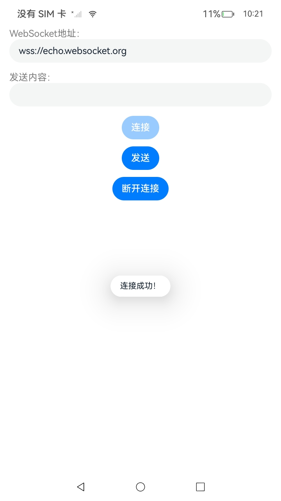
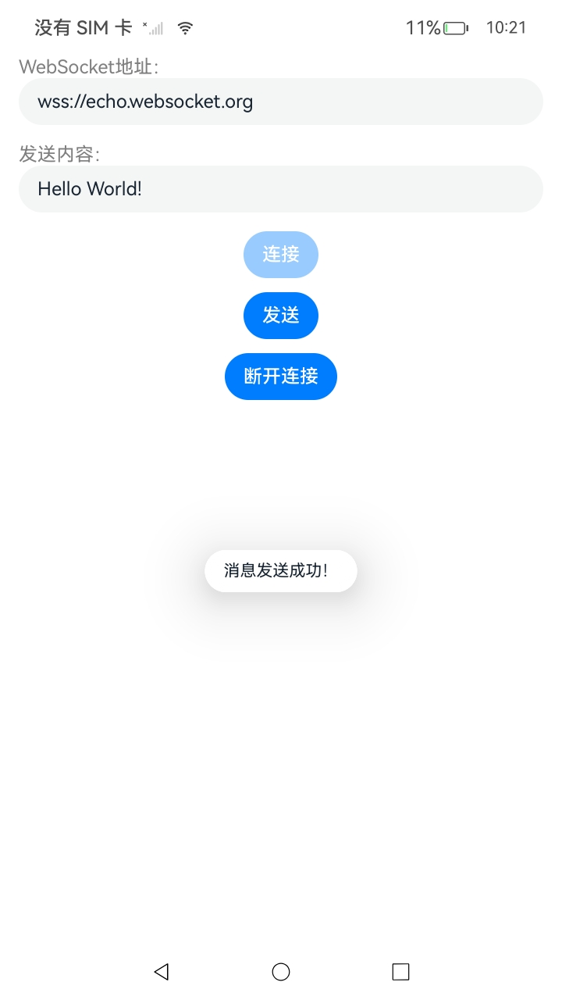
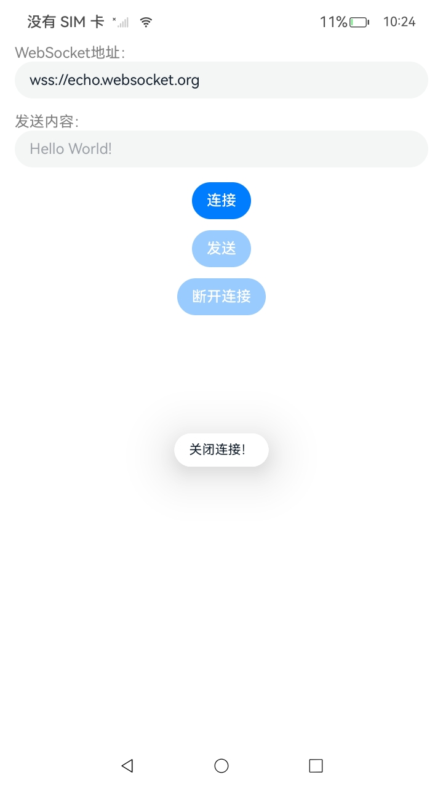

# WebSocket连接（C/C++）

### 介绍

本示例依照指南 开发->系统->网络->Network Kit（网络服务->Network Kit数据传输能力->[WebSocket连接（C/C++）](https://gitee.com/openharmony/docs/blob/OpenHarmony-5.0.1-Release/zh-cn/application-dev/network/native-websocket-guidelines.md)进行编写。
本示例主要展示了WebSocket模块可以建立服务器与客户端的双向连接的相关基础功能。通过在源文件中将相关接口封装，再在ArkTS层对封装的接口进行调用，以实现建立与WebSocket服务器的连接、发送消息给WebSocket服务器、关闭WebSocket连接。

### 效果预览

| 程序主页                                    | 连接成功                                      | 发送消息                                   | 断开连接                                  |
| ------------------------------------------- | --------------------------------------------- | ------------------------------------------ | ----------------------------------------- |
|  |  |  |  |

使用说明：

1. 在URL输入框中，输入`ws://`或`wss://`开头的WebSocket URL，点击连接按钮进行连接。
2. 在发送内容输入框里输入要发送给服务器的内容，点击发送按钮发送。
3. 点击关闭按钮，WebSocket连接断开，可以重新输入新的WebSocket URL。

### 工程目录

```
entry/src/main/
│ 
│---cpp
│   │  CMakeLists.txt    
│   │  napi_init.cpp     // 链接层
│   │
│   └─types
│       └─libentry
│            Index.d.ts
│            oh-package.json5
|
|---entryability
|   │---EntryAbility.ets
|---entrybackupability
│   |---EntryBackupAbility.ets      
|---pages
│   |---Index.ets           // 主页
```

### 具体实现

1. 配置`CMakeLists.txt`，本模块需要用到的共享库是`libnet_websocket.so`。
2. 编写调用该API的代码，接受ArkTS传递过来的url字符串参数，创建WebSocket对象指针后，检查连接到服务器是否成功。
3. WebSocket连接通过 `testWebsocket.Connect(this.wsUrl)` 方法发起，默认连接到 `ws://echo.websocket.org`
4. 消息发送使用`testWebsocket.Send(this.content)`。
5. 断开连接使用`testWebsocket.Close()`关闭 WebSocket 连接。

### 相关权限

[ohos.permission.INTERNET](https://gitee.com/openharmony/docs/blob/OpenHarmony-5.0.1-Release/zh-cn/application-dev/security/AccessToken/permissions-for-all.md#ohospermissioninternet)

### 依赖

不涉及。

### 约束与限制

1. 本示例仅支持标准系统上运行，支持设备：RK3568。

2. 本示例为Stage模型，支持API14版本SDK，版本号：5.0.2.58。

3. 本示例需要使用DevEco Studio Release（5.0.5.306）及以上版本才可编译运行。

4. 本示例需要设备联网使用。


### 下载

如需单独下载本工程，执行如下命令：

```
git init
git config core.sparsecheckout true
echo code/DocsSample/NetWork_Kit/NetWorkKit_Datatransmission/WebSocket_C > .git/info/sparse-checkout
git remote add origin https://gitee.com/openharmony/applications_app_samples.git
git pull origin master
```
