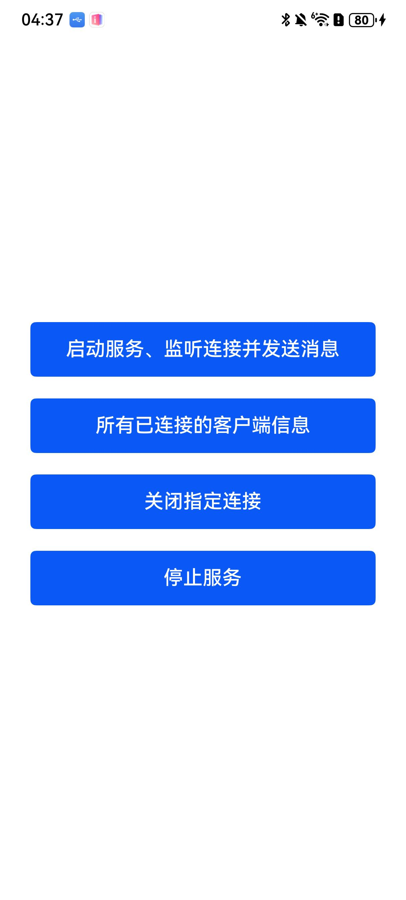

# WebSocketServer连接

### 介绍

本示例依照指南 开发->系统->网络->Network Kit（网络服务）->[使用WebSocket访问网络](https://gitcode.com/openharmony/docs/blob/master/zh-cn/application-dev/network/websocket-connection.md) 进行编写。使用WebSocket建立服务器与客户端的双向连接，需要先通过createWebSocketServer()方法创建WebSocketServer对象，然后通过start()方法启动服务器，监听客户端申请建链的消息。当连接成功后，服务端会收到connect事件的回调，之后服务端可以通过send()方法与客户端进行通信，可以通过listAllConnections()方法列举出当前与服务端建链的所有客户端信息。当客户端给服务端发消息时，服务端会收到messageReceive事件回调。当服务端想断开某个与客户端的连接时，可以通过调用close()方法主动断开与某个客户端的连接，之后服务端会收到close事件的回调。当服务端想停止service时，可以调用stop()方法。若在上述任一过程中发生错误，服务端会收到error事件的回调。本项目展示了一个WebSocketServer连接的示例应用，它实现了通过按钮创建一个WebSocketServer连接、发送消息、断开连接的功能，使用了[@ohos.net.webSocket](https://gitcode.com/openharmony/docs/blob/master/zh-cn/application-dev/reference/apis-network-kit/js-apis-webSocket.md)接口。

### 效果预览

| 程序界面                                                       |
|--------------------------------------------------------------|
|  |

使用说明

1. 点击“启动服务、监听连接并发送消息”按钮时，应用程序尝试连接到 WebSocket Server。

   若连接成功，显示 `message send successfully`。

   若连接失败，显示 `message send failed`。

2. 点击“所有已连接的客户信息”按钮时，应用程序获取所有已连接的客户信息。

   发送结果会显示在 UI 上，若发送成功，显示`client list`，若发送失败，显示 `Failed to listAllConnections`。

3. 点击“关闭指定连接”按钮时，应用程序会关闭与 WebSocket Server的连接。

   若关闭连接成功，显示 `close client connections success`，否则显示 `close client connections fail`。

4. 点击“停止服务”按钮时，应用程序会停止与 WebSocket Server的连接。

   若停止连接成功，显示 `server stop service successfully`，否则显示 `server stop service failed`。

### 工程目录

```
entry/src/main/ets/
|---common
|   |---Logger.ts                     // 日志工具
|---entryability
|   │---EntryAbility.ets
|---entrybackupability
│   |---EntryBackupAbility.ets      
|---pages
│   |---Index.ets           // 主页
```

### 具体实现

1.启动服务、监听连接并发送消息

- 使用 `@kit.NetworkKit` 提供的 `WebSocketServer` 对象创建 WebSocketServer 连接。
- 使用 `on('connect')` 监听连接成功事件，`on('close')` 监听连接关闭事件，`on('error')` 监听连接错误事件。
- 连接通过 `connect()` 方法发起，默认连接到 `ws://echo.websocket.org`。

2. 所有已连接的客户信息

- 使用 `listAllConnections()` 获取所有客户端的信息。
- 发送成功后，更新 UI 显示“client list 客户端的信息”。
- 发送失败后，更新 UI 显示“Failed to listAllConnections”。

3. 关闭指定连接

- 使用 `close()` 关闭 WebSocketServer 连接。
- 关闭成功后，更新 UI 显示“close client connections success”。
- 关闭失败时，显示“close client connections fail”。

4. 停止服务

- 使用 `stop()` 停止 WebSocketServer 连接。
- 停止成功后，更新 UI 显示“server stop service successfully”。
- 停止失败时，显示“server stop service failed”。

### 相关权限

[ohos.permission.INTERNET](https://gitcode.com/openharmony/docs/blob/master/zh-cn/application-dev/security/AccessToken/permissions-for-all.md#ohospermissioninternet)

### 依赖

不涉及。

### 约束与限制

1. 本示例仅支持标准系统上运行，支持设备：RK3568。
2. 本示例为Stage模型，支持API19版本SDK。
3. 本示例需要使用DevEco Studio Release（5.0.5.306）及以上版本才可编译运行。
4. 本示例需要设备联网使用。

### 下载

如需单独下载本工程，执行如下命令：

```
git init
git config core.sparsecheckout true
echo code/DocsSample/NetWork_Kit/NetWorkKit_Datatransmission/WebSocket_server_case/ > .git/info/sparse-checkout
git remote add origin https://gitcode.com/openharmony/applications_app_samples.git
git pull origin master
```