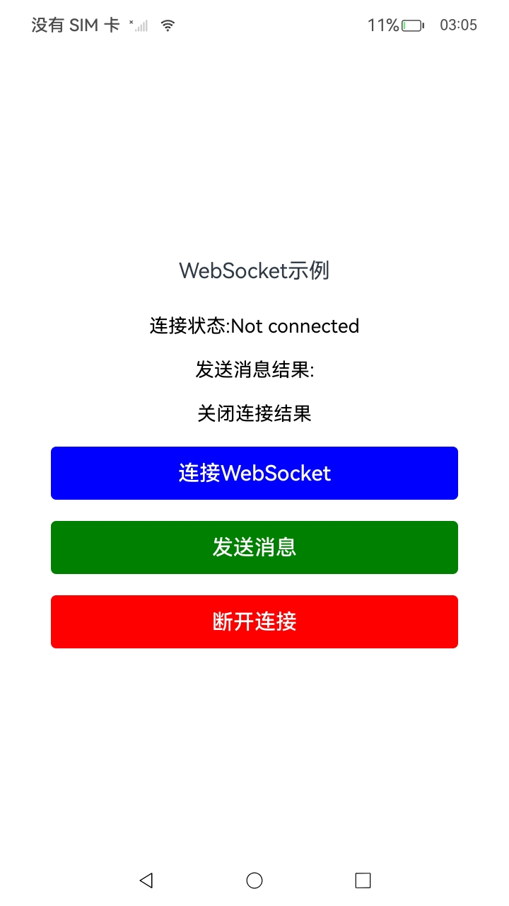
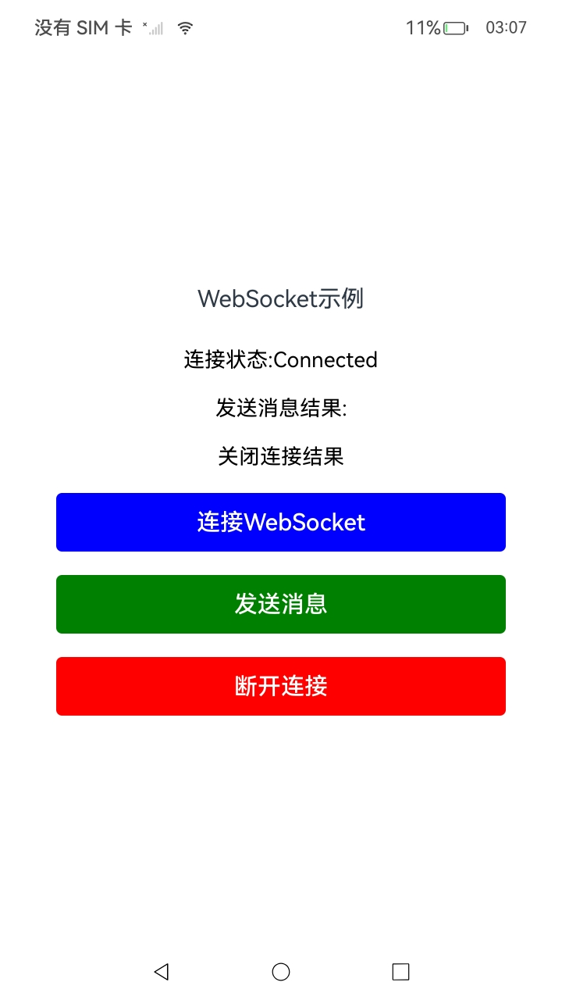
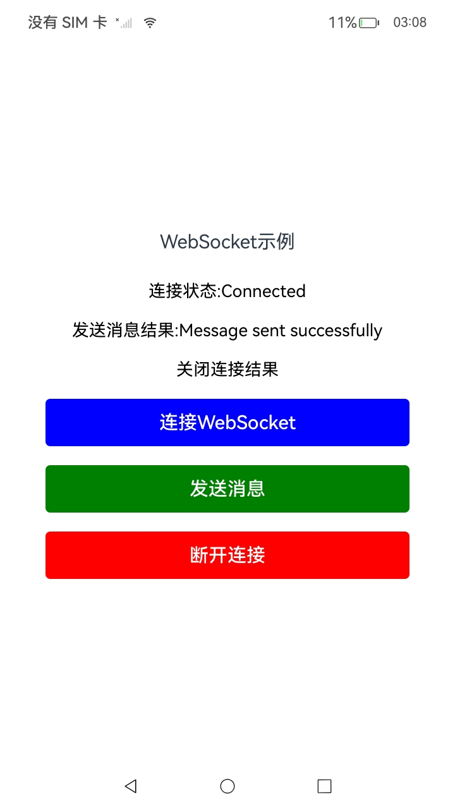
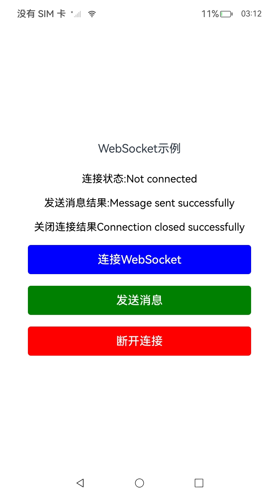

# WebSocket连接

### 介绍

本示例依照指南 开发->系统->网络->Network Kit（网络服务->Network Kit数据传输能力->[WebSocket连接（C/C++）](https://gitee.com/openharmony/docs/blob/OpenHarmony-5.0.1-Release/zh-cn/application-dev/network/native-websocket-guidelines.md)进行编写。使用WebSocket建立服务器与客户端的双向连接，需要先通过createWebSocket()方法创建WebSocket对象，然后通过connect()方法连接到服务器。当连接成功后，客户端会收到open事件的回调，之后客户端就可以通过send()方法与服务器进行通信。当服务器发信息给客户端时，客户端会收到message事件的回调。当客户端不要此连接时，可以通过调用close()方法主动断开连接，之后客户端会收到close事件的回调。本项目展示了一个WebSocket连接的示例应用，它实现了通过按钮创建一个WebSocket连接、发送消息、断开连接的功能，使用了[@ohos.net.webSocket](https://gitee.com/openharmony/docs/blob/OpenHarmony-5.0.1-Release/zh-cn/application-dev/reference/apis-network-kit/js-apis-net-connection.md)接口。

### 效果预览

| 程序启动                                                     | 连接成功                                                   | 发送消息                                                | 断开连接                                                  |
| ------------------------------------------------------------ | ---------------------------------------------------------- | ------------------------------------------------------- | --------------------------------------------------------- |
|  |  |  |  |

使用说明

1. 点击“连接 WebSocket”按钮时，应用程序尝试连接到 WebSocket 服务器（默认为 `ws://echo.websocket.org`）。

   若连接成功，显示 `Connected`，并记录日志。

   若连接失败，显示 `Connection failed`，并记录错误日志。

2. 点击“发送消息”按钮时，应用程序通过 WebSocket 连接发送一条消息（默认为 `Hello, WebSocket!`）。

   发送结果会显示在 UI 上，若发送成功，显示 `Message sent successfully`，若发送失败，显示 `Message sending failed`。

3. 点击“断开连接”按钮时，应用程序会关闭与 WebSocket 服务器的连接。

   若关闭连接成功，显示 `Connection closed successfully`，否则显示 `Connection closing failed`。

### 工程目录

```
entry/src/main/ets/
|---common
|   |---Logger.ts                     // 日志工具
|---entryability
|   │---EntryAbility.ets
|---entrybackupability
│   |---EntryBackupAbility.ets      
|---pages
│   |---Index.ets           // 主页
```

### 具体实现

1.WebSocket 连接

- 使用 `@kit.NetworkKit` 提供的 `webSocket` 对象创建 WebSocket 连接。
- 使用 `ws.on('open')` 监听连接成功事件，`ws.on('close')` 监听连接关闭事件，`ws.on('error')` 监听连接错误事件。
- 连接通过 `ws.connect()` 方法发起，默认连接到 `ws://echo.websocket.org`。

2. 消息发送

- 使用 `ws.send()` 发送消息。
- 发送成功后，通过 `sendMessageResult` 状态更新 UI，显示“Message sent successfully”。
- 发送失败后，更新 UI 显示“Message sending failed”。

3. 断开连接

- 使用 `ws.close()` 关闭 WebSocket 连接。
- 关闭成功后，更新 UI 显示“Connection closed successfully”，并重置连接状态为“Not connected”。
- 关闭失败时，显示“Connection closing failed”。

### 相关权限

[ohos.permission.INTERNET](https://gitee.com/openharmony/docs/blob/OpenHarmony-5.0.1-Release/zh-cn/application-dev/security/AccessToken/permissions-for-all.md#ohospermissioninternet)

### 依赖

不涉及。

### 约束与限制

1. 本示例仅支持标准系统上运行，支持设备：RK3568。
2. 本示例为Stage模型，支持API14版本SDK，版本号：5.0.2.58。
3. 本示例需要使用DevEco Studio Release（5.0.5.306）及以上版本才可编译运行。
4. 本示例需要设备联网使用。

### 下载

如需单独下载本工程，执行如下命令：

```
git init
git config core.sparsecheckout true
echo code/DocsSample/NetWork_Kit/NetWorkKit_Datatransmission/WebSocket_case/ > .git/info/sparse-checkout
git remote add origin https://gitee.com/openharmony/applications_app_samples.git
git pull origin master
```