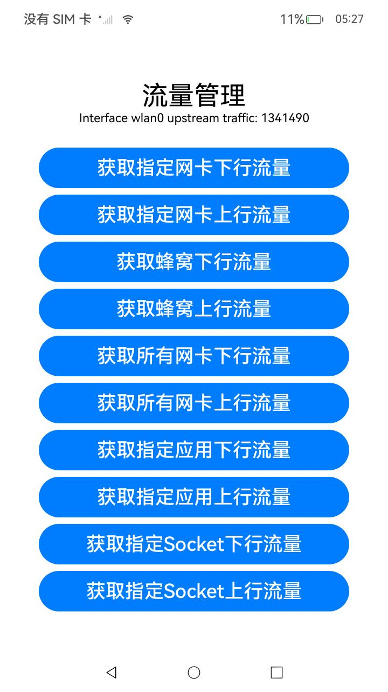

#  流量管理

### 介绍

本示例依照指南 开发->系统->网络->Network Kit（网络服务->Network Kit数据传输能力->[流量管理](https://gitee.com/openharmony/docs/blob/OpenHarmony-5.0.1-Release/zh-cn/application-dev/network/net-statistics.md)进行编写，在此调用了示例中的所有非系统接口部分。

流量管理提供了基于物理网络的数据流量统计能力，支持基于网卡/UID 的流量统计。

流量管理主要实现功能有：

- 支持基于网卡/UID 的实时流量统计。
- 支持基于网卡/UID 的历史流量统计。
- 支持基于网卡/UID 的流量变化订阅。 

**注意：**1.获取蜂窝流量接口（getCellularRxBytes、getCellularTxBytes）需要设备插入sim卡使用。

​	    2.指定应用相关接口（getUidRxBytes、getUidTxBytes）需要指定有流量开销的应用。

​	    3.指定Socket相关接口（getSockfdRxBytes、getSockfdTxBytes）需要传入一个有效socket，代码中的实例仅供参考。

### 效果预览

| 获取指定网卡下行流量                                 | 获取指定网卡上行流量                               | 获取所有网卡下行流量                                     | 获取所有网卡上行流量                                   |
| ---------------------------------------------------- | -------------------------------------------------- | -------------------------------------------------------- | ------------------------------------------------------ |
|  |  |  |  |

使用说明

1. 点击按钮调用指定接口。

2. 接口调用结果在程序上方显示。


### 工程目录

```
entry/src/main/ets/
|---common
|   |---Logger.ts                     // 日志工具
|---entryability
|   │---EntryAbility.ets
|---entrybackupability
│   |---EntryBackupAbility.ets
|---filemanager
|	|---GetRealtimeStats.ets		  // 实时流量统计接口	
|---pages
│   |---Index.ets          			  // 主页
```

### 具体实现

- **获取指定网卡实时下行流量数据**
  使用 `statistics.getIfaceRxBytes(IFACE)` 获取指定网络接口（如 `wlan0`）的实时下行流量数据。
- **获取指定网卡实时上行流量数据**
  使用 `statistics.getIfaceTxBytes(IFACE)` 获取指定网络接口的实时上行流量数据。
- **获取蜂窝网络实时下行流量数据**
  使用 `statistics.getCellularRxBytes()` 获取蜂窝网络的实时下行流量数据。
- **获取蜂窝网络实时上行流量数据**
  使用 `statistics.getCellularTxBytes()` 获取蜂窝网络的实时上行流量数据。
- **获取所有网卡实时下行流量数据**
  使用 `statistics.getAllRxBytes()` 获取所有网卡的实时下行流量数据。
- **获取所有网卡实时上行流量数据**
  使用 `statistics.getAllTxBytes()` 获取所有网卡的实时上行流量数据。

- **获取指定应用实时下行流量数据**
  使用 `statistics.getUidRxBytes(UID)` 获取指定应用（通过 `UID` 获取）的实时下行流量数据。
- **获取指定应用实时上行流量数据**
  使用 `statistics.getUidTxBytes(UID)` 获取指定应用的实时上行流量数据。

- **获取指定 Socket 实时下行流量数据**
  使用 `statistics.getSockfdRxBytes(sockfd)` 获取指定 socket 文件描述符的实时下行流量数据。
- **获取指定 Socket 实时上行流量数据**
  使用 `statistics.getSockfdTxBytes(sockfd)` 获取指定 socket 文件描述符的实时上行流量数据。

### 相关权限

[ohos.permission.INTERNET](https://gitee.com/openharmony/docs/blob/OpenHarmony-5.0.1-Release/zh-cn/application-dev/security/AccessToken/permissions-for-all.md#ohospermissioninternet)

[ohos.permission.GET_NETWORK_INFO](https://gitee.com/openharmony/docs/blob/OpenHarmony-5.0.1-Release/zh-cn/application-dev/security/AccessToken/permissions-for-all.md#ohospermissionget_network_info)

### 依赖

不涉及。

### 约束与限制

1. 本示例仅支持标准系统上运行，支持设备：RK3568。
2. 本示例为Stage模型，支持API14版本SDK，版本号：5.0.2.58。
3. 本示例需要使用DevEco Studio Release（5.0.5.306）及以上版本才可编译运行。
4. 本示例需要设备联网使用。

### 下载

如需单独下载本工程，执行如下命令：

```
git init
git config core.sparsecheckout true
echo code/DocsSample/NetWork_Kit/NetWorkKit_NetManager/FlowManagement_case/ > .git/info/sparse-checkout
git remote add origin https://gitee.com/openharmony/applications_app_samples.git
git pull origin master
```