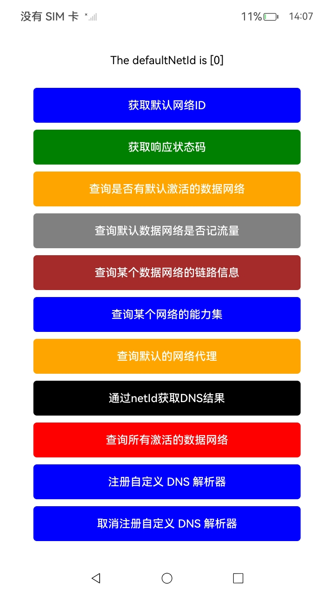
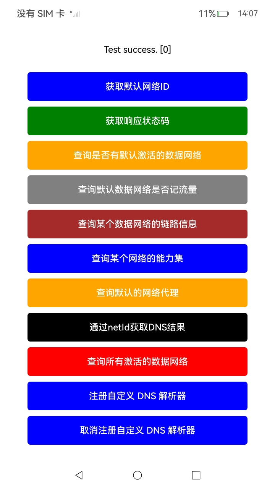
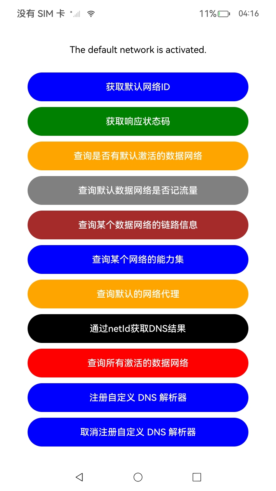
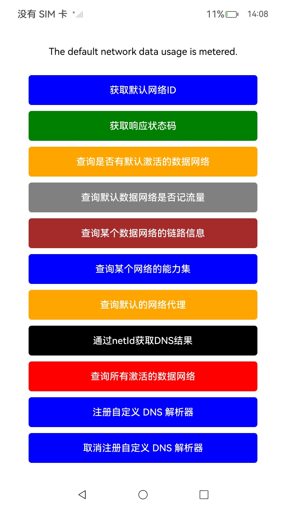

#  NetConnection开发指导

### 介绍

本示例参考OpenHarmony官方文档中的网络服务部分（网络服务->Network Kit数据传输能力->[NetConnection开发指导](https://gitee.com/openharmony/docs/blob/OpenHarmony-5.0.1-Release/zh-cn/application-dev/network/native-websocket-guidelines.md)）进行编写。项目中的前两个按钮所调用的接口对应于《NetConnection开发指导》中的内容，而后续按钮则调用了[NetConnection](https://gitee.com/openharmony/docs/blob/OpenHarmony-5.0.1-Release/zh-cn/application-dev/reference/apis-network-kit/_net_connection.md)中的其他网络接口。

本示例旨在展示`NetConnection`模块中常用的网络信息查询功能。通过创建一个Native C++工程，我们首先在源代码中封装相关接口，随后在ArkTS层调用这些封装接口，从而实现对`NetConnection`中部分接口的调用。

**注意**：由于部分接口需要提供有效的NetID进行调用，可能会出现调用失败的情况。该示例的主要目的是指导用户如何进行接口调用，某些接口的正常调用条件较为复杂，涉及到的对象和环境配置未完全构建，因此部分接口可能无法正常执行。

### 效果预览

| 获取默认网络ID                          | 获取响应状态码                       | 查询是否有激活的的数据网络                 | 查询默认网络是否记流量                           |
| --------------------------------------- | ------------------------------------ | ------------------------------------------ | ------------------------------------------------ |
|  |  |  |  |

使用说明

1. 点击相应的按钮调取相应接口。
2. 相关接口的调用结果会在屏幕上方显示。

### 工程目录

```
entry/src/main/
│ 
│---cpp
│   │---CMakeLists.txt    
│   │---napi_init.cpp     // 链接层
│   └---types
│       |---libentry
│       |---Index.d.ts
│       |---oh-package.json5
|
|---entryability
|   │---EntryAbility.ets
|---entrybackupability
│   |---EntryBackupAbility.ets      
|---pages
│   |---Index.ets           // 主页
```

### 具体实现

1. 配置`CMakeLists.txt`，本模块需要用到的共享库是`libnet_connection.so`。
2. 在 C++ 层封装对 `NetConnection` API 的调用。
3. 在 ArkTS 层通过调用封装的接口获取相应的网络信息。
4. 提供多种网络相关功能：获取默认网络、检查默认网络状态、获取网络编号等。

### 相关权限

[ohos.permission.INTERNET](https://gitee.com/openharmony/docs/blob/OpenHarmony-5.0.1-Release/zh-cn/application-dev/security/AccessToken/permissions-for-all.md#ohospermissioninternet)

[ohos.permission.GET_NETWORK_INFO](https://gitee.com/openharmony/docs/blob/OpenHarmony-5.0.1-Release/zh-cn/application-dev/security/AccessToken/permissions-for-all.md#ohospermissionget_network_info)

### 依赖

不涉及。

### 约束与限制

1. 本示例仅支持标准系统上运行，支持设备：RK3568。

2. 本示例为Stage模型，支持API14版本SDK，版本号：5.0.2。

3. 本示例需要使用DevEco Studio Release（5.0.5.306）及以上版本才可编译运行。

4. 本示例需要设备联网使用。


### 下载

如需单独下载本工程，执行如下命令：

```
git init
git config core.sparsecheckout true
echo code/DocsSample/NetWork_Kit/NetWorkKit_NetManager/NetConnection_Exploitation_case > .git/info/sparse-checkout
git remote add origin https://gitee.com/openharmony/applications_app_samples.git
git pull origin master
```
