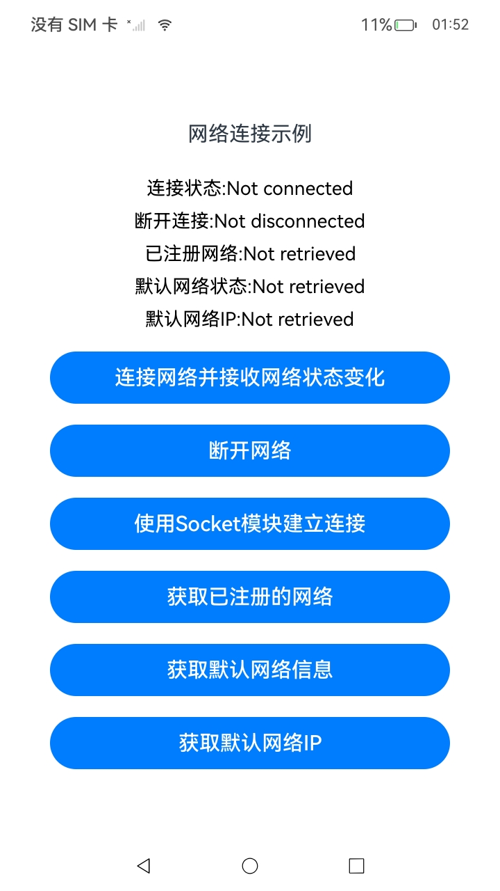
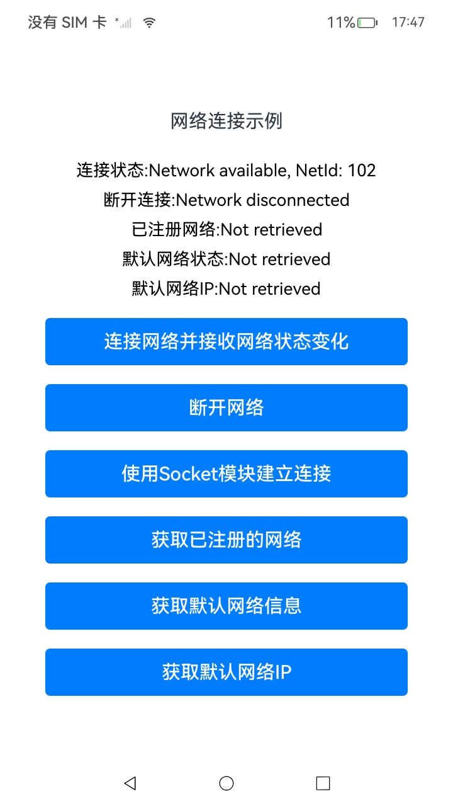
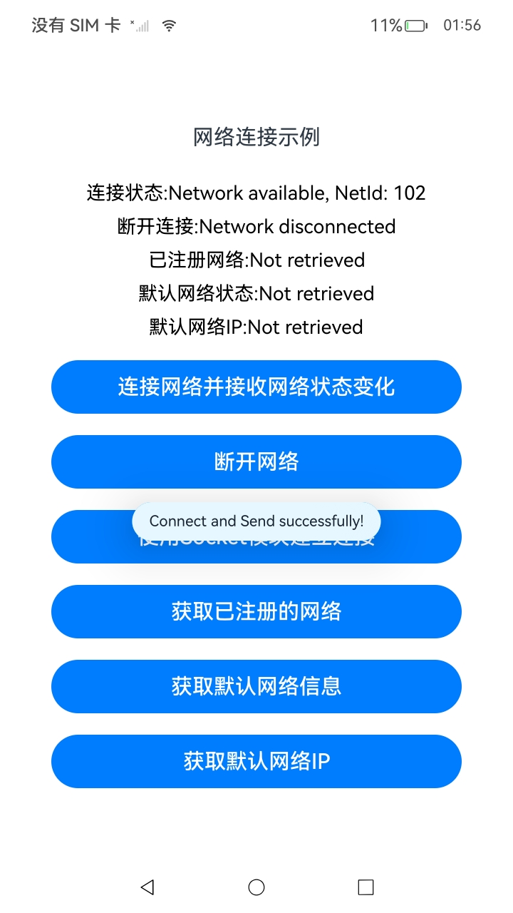
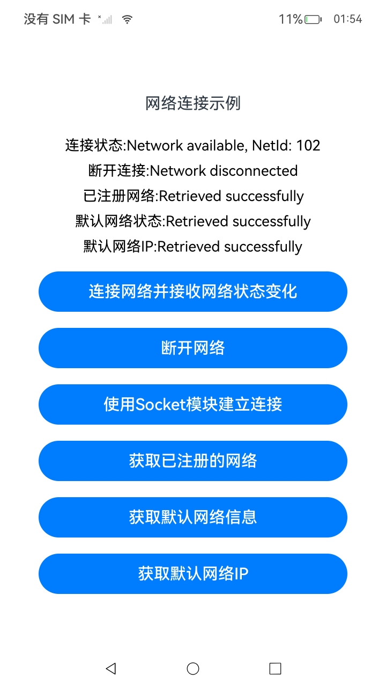

# NetConnection_Manage_case(网络连接管理)

### 介绍

本示例依照指南 系统->网络->Network Kit（网络服务）->Network Kit网络管理能力->[网络连接管理](https://gitee.com/openharmony/docs/blob/OpenHarmony-5.0.1-Release/zh-cn/application-dev/network/net-connection-manager.md)进行编写。网络连接管理提供管理网络一些基础能力，包括WiFi/蜂窝/Ethernet等多网络连接优先级管理、网络质量评估、订阅默认/指定网络连接状态变化、查询网络连接信息等功能。本项目展示了一个网络连接管理的示例应用，它实现了通过按钮控制网络连接、获取已连接网络、获取默认网络以及获取默认网络的IP地址的功能，使用了`@ohos.net.connection`接口。

### 效果预览

|网络连接|连接并显示网络状态|使用Socket建立连接|获取网络相关信息|
|--------------------------------|--------------------------------|--------------------------------|--------------------------------|
|||||

使用说明

1. 点击“连接网络并接收网络状态”按钮建立网络连接，并更新连接状态。
2. 点击“断开网络”按钮将断开当前网络连接，并更新断开状态。
3. 点击“使用Socket模块建立连接”按钮建立网络连接，并发送消息。
4. 点击“获取已注册的网络”按钮，并更新获取状态。
5. 点击“获取默认网络信息”按纽获取，并更新获取状态。
6. 点击“获取默认网络IP”按钮，应用程序将获取并展示获取状态。

### 工程目录

```
entry/src/main/ets/
|---common
|   |---Logger.ts                     // 日志工具
|---entryability
|   │---EntryAbility.ets
|---entrybackupability
│   |---EntryBackupAbility.ets      
|---pages
│   |---Index.ets                     // 主页
```

### 具体实现

1. 网络连接管理：

- 使用 `@kit.NetworkKit` 提供的 `connection` 和 `socket` 模块，创建和管理网络连接。通过 `connection.createNetConnection()` 监听网络变化（如网络连接和断开），通过 `socket.TCPSocket` 处理TCP连接。
- 当默认网络发生变化时，通过监听 `netAvailable` 事件重新建立TCP连接。

2. Socket通信：

- 使用 `socket.TCPSocket` 对象进行TCP连接和数据发送。通过指定连接的地址和端口号建立连接，并向服务器发送数据（如“Hello, server!”）。
- 提供错误处理机制：若连接失败，会显示提示信息，并且若数据发送失败，也会做相应的错误提示。

3. 网络状态显示与操作：

- 页面通过UI组件（如 `Text`, `Button`）显示当前的网络连接状态（如是否已连接、是否已断开）以及网络信息（如可用网络、默认网络等）。
- 提供按钮来执行不同的操作，如连接网络、断开网络、重新连接网络、获取网络信息等。

4. 单例管理：

- `GlobalContext` 类作为全局上下文，用于存储和管理网络连接信息（如当前网络列表和当前网络句柄），并支持获取和设置对象。

5. 网络连接状态管理：

- 通过 `connectNetwork()` 和 `disconnectNetwork()` 方法来管理网络连接的建立和断开。`connectNetwork()` 方法通过指定网络类型（如WiFi）连接网络，`disconnectNetwork()` 方法则用于取消订阅并断开连接。
- `getAllNetworks()` 和 `getDefaultNetwork()` 方法用于获取所有网络连接及当前默认网络的信息，包括网络的能力和连接属性

### 相关权限

[ohos.permission.INTERNET](https://gitee.com/openharmony/docs/blob/OpenHarmony-5.0.1-Release/zh-cn/application-dev/security/AccessToken/permissions-for-all.md#ohospermissioninternet)

[ohos.permission.GET_NETWORK_INFO](https://gitee.com/openharmony/docs/blob/OpenHarmony-5.0.1-Release/zh-cn/application-dev/security/AccessToken/permissions-for-all.md#ohospermissionget_network_info)

### 依赖

不涉及。

### 约束与限制

1. 本示例仅支持标准系统上运行，支持设备：RK3568。
2. 本示例为Stage模型，支持API14版本SDK，版本号：5.0.2。
3. 本示例需要使用DevEco Studio Release（5.0.5.306）及以上版本才可编译运行。
4. 本示例需要用任意方式连接网络使用（示例代码为以连接wifi为例）。
5. 在使用本示例前，用户需自行配置TCP服务器，推荐使用python脚本。确保服务器的IP地址和端口号正确，并且服务器与客户端能够通过相同的网络进行通信。客户端和服务器需要连接到相同的热点或局域网，确保两者在同一网络环境下才能正常建立连接。根据实际情况配置服务器的IP地址。客户端在启动前需确认服务器IP已正确配置，以确保能够成功连接。

### 下载

如需单独下载本工程，执行如下命令：

```
git init
git config core.sparsecheckout true
echo code/DocsSample/NetWork_Kit/NetWorkKit_NetManager/NetConnection_Manage_case/ > .git/info/sparse-checkout
git remote add origin https://gitee.com/openharmony/applications_app_samples.git
git pull origin master
```