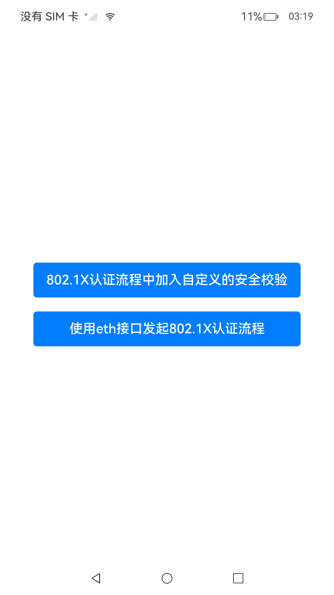
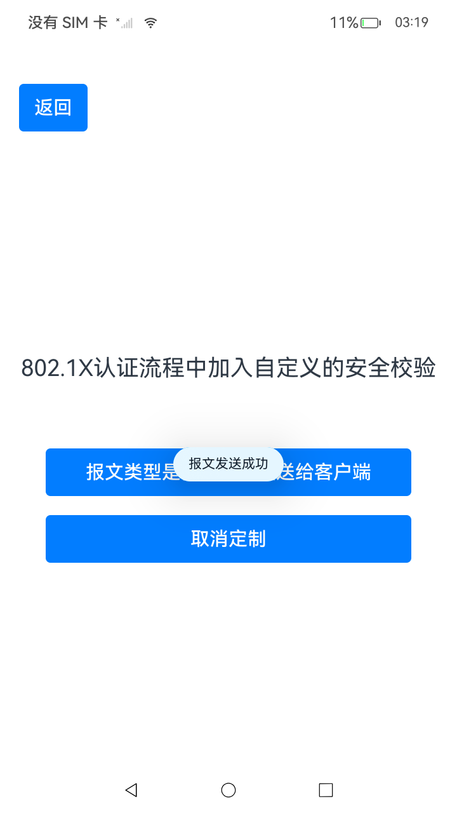
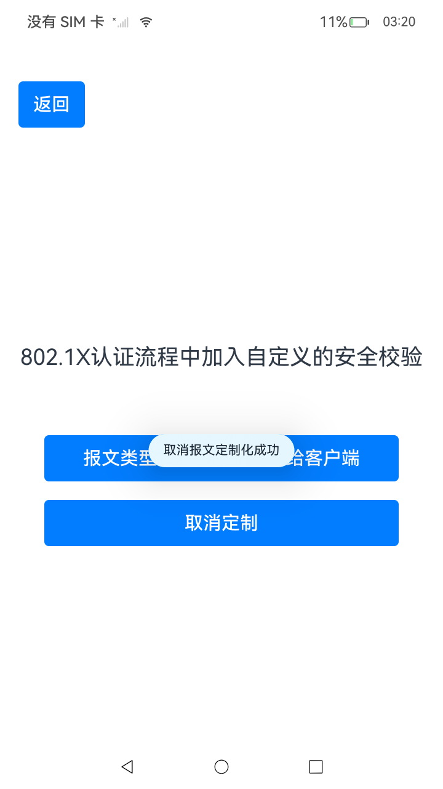
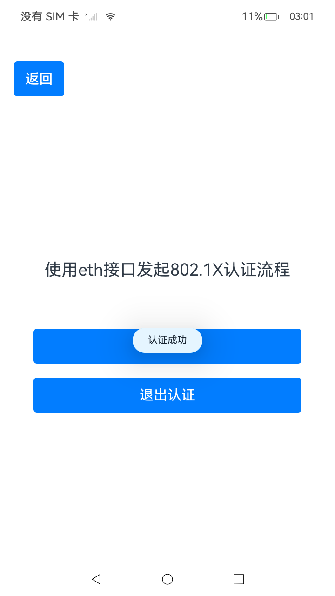

# NetConnection_Manage_case(网络连接管理)

### 介绍

某些企业用户通过802.1X认证方式接入PC网络，认证客户端由外部供应商提供。

注释： 扩展认证功能自API版本20起支持。

认证客户端具有以下定制行为：
1. 在EAP协议报文内封装特定数据，该数据结构由客户端与认证服务器协商确定。
2. 在认证过程中，客户端在本地执行安全检查等定制操作，特定操作结束后，客户端向接入设备发送认证消息。 在这种机制下，需要操作系统提供第三方客户端介入802.1X认证流程的机制，支持客户端的定制认证。

为满足上述需求场景，定制化802.1X认证提供以下功能：
1. 定制化监听与修改802.1X报文交互流程的功能。
2. 对以太网接口发起802.1X认证和去认证的功能。

### 效果预览

| 首页                              | 报文发送成功                                        | 取消报文定制化                                      | EAP认证成功       | EAP退出认证成功 |
|---------------------------------|-----------------------------------------------|-------------------------------------------------|---------------------------------------|-----------|
|  |  |  |  |          |

使用说明

1. 点击“报文类型选择”按钮，并显示报文发送成功的消息。
2. 点击“取消”按钮，并显示取消订阅成功的消息。
3. 点击“开始认证”按钮，并显示认证成功的消息。
4. 点击“退出认证”按钮，并显示退出认证成功的消息。

### 工程目录

```
entry/src/main/ets/
|---entryability
|   │---EntryAbility.ets
|---entrybackupability
│   |---EntryBackupAbility.ets      
|---pages
│   |---Index.ets                        // 主页
│   |---AccreditationProcess.ets         // 802.1X认证流程中加入自定义的安全校验
│   |---EthInterface.ets                 // 使用eth接口发起802.1X认证流程
```

### 具体实现

1. 802.1X认证流程中加入自定义的安全校验：

- 调用`regCustomEapHandler`方法，注册所需监听的EAP报文类型。在802.1X认证过程中，系统会将符合条件的EAP报文传递至回调函数中，供企业应用获取。
- 若注册的报文类型是由服务器发送给客户端的，则此时可以从报文中读取，由服务器加入的自定义内容。应用根据自定义内容，判断认证是否应继续往后续步骤进行，并调用`replyCustomEapData`方法通知系统。
- 若注册的报文类型是由客户端发给服务器的，则此时获取到的是原始的802.1X认证报文，应用需要在原始报文内容中添加自定义内容，并包含自定义内容的报文调用`replyCustomEapData`方法通知系统。
- 如此便从发送/接收两个方向上实现了对标准802.1X流程的定制化。需要取消定制化时，调用`unregCustomEapHandler`方法。


2. 使用eth接口发起802.1X认证流程：

- 当企业管理软件需要进行认证，调用`startEthEap`方法时，将启动802.1X认证流程。
- 当企业管理软件需要终止认证状态，调用`logOffEthEap`方法时，会启动802.1X反认证流程。


### 相关权限

[ohos.permission.MANAGE_ENTERPRISE_WIFI_CONNECTION](https://gitcode.com/openharmony/docs/blob/master/zh-cn/application-dev/security/AccessToken/permissions-for-all.md#ohospermissioninternet)


### 依赖

不涉及。

### 约束与限制

1. 本示例仅支持标准系统上运行，支持设备：RK3568。
2. 本示例为Stage模型，支持API20版本SDK。
3. 本示例需要使用DevEco Studio Release（5.0.5.306）及以上版本才可编译运行。
4. 本示例需要用任意方式连接网络使用（示例代码为以连接wifi为例）。


### 下载

如需单独下载本工程，执行如下命令：

```
git init
git config core.sparsecheckout true
echo code/DocsSample/NetWork_Kit/NetWorkKit_NetManager/NetConnection_Manage_case/ > .git/info/sparse-checkout
git remote add origin https://gitcode.com/openharmony/applications_app_samples.git
git pull origin master
```