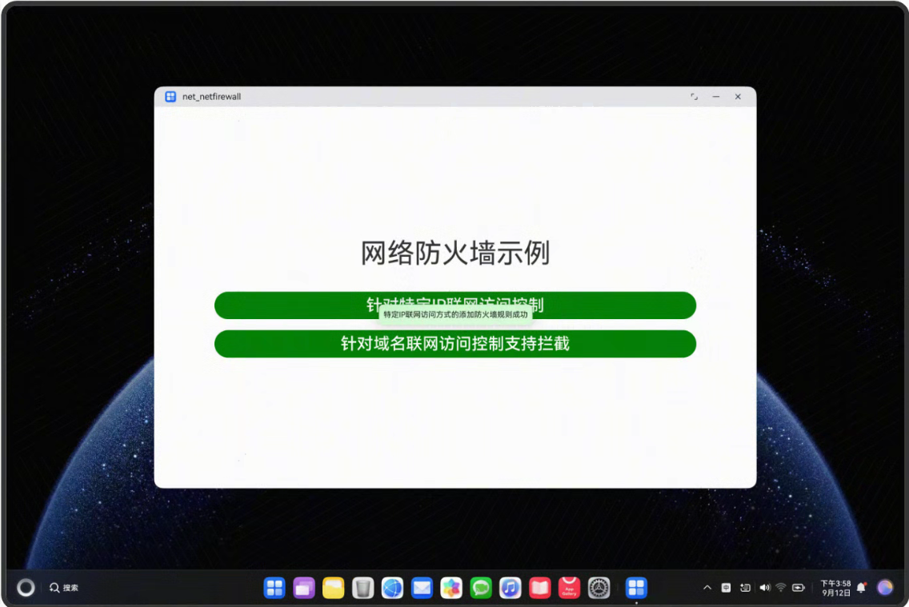
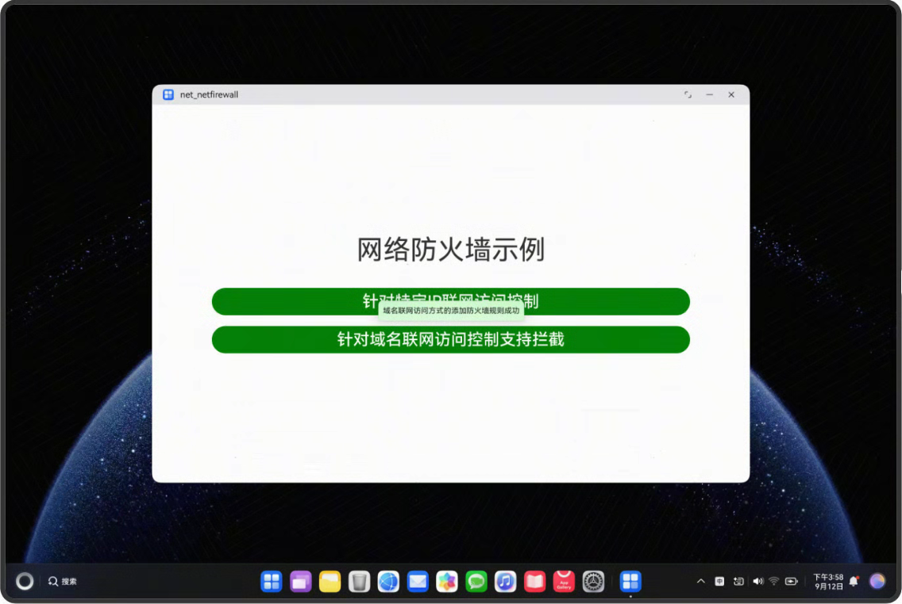

# NetFireWall_case(网络防火墙)

### 介绍

网络防火墙提供如下功能：

防火墙的基础能力，包括防火墙的使能、规则的启用与禁用、审计能力。
防火墙规则的配置能力，包括规则的名称、描述、操作、生效应用、协议类型、地址、端口、出站/入站方向等。
DNS策略的配置能力，包括配置禁止/允许解析的域名、解析使用的DNS服务器（主选/备选）（应用级）。

本项目的构建依据[网络防火墙](https://gitcode.com/openharmony/docs/blob/master/zh-cn/application-dev/network/net-netfirewall.md)示例代码，构建了一个使用网络防火墙的示例应用，通过点击按钮实现了针对特定IP联网访问控制和针对域名联网访问控制支持拦截的功能，使用了[@ohos.net.netFirewall](https://gitcode.com/openharmony/docs/blob/master/zh-cn/application-dev/reference/apis-network-kit/js-apis-net-netfirewall.md)接口。

### 效果预览

| 程序启动                                                    | 发送HTTP请求                                                    | 发送流式HTTP连接                                                             |
|---------------------------------------------------------|-------------------------------------------------------------|------------------------------------------------------------------------|
|  |  |  |


使用说明


1. 点击 "针对特定IP联网访问控制" 按钮，显示测试结果。

2. 点击 "针对域名联网访问控制支持拦截" 按钮，显示测试结果。


### 工程目录

```
entry/src/main/ets/
|---common
|   |---Logger.ets                     // 日志工具
|---entryability
|   │---EntryAbility.ets
|---entrybackupability
│   |---EntryBackupAbility.ets      
|---pages
│   |---Index.ets                      // 主页
```

### 具体实现

1. **针对特定IP联网访问控制**
    - 设备通过硬件接口，插入网线。
    - 用户调用setNetFirewallPolicy方法，打开防火墙。
    - 用户通过addNetFirewallRule方法，添加防火墙规则。
2. **针对域名联网访问控制支持拦截**
    - 设备通过硬件接口，插入网线。
    - 调用setNetFirewallPolicy方法，打开防火墙。
    - 通过addNetFirewallRule方法，添加防火墙规则。

### 相关权限

[ohos.permission.MANAGE_NET_FIREWALL](https://gitcode.com/openharmony/docs/blob/master/zh-cn/application-dev/security/AccessToken/permissions-for-enterprise-apps.md#ohospermissionmanage_net_firewall)

### 依赖

不涉及。

### 约束与限制

1. 本示例仅支持标准系统上运行，支持设备：2in1(PC)、TV。
2. 本示例为Stage模型，支持API15版本SDK，版本号：5.0.3。
3. 本示例需要使用DevEco Studio Release（5.0.5.306）及以上版本才可编译运行。

### 下载

如需单独下载本工程，执行如下命令：

```
git init
git config core.sparsecheckout true
echo code/DocsSample/NetWork_Kit/NetWorkKit_NetManager/NetFireWall_case/ > .git/info/sparse-checkout
git remote add origin https://gitcode.com/openharmony/applications_app_samples.git
git pull origin master
```