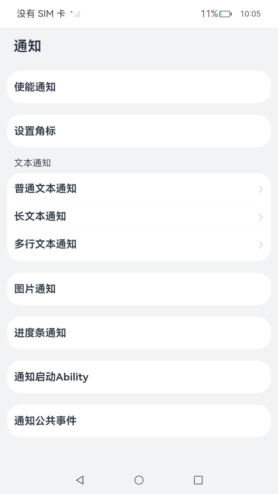
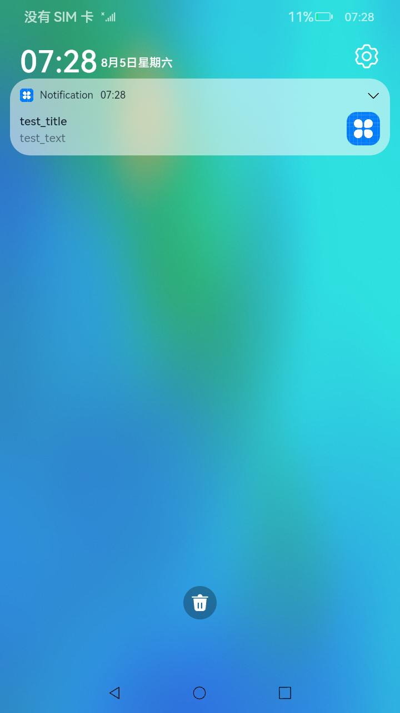
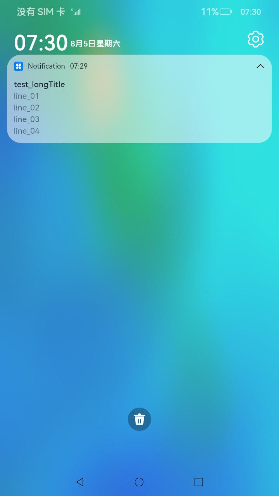
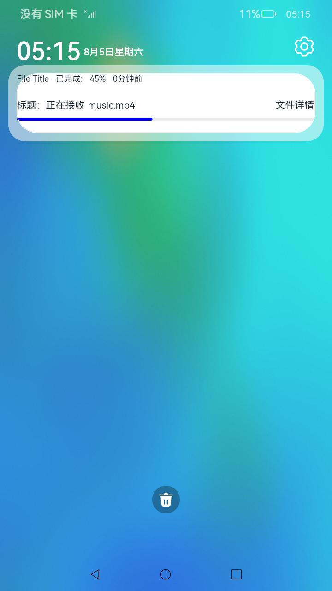

# 通知

### 介绍

本示例使用 [@ohos.notificationManager](https://gitee.com/openharmony/docs/blob/master/zh-cn/application-dev/reference/apis/js-apis-notificationManager.md) 等接口， 展示了如何初始化不同类型通知的通知内容以及通知的发布、取消及桌面角标的设置，通知类型包括基本类型、长文本类型、多行文本类型、图片类型、带进度条的通知、点击可跳转到应用以及公共事件通知。 

### 效果预览		

| 主界面                                                      |                         图片通知                         |                          多行文本通知                           |                           进度条通知                           |
|----------------------------------------------------------|:----------------------------------------------------:|:---------------------------------------------------------:|:---------------------------------------------------------:|
|  |  |  |  |

使用说明

1.启动应用后，弹出是否允许发送通知的弹窗，点击允许后开始操作；

2.点击主界面中设置角标列表项设置角标，回到仿桌面，可以看到角标数量，对应消息数量（使用前需安装并启动[仿桌面应用](../../../SystemFeature/ApplicationModels/Launcher)）；

3.点主击界面中对应的列表项发布不同类型的通知，下拉状态栏，在通知栏可以看到发布的通知；

### 工程目录

```
entry/src/main/ets/
|---entryability
|   |---EntryAbility.ets
|---pages
|   |---Index.ets						// 首页
|   |---Second.ets						// 通知启动Ability时，被拉起的Ability页面
|---publish
|   |---PublishOperation.ets			// 使能通知开关、设置通知角标、发布通知
|---secondability
|   |---SecondAbility.ets				// 通知启动Ability时，被拉起的Ability
|---subscribe
|   |---SubscribeOperation.ets			// 订阅通知
```

### 具体实现

- 允许发送通知、发送通知的功能接口封装在PublishOperation，源码参考：[PublishOperation.ets](entry/src/main/ets/publish/PublishOperation.ets)
  * 允许发送通知：
    通过publishOperation.enableNotification()调用notificationManager.requestEnableNotification()接口向用户请求发送通知；
    
  * 设置角标：
  
    通过publishOperation.setBadgeNumberForBasic()调用notificationManager.setBadgeNumber()接口设置角标；
  
  * 发送通知：通过notificationManager.publish发布通知的接口，通知类型包括基本类型、长文本类型、多行文本类型、图片类型、带进度条的通知、点击可跳转到应用以及公共事件通知；
- 订阅通知功能接口封装在SubscribeOperation，源码参考：[PublishOperation.ets](entry/src/main/ets/subscribe/SubscribeOperation.ets)

### 相关权限

[ohos.permission.NOTIFICATION_CONTROLLER](https://gitee.com/openharmony/docs/blob/master/zh-cn/application-dev/security/permission-list.md#ohospermissionnotification_controller)

### 依赖

应用的角标依赖于仿桌面应用进行显示：[仿桌面应用](../../../SystemFeature/ApplicationModels/Launcher)。

### 约束与限制

1.本示例仅支持标准系统上运行，支持设备：RK3568。

2.本示例为Stage模型，支持API11版本SDK，版本号：4.1.3.1；

3.本示例涉及使用系统接口：notificationManager.requestEnableNotification  ，需要手动替换Full SDK才能编译通过；

4.本示例需要使用DevEco Studio 3.1.1 Release (Build Version: 3.1.0.501, built on June 20, 2023)才可编译运行；

5.本示例涉及[ohos.permission.NOTIFICATION_CONTROLLER](https://gitee.com/openharmony/docs/blob/master/zh-cn/application-dev/security/permission-list.md#ohospermissionnotification_controller)权限为system_core级别，需要配置高权限签名；

### 下载

```shell
git init
git config core.sparsecheckout true
echo code/DocsSample/Notification/Notification/ > .git/info/sparse-checkout
git remote add origin https://gitee.com/openharmony/applications_app_samples.git
git pull origin master
```

