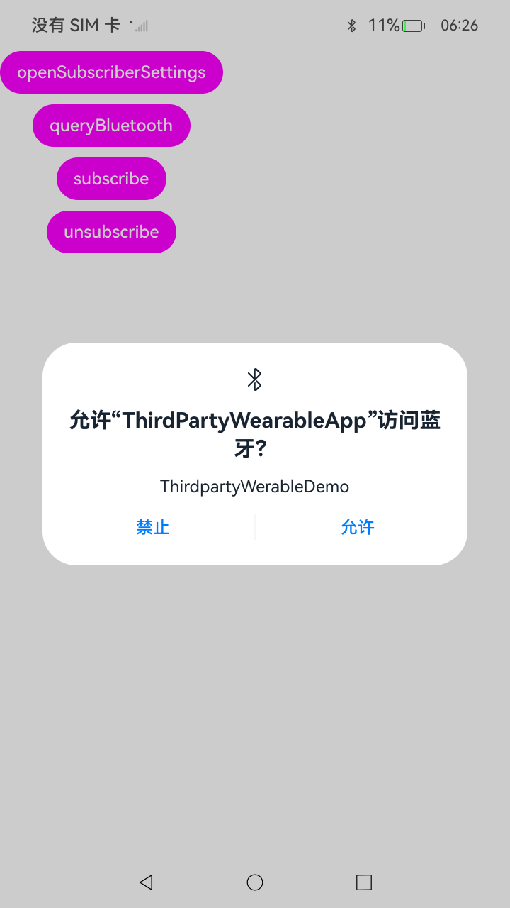

# 通知订阅拓展能力概述

### 介绍

[NotificationSubscriberExtensionAbility](../reference/apis-ability-kit/js-apis-application-NotificationSubscriberExtensionAbility.md)提供扩展能力，允许第三方应用接收系统通知并将其同步到穿戴设备。该能力主要用于支持手机与第三方穿戴设备之间的通知协同。

使用说明

1.启动应用后，弹出是否允许访问蓝牙的弹窗，点击允许后开始操作；

2.点击主页面openSubscriberSettings按钮，调用OpenSubscriptionSettings接口，打开通知扩展订阅设置页面，该页面以半模态弹窗显示。用户可设置通知的启用状态及模式。

3.点击主页面queryBluetooth按钮，获取已配对设备信息。

4.连接穿戴设备，使用蓝牙模块接口获取地址，通过subscribe/unsubscribe按钮调用接口订阅或取消订阅通知。

### 效果预览	
 
 
### 工程目录

```
ets
 ┣ entryability
 ┃ ┗ EntryAbility.ets
 ┣ extensionability
 ┃ ┗ NotificationSubscriberExtAbility.ets // 通知订阅拓展能力
 ┣ pages
 ┃ ┗ Index.ets                            // 主页面
 ┗ utils
 ┃ ┗ SppClientManager.ets                 // 蓝牙模块接口能力
```

### 相关权限

[ohos.permission.SUBSCRIBE_NOTIFICATION](https://gitee.com/openharmony/docs/blob/master/zh-cn/application-dev/security/AccessToken/restricted-permissions.md#ohospermissionsubscribe_notification)

[ohos.permission.ACCESS_BLUETOOTH](https://gitee.com/openharmony/docs/blob/master/zh-cn/application-dev/security/AccessToken/permissions-for-all-user.md#ohospermissionaccess_bluetooth)

### 约束与限制
- [授权方式]：系统授权
- [权限级别]：系统基础应用
- [分布式支持]：false (不支持分布式场景)
- [设备类型]：手机和平板
- [版本约束]：API Version 从 22 开始支持


