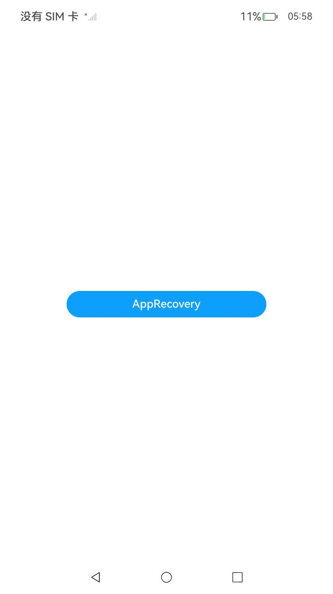

# 应用恢复开发指导

###  介绍

本示例主要展示了应用恢复相关的功能，应用在运行中不可避免会产生一些非预期的行为，如运行时抛出未处理的异常和错误，违反框架的调用/运行约束等。

系统默认对异常的处理方式为进程退出，如果应用使用过程中产生了用户数据，直接退出可能会导致用户工作中断，数据丢失。 如果应用在[AbilityStage](https://docs.openharmony.cn/pages/v5.0/zh-cn/application-dev/reference/apis-ability-kit/js-apis-app-ability-abilityStage.md)中使能[应用恢复功能](https://docs.openharmony.cn/pages/v5.0/zh-cn/application-dev/dfx/apprecovery-guidelines.md#应用恢复接口功能介绍)，并对临时数据进行保存，应用非预期退出后的下一次启动会恢复先前的状态和数据，给用户更连贯的使用体验。这里状态包括应用的页面栈以及onSaveState接口中保存的数据。

###  效果预览

|                             主页                             |
| :----------------------------------------------------------: |
|  |

使用说明

1.在主界面，点击按钮引发崩溃，重启应用；切换到"Log"窗口，日志过滤选择"No filters",搜索内容设置分别为"[Demo]"和"This ability need to recovery"。此时窗口若分别出现下面两句，则验证成功。

```
[Demo] EntryAbility onSaveState
This ability need to recovery
```


###  工程目录

```
entry/src/main/ets/
└─entryability
| 	└─---EntryAbility.ets				  //添加回调函数
└─pages
    └─---Index.ets						 //首页
```

###  具体实现

- 在EntryAbility.ets中添加应用恢复回调函数，以及启动时恢复判断；
- 在Index.ets中添加一个按钮并在其点击事件中引发崩溃事件，进而调用应用恢复回调函数。

###  相关权限

不涉及。

###  依赖

不涉及。

###  约束与限制

1. 本示例仅支持标准系统上运行，支持设备：RK3568;
2. 本示例已适配API14版本SDK,版本号：5.0.2.58,镜像版本号：OpenHarmony5.0.2.58;
3. 本示例需要使用DevEco Studio (5.0.3.910)及以上版本才可编译运行。

### 下载

如需单独下载本工程，执行如下命令：

```
git init
git config core.sparsecheckout true
echo code/DocsSample/PerformanceAnalysisKit/ErrorManage/ApplyRecovery/ > .git/info/sparse-checkout
git remote add origin https://gitee.com/openharmony/applications_app_samples.git
git pull origin master
```

