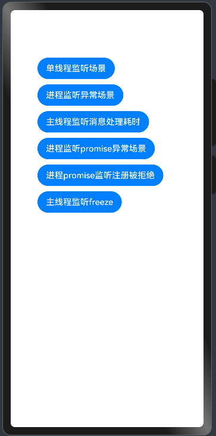

# 错误管理开发指导

###  介绍

本示例主要展示了错误管理相关的功能，当应用的代码存在规范问题或错误时，会在运行中产生异常和错误，如应用未捕获异常、应用生命周期超时等。在错误产生后，应用会异常退出。错误日志通常会保存在用户本地存储上，不方便开发者定位问题。所以，应用开发者可以使用错误管理的接口，在应用退出前，及时将相关错误及日志上报到开发者的服务平台来定位问题。

使用errormanager接口监听异常和错误后，应用不会退出，建议在回调函数执行完后，增加同步退出操作，如果只是为了获取错误日志，建议使用[hiappevent](https://gitcode.com/openharmony/docs/blob/master/zh-cn/application-dev/dfx/errormanager-guidelines.md)。
###  效果预览

|                             主页                             |
| :----------------------------------------------------------: |
|  |

使用说明

1. 在主界面，启动应用，切换到"Log"窗口，日志过滤选择"No filters"，搜索内容设置为"testErrorManage"。

（1）重启应用，点击“单线程监听场景”按钮，出现如下形式日志输出：

```
onUnhandledException, errorMsg: xxx
onException, name: xxx
onException, message: xxx
onException, stack: xxx
```
（2）重启应用，点击“进程监听异常场景”按钮，出现如下形式日志输出：

```
result name :Error
result message :test errorFunc msg
result stack:    at anonymous entry xxx
result instanceName : xxx
result instanceType :0
```
（3）重启应用，点击“主线程监听消息处理耗时”按钮，出现如下形式日志输出：

```
Duration timeout: xxx
```
（4）重启应用，点击“进程监听promise异常场景”按钮，出现如下形式日志输出：

```
result name :Error
result message :process promise exception
result stack:    at anonymous entry xxx
result instanceName : xxx
result instanceType :0
```
（5）重启应用，点击“进程promise监听注册被拒绝”按钮，出现如下形式日志输出：

```
reason.name : xxx
reason.message : xxx
reason.stack: xxx
```
（6）重启应用，点击“主线程监听freeze”按钮，出现如下形式日志输出：

```
freezecallback
```

###  工程目录

```
entry/src/main/ets
                ├─entryability
                │   └─EntryAbility.ets
                ├─entrybackupability
                │   └─EntryBackupAbility.ets
                └─pages
                    └─FirstErrorHandler.ets   // first error handler
                    └─Index.ets   		      // 主页
                    └─SecondErrorHandler.ets  // second error handler
```

###  具体实现

- 在Index.ets、FirstErrorHandler.ets及SecondErrorHandler.ets中定义各类error的构造函数及回调函数
- 在Index.ets中添加触发按钮，点击按钮即可引发对应error事件，进而调用相关错误管理的回调函数。

###  相关权限

不涉及。

###  依赖

不涉及。

###  约束与限制

1. 本示例仅支持标准系统上运行，支持设备：RK3568;
2. 本示例中除错误处理器责任链模式场景外的所有错误场景均已适配API18版本SDK，版本号：5.1.0.56，镜像版本号：OpenHarmony_5.1.0.56
3. 本示例需要使用DevEco Studio (5.0.3.910)及以上版本才可编译运行；
4. 错误处理器责任链模式场景需要适配API21版本SDK，支持API21版本SDK，版本号：6.0.0.55，镜像版本号：OpenHarmony_6.0.0.55。

### 下载

如需单独下载本工程，执行如下命令：

```
git init
git config core.sparsecheckout true
echo code/DocsSample/PerformanceAnalysisKit/ErrorManage/ErrorManage/ > .git/info/sparse-checkout
git remote add origin https://gitcode.com/openharmony/applications_app_samples.git
git pull origin master
```

