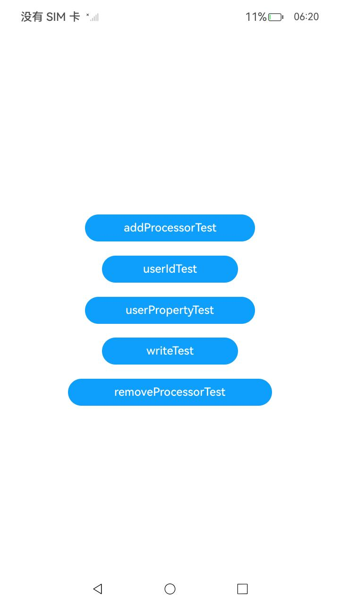

# 事件上报

###  介绍

本示例主要展示了使用事件上报相关的功能，HiAppEvent提供接口用于处理中上报事件。

该工程中的展示的代码详细描述可查如下链接：

- [事件上报](https://gitcode.com/openharmony/docs/blob/master/zh-cn/application-dev/dfx/hiappevent-event-reporting.md)

###  效果预览

|                             主页                             |
| :----------------------------------------------------------: |
|  |

使用说明

1.在应用侧主界面，从上至下依次点击按钮；
2.在DevEco Studio侧下方导航栏，切换到"Log"窗口，日志过滤选择"No filters"，搜索内容设置为"testTag"。此时窗口仅显示符合条件的日志，打印日志结果为：

```text
// 点击addProcessorTest，无输出

// 点击userIdTest
userId: 123456
// 点击userPropertyTest
userProperty: 123456
// 点击writeTest
HiAppEvent success to write event
// 点击removeProcessorTest，无输出

```

###  工程目录

```text
entry/src/main/ets/
└─pages
    └─---Index.ets						 // 首页
```

###  具体实现

1.添加一个按钮并在其onClick函数中添加数据处理者；
2.添加一个按钮并在其onClick函数中添加并查看用户ID；
3.添加一个按钮并在其onClick函数中添加并查看用户属性；
4.添加一个按钮并在其onClick函数中进行事件打点，以记录按钮点击事件；
5.添加一个按钮并在其onClick函数中进行数据处理者移除(第二步已完成数据处理者添加)。

###  相关权限

不涉及。

###  依赖

不涉及。

###  约束与限制

1. 本示例仅支持标准系统上运行，支持设备：RK3568；
2. 本示例已适配API14版本SDK，版本号：5.0.2.58，镜像版本号：OpenHarmony5.0.2.58；
3. 本示例需要使用DevEco Studio(5.0.3.910)及以上版本才可编译运行。

### 下载

如需单独下载本工程，执行如下命令：

```text
git init
git config core.sparsecheckout true
echo code/DocsSample/PerformanceAnalysisKit/HiAppEvent/EventEsc/ > .git/info/sparse-checkout
git remote add origin https://gitcode.com/openharmony/applications_app_samples.git
git pull origin master
```