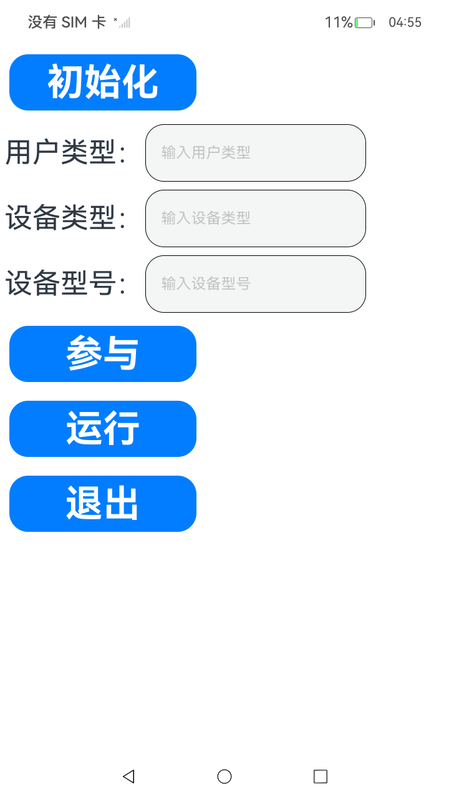

# 应用灰度采集

### 介绍

本示例主要展示了使用应用灰度采集相关的功能

该工程中展示的代码详细描述可查看如下链接：

- [应用灰度采集](https://gitcode.com/openharmony/docs/blob/master/zh-cn/application-dev/dfx/hiretrieval-guidelines-arkts.md)

### 效果预览

|                                     主页                                     |
| :--------------------------------------------------------------------------: |
|  |

使用说明

1. 在DevEco Studio左侧下方导航栏，切换到“Log”窗口，日志过滤选择“选中应用的全部日志”，搜索内容设置为“hiRetrieval”，打开大小写敏感开关“Cc”。

2. 点击应用主界面的“初始化”按钮，在DevEco Studio的"Log"窗口中，观察到如下日志：

```text
05-12 20:29:29.371 16792-16792 A03D00/com.example.hiretrievaldemo/JSAPPP com.example.hiretrievaldemo I      succeed to init hiRetrieval
```

3. 点击应用主界面的“参与”按钮，在DevEco Studio的"Log"窗口中，观察到如下日志：
```text
05-12 20:33:30.236 16792-16792 A03D00/com.example.hiretrievaldemo/JSAPPP com.example.hiretrievaldemo I      succeed to participate hiRetrieval
```

4. 点击应用主界面的“运行”按钮，在DevEco Studio的"Log"窗口中，观察到如下日志：
```text
05-12 20:34:04.409 16792-16792 A03D00/com.example.hiretrievaldemo/JSAPPP com.example.hiretrievaldemo I      succeed to run hiRetrieval
```

5. 点击应用主界面的“退出”按钮，在DevEco Studio的"Log"窗口中，观察到如下日志：
```text
05-12 20:34:22.918 16792-16792 A03D00/com.example.hiretrievaldemo/JSAPPP com.example.hiretrievaldemo I      succeed to quit hiRetrieval
```

###  工程目录

```text
entry/src/main/ets/
└─pages
    └─---Index.ets                     // 首页
```

###  具体实现

1. 从“@kit.PerformanceAnalysisKit”中导入hiRetrieval模块。
2. 添加一个按钮并在其onClick函数中调用hiRetrieval.init接口。
3. 添加三个文本输入框，输入的内容分别作为用户类型，设备类型，设备型号参数构造hiRetrieval.HiRetrievalConfig配置。
4. 添加一个按钮并在其onClick函数中调用hiRetrieval.participate接口。该接口传入上一步构造的hiRetrieval.HiRetrievalConfig配置。
5. 添加一个按钮并在其onClick函数中调用hiRetrieval.run接口。
6. 添加一个按钮并在其onClick函数中调用hiRetrieval.quit接口。

###  相关权限

不涉及。

###  依赖

不涉及。

###  约束与限制

1. 本示例仅支持标准系统上运行。
2. 本示例支持API 26版本SDK，SDK版本号(API Version 26)，镜像版本号(6.0)。
3. 本示例需要使用DevEco Studio版本号(5.0.5 Release)及以上版本才可编译运行。
4. 运行本实例需连接WIFI。

### 下载

如需单独下载本工程，执行如下命令：

```text
git init
git config core.sparsecheckout true
echo code/DocsSample/PerformanceAnalysisKit/HiRetrieval/ > .git/info/sparse-checkout
git remote add origin https://gitcode.com/openharmony/applications_app_samples.git
git pull origin master
```