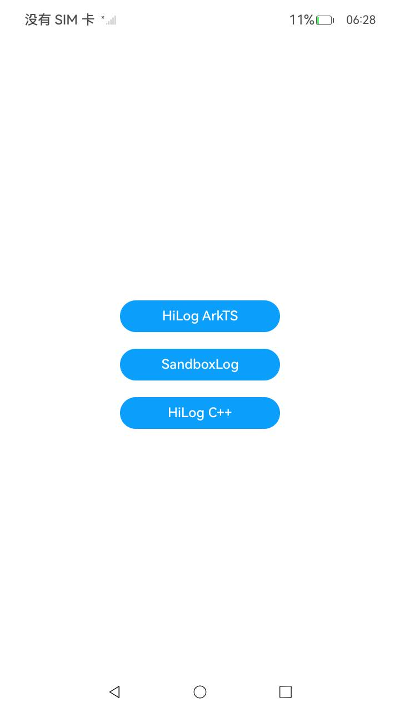

# 使用HiLog打印日志

###  介绍

本示例主要展示了使用HiLog打印日志相关的功能，在应用开发过程中，可在关键代码处输出日志信息。在运行应用后，通过查看日志信息来分析应用执行情况（如应用是否正常运行、代码运行时序、运行逻辑分支是否正常等）。

HiLog日志系统，提供给系统框架、服务、以及应用，用于打印日志，记录用户操作、系统运行状态等。

该工程中的展示的代码详细描述可查如下链接：

- [使用HiLog打印日志（ArkTS）](https://gitcode.com/openharmony/docs/blob/master/zh-cn/application-dev/dfx/hilog-guidelines-arkts.md)

- [使用HiLog打印日志（C/C++）](https://gitcode.com/openharmony/docs/blob/master/zh-cn/application-dev/dfx/hilog-guidelines-ndk.md)

###  效果预览

|                             主页                             |
| :----------------------------------------------------------: |
|  |

#### 使用说明

##### 1.Hilog（ArkTS）使用说明

1.在应用侧主界面，点击"HiLog ArkTS"按钮；

2.在DevEco界面切换到"Log"窗口，日志过滤选择"No filters",搜索内容设置为"testTag"。此时窗口仅显示符合条件的日志，打印日志结果为：

```
08-05 06:32:35.928   10753-10753   A0ff00/testTag                  com.sampl...logarkts  I     A log with a domainID of 0xFF00 and a label of testTag can print logs at the Info level or higher.
08-05 06:32:35.928   10753-10753   A0ff00/testTag                  com.sampl...logarkts  I     hello World 3
08-05 06:32:35.928   10753-10753   A0ff00/testTag                  com.sampl...logarkts  I     peter is {"name":"peter","age":15}
08-05 06:32:35.928   10753-10753   A0ff00/testTag                  com.sampl...logarkts  E     this is an error level log
08-05 06:32:35.928   10753-10753   A0ff00/testTag                  com.sampl...logarkts  I     this is an another info level log
08-05 06:32:35.928   10753-10753   A0ff00/testTag                  com.sampl...logarkts  E     this is an another error level log
```

3.在应用侧主界面，点击"SandboxLog"按钮；

4.打开应用公共沙箱日志，打印结果为：

```
08-05 06:32:35.928 10753 10753 I A0ff00/testTag: current log type:4
08-05 06:32:35.928 10753 10753 I A0ff00/testTag: current log dir:/data/storage/el2/log/hiapplog
08-05 06:32:35.929 10753 10753 I A0ff00/testTag: hilog_info_test
08-05 06:32:35.929 10753 10753 D A0ff00/testTag: hilog_debug_test
08-05 06:32:35.929 10753 10753 W A0ff00/testTag: hilog_warn_test
08-05 06:32:35.929 10753 10753 F A0ff00/testTag: hilog_fatal_test
08-05 06:32:35.929 10753 10753 E A0ff00/testTag: hilog_error_test
08-05 06:32:35.930 10753 10753 I A0ff00/testTag: current log files:hiapplog.10753.001.20170805-063235.log
```

##### 2.HiLog（C++）使用说明

1.在主界面，点击"HiLog C++"按钮；

2.切换到"Log"窗口，日志过滤选择"No filters"，搜索内容设置为"Failed to test"。此时窗口显示报错的日志，打印日志结果为"Failed to test"。

###  工程目录

```
entry/src/main
├─cpp
│  ├─CMakeLists.txt  //导入so链接
│  └─napi_init.cpp   //功能函数
│
└─ets
   └─pages
     └─Index.ets     //主页

```

###  具体实现

1.ArkTS实现时只需在按钮的点击事件中添加各种类型日志的打印函数

2.C++实现时在napi_init.cpp添加具有打印功能的函数，在主页按钮中增加一个单击事件，并调用功能函数打印一条日志。

###  相关权限

不涉及。

###  依赖

不涉及。

###  约束与限制

1. 本示例仅支持标准系统上运行，支持设备：RK3568；
2. 本示例已适配API26版本SDK，版本号：26.0.0，镜像版本号：OpenHarmony7.0.0.26；
3. 本示例需要使用DevEco Studio(6.1.1.268)及以上版本才可编译运行。

### 下载

如需单独下载本工程，执行如下命令：

```
git init
git config core.sparsecheckout true
echo code/DocsSample/PerformanceAnalysisKit/Hilog/ > .git/info/sparse-checkout
git remote add origin https://gitee.com/openharmony/applications_app_samples.git
git pull origin master
```