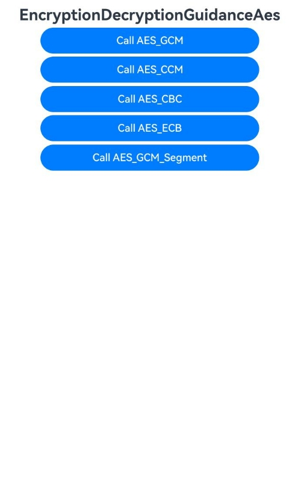
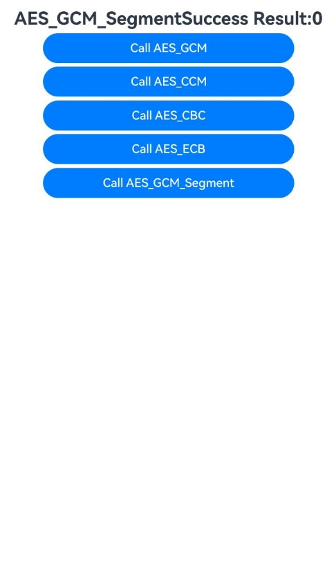

# 使用AES对称密钥加解密(C/C++)

### 介绍

本示例主要展示了使用AES对称密钥(C/C++)GCM模式、CCM模式、CBC模式、ECB模式以及GCM模式分段加解密场景 。该工程中展示的代码详细描述可查如下链接。

- [使用AES对称密钥（GCM模式）加解密(C/C++)](https://docs.openharmony.cn/pages/v5.0/zh-cn/application-dev/security/CryptoArchitectureKit/crypto-aes-sym-encrypt-decrypt-gcm-ndk.md)
- [使用AES对称密钥（CCM模式）加解密(C/C++)](https://docs.openharmony.cn/pages/v5.0/zh-cn/application-dev/security/CryptoArchitectureKit/crypto-aes-sym-encrypt-decrypt-ccm-ndk.md)
- [使用AES对称密钥（CBC模式）加解密(C/C++)](https://docs.openharmony.cn/pages/v5.0/zh-cn/application-dev/security/CryptoArchitectureKit/crypto-aes-sym-encrypt-decrypt-cbc-ndk.md)
- [使用AES对称密钥（ECB模式）加解密(C/C++)](https://docs.openharmony.cn/pages/v5.0/zh-cn/application-dev/security/CryptoArchitectureKit/crypto-aes-sym-encrypt-decrypt-ecb-ndk.md)
- [使用AES对称密钥（GCM模式）分段加解密(C/C++)](https://docs.openharmony.cn/pages/v5.0/zh-cn/application-dev/security/CryptoArchitectureKit/crypto-aes-sym-encrypt-decrypt-gcm-by-segment-ndk.md)

### 效果预览

| 首页效果图                                                   | 执行结果图                                                   |
| ------------------------------------------------------------ | ------------------------------------------------------------ |
|  |  |

### 使用说明

1. 运行Index主界面。
2. 页面呈现上述执行结果图效果，点击不同按钮可以跳转到不同功能页面，点击跳转页面中按钮可以执行对应操作，并更新文本内容。
3. 运行测试用例EncryptionDecryptionGuidanceAes.test.ets文件对页面代码进行测试可以全部通过。

### 工程目录

```
entry/src/
 ├── main
 │   ├── cpp
 │   │   ├── types
 │   │   |   ├── libentry
 │   │   |       ├── index.d.ts
 │   │   |       ├── oh-package.json5
 │   │   |   ├── project
 │   │   |       ├── aes_cbc_encryption_decryption.cpp
 │   │   |       ├── aes_ccm_encryption_decryption.cpp
 │   │   |       ├── aes_ecb_encryption_decryption.cpp
 │   │   |       ├── aes_gcm_encryption_decryption.cpp
 │   │   |       ├── aes_gcm_segment_encryption_decryption.cpp
 │   │   |       ├── file.h
 │   │   ├── CMakeList.txt
 │   │   ├── napi_init.cpp
 │   ├── ets
 │   │   ├── entryability
 │   │   ├── entrybackupability
 │   │   ├── pages
 │   │       ├── Index.ets               // 使用AES对称密钥加解密(C/C++)示例代码
 │   ├── module.json5
 │   └── resources
 ├── ohosTest
 │   ├── ets
 │   │   └── test
 │   │       ├── Ability.test.ets 
 │   │       ├── EncryptionDecryptionGuidanceAes.test.ets  // 自动化测试代码
 │   │       └── List.test.ets
```

### 相关权限

不涉及。

### 依赖

不涉及。

### 约束与限制

1.本示例仅支持标准系统上运行, 支持设备：RK3568。

2.本示例为Stage模型，支持API14版本SDK，版本号：5.0.2.57，镜像版本号：OpenHarmony_5.0.2.58。

3.本示例需要使用DevEco Studio 5.0.1 Release (Build Version: 5.0.5.306, built on December 6, 2024)及以上版本才可编译运行。

### 下载

如需单独下载本工程，执行如下命令：

````
git init
git config core.sparsecheckout true
echo code/DocsSample/Security/CryptoArchitectureKit/EncryptionDecryption/EncryptionDecryptionGuidanceAes > .git/info/sparse-checkout
git remote add origin https://gitee.com/openharmony/applications_app_samples.git
git pull origin master
````