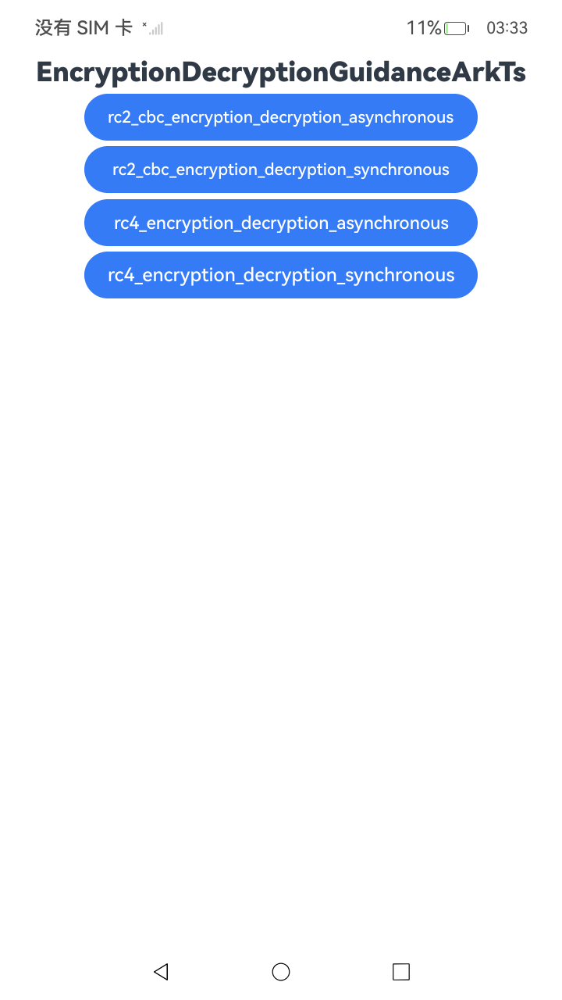

# 弱算法加解密示例（RC2/RC4）(ArkTS)

### 介绍

本示例主要展示使用弱算法 **RC2-CBC**、**RC4** 进行加解密的同步与异步方法（ArkTS）。该类算法仅用于兼容旧系统或文档说明，实际生产环境请使用 AES 等强算法。该工程中展示的代码详细描述可查阅安全加解密相关文档。

- [使用RC2对称密钥(CBC)模式 加解密(ArkTs)](https://gitcode.com/openharmony/docs/blob/master/zh-cn/application-dev/security/CryptoArchitectureKit/crypto-rc2-sym-encrypt-decrypt-cbc.md)
- [使用RC4对称密钥 加解密(ArkTs)](https://gitcode.com/openharmony/docs/blob/master/zh-cn/application-dev/security/CryptoArchitectureKit/crypto-rc4-sym-encrypt-decrypt.md)

### 效果预览

| 首页效果图                                                   | 
| ------------------------------------------------------------ | 
|  | 

### 使用说明

1. 运行 Index 主界面。
2. 页面呈现上述执行结果图效果，点击「RC2_CBC 异步/同步」「RC4 异步/同步」等按钮可跳转到对应功能页面，在子页面中点击按钮执行加解密操作，并更新文本内容。
3. 运行测试用例 `EncryptionDecryptionGuidanceArkTs.test.ets` 对页面代码进行测试，可全部通过。

### 工程目录

```
entry/src/
 ├── main
 │   ├── ets
 │   │   ├── entryability
 │   │   ├── entrybackupability
 │   │   ├── pages
 │   │       ├── rc2_cbc_encryption_decryption
 │   │       │   ├── rc2_cbc_encryption_decryption_asynchronous.ets
 │   │       │   ├── rc2_cbc_encryption_decryption_synchronous.ets
 │   │       ├── rc4_cbc_encryption_decryption
 │   │       │   ├── rc4_encryption_decryption_asynchronous.ets
 │   │       │   ├── rc4_encryption_decryption_synchronous.ets
 │   │       ├── Index.ets               // 弱算法加解密(ArkTS)示例入口
 │   ├── module.json5
 │   └── resources
 ├── ohosTest
 │   ├── ets
 │   │   └── test
 │   │       ├── Ability.test.ets
 │   │       ├── EncryptionDecryptionGuidanceArkTs.test.ets  // 自动化测试代码
 │   │       └── List.test.ets
```

### 具体实现
使用createSymKeyGenerator接口传入需要生成的算法（RC2），使用createCipher传入（RC2|CBC|PKCS7）生成加解密生成器，调用cipher.init传入加解密参数，cipher.doFinal获取加解密结果。具体查看对应接口[@js-apis-cryptoFramework](https://gitcode.com/openharmony/docs/blob/master/zh-cn/application-dev/reference/apis-crypto-architecture-kit/js-apis-cryptoFramework.md)

### 相关权限

不涉及。

### 依赖

不涉及。

### 约束与限制

1. 本示例仅支持在标准系统上运行，支持设备：RK3568。
2. 本示例为 Stage 模型，支持 API14 版本 SDK，版本号：5.0.2.57，镜像版本号：OpenHarmony_5.0.2.58。
3. 本示例需使用 DevEco Studio 5.0.1 Release (Build Version: 5.0.5.306, built on December 6, 2024) 及以上版本才可编译运行。

### 下载

如需单独下载本工程，执行如下命令：

````
git init
git config core.sparsecheckout true
echo code/DocsSample/Security/CryptoArchitectureKit/EncryptionDecryption/EncryptionDecryptionGuidanceArkTs > .git/info/sparse-checkout
git remote add origin https://gitcode.com/openharmony/applications_app_samples.git
git pull origin master
````
