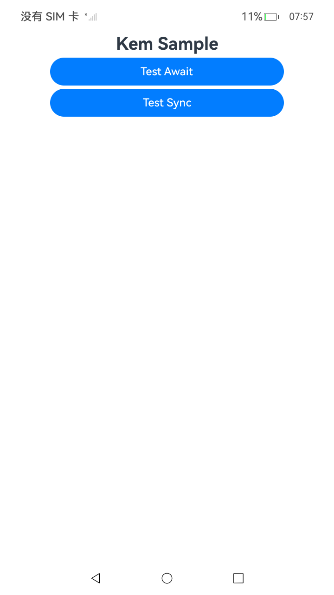

# 使用KEM算法进行密钥封装解封装(ArkTS)

### 介绍

本示例主要展示了使用KEM算法进行封装解封装(ArkTS)的同步异步方法场景 。该工程中展示的代码详细描述可查如下链接。

- [使用KEM算法进行密钥封装解封装(ArkTS)](https://gitcode.com/openharmony/docs/blob/master/zh-cn/application-dev/security/CryptoArchitectureKit/crypto-kem-encapsulate-decapsulate.md)

### 效果预览

| 首页效果图                              | 异步任务执行结果图                   | 同步任务执行结果图                        |
| -------------------------------------- | ----------------------------------- | ----------------------------------------- |
|  |  |  |

### 使用说明

1. 运行Index主界面。
2. 页面呈现上述执行结果图效果，点击不同按钮可以跳转到不同功能页面，点击跳转页面中按钮可以执行对应操作，并更新文本内容。

### 工程目录

```
entry/src/
 ├── main
 │   ├── ets
 │   │   ├── entryability
 │   │   ├── entrybackupability
 │   │   ├── pages
 │   │       ├── Await.ets               // 使用KEM算法进行密钥封装解封装(ArkTS)异步示例代码
 │   │       ├── Sync.ets               // 使用KEM算法进行密钥封装解封装(ArkTS)同步示例代码
 │   │       ├── Index.ets
 │   ├── module.json5
 │   └── resources
 ├── ohosTest
 │   ├── ets
 │   │   └── test
 │   │       ├── Ability.test.ets 
 │   │       └── List.test.ets
 │   │       └── KemEncapsulateDecapsulateTest.test.ets    // 自动化测试代码
```

### 相关权限

不涉及。

### 依赖

不涉及。

### 约束与限制

1.本示例仅支持标准系统上运行, 支持设备：RK3568。

2.本示例为Stage模型，支持API26版本SDK，版本号：7.0.0.26，镜像版本号：OpenHarmony_7.0.0.26。

3.本示例需要使用DevEco Studio 6.1.0 Release(6.1.0.850)及以上版本才可编译运行。

### 下载

如需单独下载本工程，执行如下命令：

````
git init
git config core.sparsecheckout true
echo code/DocsSample/Security/CryptoArchitectureKit/KemEncapsulateDecapsulate > .git/info/sparse-checkout
git remote add origin https://gitcode.com/openharmony/applications_app_samples.git
git pull origin master
````