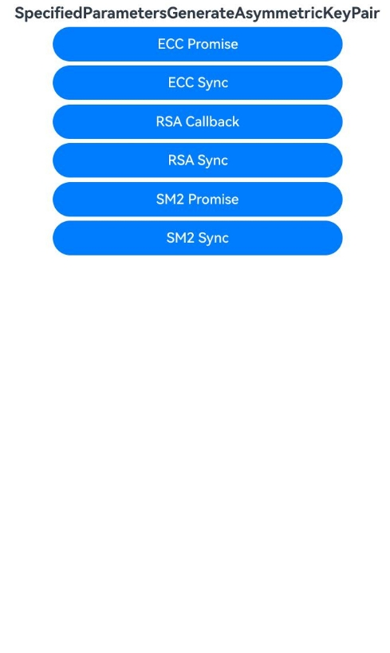

# 指定密钥参数生成非对称密钥对

### 介绍

以RSA、ECC、SM2为例，根据指定的密钥参数，生成非对称密钥对（KeyPair），并获取密钥参数属性。该对象可用于后续的加解密等操作。获取的密钥参数属性可用于存储或运输。

本示例主要展示了指定密钥参数生成非对称密钥对，指定密钥参数生成RSA公钥、指定密钥参数生成ECC密钥对、根据椭圆曲线名生成SM2密钥对场景。该工程中展示的代码详细描述可查如下链接中业务扩展场景介绍部分。

- [指定密钥参数生成非对称密钥对](https://docs.openharmony.cn/pages/v5.0/zh-cn/application-dev/security/CryptoArchitectureKit/crypto-generate-asym-key-pair-from-key-spec.md)

### 效果预览

| 首页效果图                                                   | 执行结果图                                                   |
| ------------------------------------------------------------ | ------------------------------------------------------------ |
|  |  |

### 使用说明

1. 运行Index主界面。
2. 页面呈现上述执行结果图效果，点击不同按钮可以跳转到不同功能页面，点击跳转页面中按钮可以执行对应操作，并更新文本内容。
3. 运行测试用例SpecifiedParametersGenerateAsymmetricKeyPair.test.ets文件对页面代码进行测试可以全部通过。

### 工程目录

```
entry/src/
 ├── main
 │   ├── ets
 │   │   ├── entryability
 │   │   ├── entrybackupability
 │   │   ├── pages
 │   │       ├── Index.ets               // 指定密钥参数生成非对称密钥对示例代码
 │   │       ├── ecc
 │   │       |   ├── Promise.ets
 │   │       |   ├── Sync.ets
 │   │       ├── rsa
 │   │       |   ├── Callback.ets
 │   │       |   ├── Sync.ets
 │   │       ├── sm2
 │   │       |   ├── Promise.ets
 │   │       |   ├── Sync.ets
 │   ├── module.json5
 │   └── resources
 ├── ohosTest
 │   ├── ets
 │   │   └── test
 │   │       ├── Ability.test.ets 
 │   │       ├── SpecifiedParametersGenerateAsymmetricKeyPair.test.ets  // 自动化测试代码
 │   │       └── List.test.ets
```

### 相关权限

不涉及。

### 依赖

不涉及。

### 约束与限制

1.本示例仅支持标准系统上运行, 支持设备：RK3568。

2.本示例为Stage模型，支持API14版本SDK，版本号：5.0.2.57，镜像版本号：OpenHarmony_5.0.2.58。

3.本示例需要使用DevEco Studio 5.0.1 Release (Build Version: 5.0.5.306, built on December 6, 2024)及以上版本才可编译运行。

### 下载

如需单独下载本工程，执行如下命令：

````
git init
git config core.sparsecheckout true
echo code/DocsSample/Security/CryptoArchitectureKit/KeyGenerationConversion/SpecifiedParametersGenerateAsymmetricKeyPair > .git/info/sparse-checkout
git remote add origin https://gitee.com/openharmony/applications_app_samples.git
git pull origin master
````