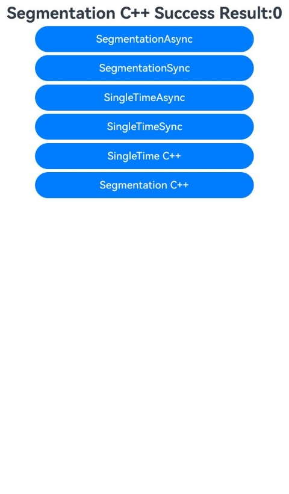

# 消息摘要计算

### 介绍

本示例主要展示了消息摘要计算(ArkTS)、消息摘要计算(C/C++)场景。该示例支持三种摘要算法：MD5、SHA256、SHA3，每种算法都提供了单次计算和分段计算两种模式，以及同步和异步两种调用方式。该工程中展示的代码详细描述可查如下链接。

- [消息摘要计算SHA256(ArkTS)](https://gitcode.com/openharmony/docs/blob/master/zh-cn/application-dev/security/CryptoArchitectureKit/crypto-generate-message-digest.md)
- [消息摘要计算SHA256(C/C++)](https://gitcode.com/openharmony/docs/blob/master/zh-cn/application-dev/security/CryptoArchitectureKit/crypto-generate-message-digest-ndk.md)
- [消息摘要计算MD5(ArkTS)](https://gitcode.com/openharmony/docs/blob/master/zh-cn/application-dev/security/CryptoArchitectureKit/crypto-generate-message-digest-md5.md)
- [消息摘要计算MD5(C/C++)](https://gitcode.com/openharmony/docs/blob/master/zh-cn/application-dev/security/CryptoArchitectureKit/crypto-generate-message-digest-md5-ndk.md)
- [消息摘要计算SHA3(ArkTS)](https://gitcode.com/openharmony/docs/blob/master/zh-cn/application-dev/security/CryptoArchitectureKit/crypto-generate-message-digest-sha3.md)
- [消息摘要计算SHA3(C/C++)](https://gitcode.com/openharmony/docs/blob/master/zh-cn/application-dev/security/CryptoArchitectureKit/crypto-generate-message-digest-sha3-ndk.md)

### 效果预览

| 首页效果图                                                   | 执行结果图                                                   |
|---------------------------------------------------------| ------------------------------------------------------------ |
|  |  |

### 使用说明

1. 运行Index主界面。
2. 页面呈现上述执行结果图效果，主界面包含以下功能按钮：
   - **SHA256算法**：分段异步、分段同步、单次异步、单次同步、单次C++、分段C++
   - **SHA3算法**：单次异步、单次同步、分段异步、分段同步、单次C++、分段C++
   - **MD5算法**：单次异步、单次同步、分段异步、分段同步、单次C++、分段C++
3. 点击不同按钮可以跳转到对应功能页面，点击跳转页面中按钮可以执行对应操作，并更新文本内容。
4. 运行测试用例MessageDigestComputation.test.ets文件对页面代码进行测试可以全部通过。

### 工程目录

```
entry/src/
 ├── main
 │   ├── cpp
 │   │   ├── types
 │   │   │   ├── libentry
 │   │   │   │   ├── index.d.ts
 │   │   │   │   └── oh-package.json5
 │   │   │   └── project
 │   │   │       ├── file.h
 │   │   │       ├── md5
 │   │   │       │   ├── segmentation.cpp
 │   │   │       │   └── singleTime.cpp
 │   │   │       ├── sha256
 │   │   │       │   ├── segmentation.cpp
 │   │   │       │   └── singleTime.cpp
 │   │   │       └── sha3
 │   │   │           ├── segmentation.cpp
 │   │   │           └── singleTime.cpp
 │   │   ├── CMakeLists.txt
 │   │   └── napi_init.cpp
 │   ├── ets
 │   │   ├── entryability
 │   │   ├── entrybackupability
 │   │   └── pages
 │   │       ├── Index.ets                    // 消息摘要计算主界面
 │   │       ├── md5
 │   │       │   ├── segmentation
 │   │       │   │   ├── SegmentationAsync.ets
 │   │       │   │   └── SegmentationSync.ets
 │   │       │   └── singleTime
 │   │       │       ├── SingleTimeAsync.ets
 │   │       │       └── SingleTimeSync.ets
 │   │       ├── sha256
 │   │       │   ├── segmentation
 │   │       │   │   ├── SegmentationAsync.ets
 │   │       │   │   └── SegmentationSync.ets
 │   │       │   └── singleTime
 │   │       │       ├── SingleTimeAsync.ets
 │   │       │       └── SingleTimeSync.ets
 │   │       └── sha3
 │   │           ├── segmentation
 │   │           │   ├── SegmentationAsync.ets
 │   │           │   └── SegmentationSync.ets
 │   │           └── singleTime
 │   │               ├── SingleTimeAsync.ets
 │   │               └── SingleTimeSync.ets
 │   ├── module.json5
 │   └── resources
 └── ohosTest
     ├── ets
     │   └── test
     │       ├── Ability.test.ets 
     │       ├── MessageDigestComputation.test.ets  // 自动化测试代码
     │       └── List.test.ets
```

### 相关权限

不涉及。

### 依赖

不涉及。

### 约束与限制

1.本示例仅支持标准系统上运行， 支持设备：RK3568。

2.本示例为Stage模型，支持API22版本SDK，版本号：6.1.0.17，镜像版本号：OpenHarmony_6.1.0.17。

3.本示例需要使用DevEco Studio 6.0.1 Release(6.0.1.251)及以上版本才可编译运行。

### 下载

如需单独下载本工程，执行如下命令：

````
git init
git config core.sparsecheckout true
echo code/DocsSample/Security/CryptoArchitectureKit/MessageDigestComputation > .git/info/sparse-checkout
git remote add origin https://gitcode.com/openharmony/applications_app_samples.git
git pull origin master
````