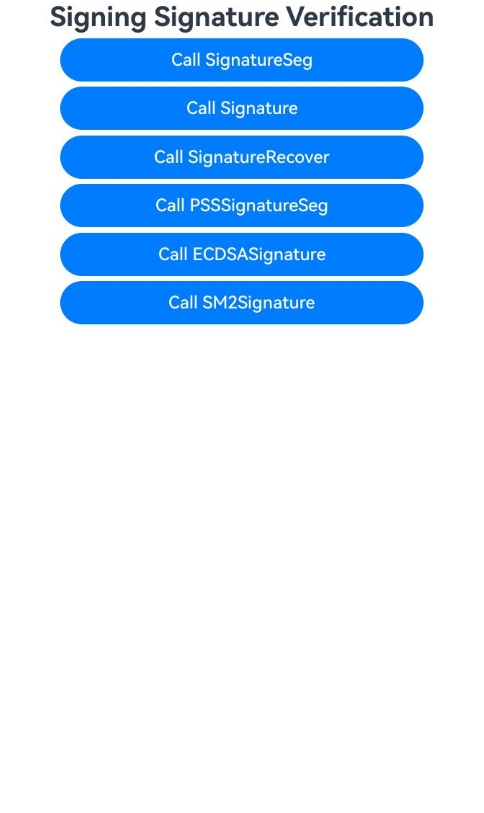
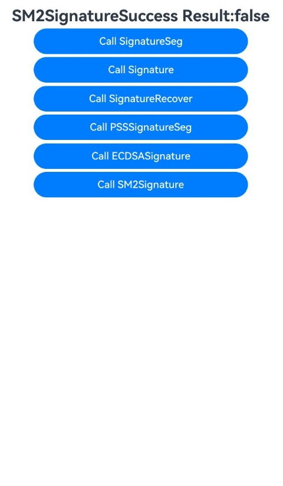

# 签名验签(C/C++)

### 介绍

当需要判断接收的数据是否被篡改、数据是否为指定对象发送的数据时，可以使用签名验签操作。接下来将说明系统目前支持的算法及其对应的规格。

本示例主要展示了签名验签(C/C++)的多种场景，包括RSA（PKCS1和PSS模式）、ECDSA、SM2等算法的签名验签功能，以及SM2签名格式转换功能。该工程中展示的代码详细描述可查如下链接。

- [使用RSA密钥对（PKCS1模式）验签(C/C++)](https://gitcode.com/openharmony/docs/blob/master/zh-cn/application-dev/security/CryptoArchitectureKit/crypto-rsa-sign-sig-verify-pkcs1-ndk.md)
- [使用RSA密钥对（PKCS1模式）签名恢复(C/C++)](https://gitcode.com/openharmony/docs/blob/master/zh-cn/application-dev/security/CryptoArchitectureKit/crypto-rsa-sign-sig-verify-recover-pkcs1-ndk.md)
- [使用RSA密钥对分段验签（PKCS1模式）(C/C++)](https://gitcode.com/openharmony/docs/blob/master/zh-cn/application-dev/security/CryptoArchitectureKit/crypto-rsa-sign-sig-verify-pkcs1-by-segment-ndk.md)
- [使用RSA密钥对验签（PSS模式）(C/C++)](https://gitcode.com/openharmony/docs/blob/master/zh-cn/application-dev/security/CryptoArchitectureKit/crypto-rsa-sign-sig-verify-pss-ndk.md)
- [使用ECDSA密钥对验签(C/C++)](https://gitcode.com/openharmony/docs/blob/master/zh-cn/application-dev/security/CryptoArchitectureKit/crypto-ecdsa-sign-sig-verify-ndk.md)
- [使用SM2密钥对验签(C/C++)](https://gitcode.com/openharmony/docs/blob/master/zh-cn/application-dev/security/CryptoArchitectureKit/crypto-sm2-sign-sig-verify-pkcs1-ndk.md)
- [SM2签名数据格式转换 (C/C++)](https://gitcode.com/openharmony/docs/blob/master/zh-cn/application-dev/security/CryptoArchitectureKit/crypto-sm2-sign-data-format-conversion-ndk.md)

### 效果预览

| 首页效果图                                                   | 执行结果图                                                   |
| ------------------------------------------------------------ | ------------------------------------------------------------ |
|  |  |

### 使用说明

1. 运行Index主界面。
2. 页面呈现上述执行结果图效果，主界面包含以下功能按钮：
   - **Call SignatureSeg**：RSA密钥对分段验签（PKCS1模式）
   - **Call Signature**：RSA密钥对验签（PKCS1模式）
   - **Call SignatureRecover**：RSA密钥对签名恢复（PKCS1模式）
   - **Call PSSSignatureSeg**：RSA密钥对验签（PSS模式）
   - **Call ECDSASignature**：ECDSA密钥对验签
   - **Call SM2Signature**：SM2密钥对验签
   - **Call SM2 RS to DER**：SM2签名格式转换（R/S转DER）
   - **Call SM2 DER Convert RS**：SM2签名格式转换（DER转R/S）
3. 点击不同按钮可以执行对应操作，并更新文本内容显示执行结果。
4. 运行测试用例SigningSignatureVerification.test.ets文件对页面代码进行测试可以全部通过。

### 工程目录

```
entry/src/
 ├── main
 │   ├── cpp
 │   │   ├── types
 │   │   │   ├── libentry
 │   │   │   │   ├── Index.d.ts
 │   │   │   │   └── oh-package.json5
 │   │   │   └── project
 │   │   │       ├── ecdsa_signature_verification.cpp
 │   │   │       ├── rsa_pkcs1_segment_signature.cpp
 │   │   │       ├── rsa_pkcs1_signature_restoration.cpp
 │   │   │       ├── rsa_pkcs1_signature_validator.cpp
 │   │   │       ├── rsa_pss_verification_tool.cpp
 │   │   │       ├── signing_signature_verification.h
 │   │   │       ├── sm2_der_convert_r_s.cpp
 │   │   │       ├── sm2_signature_format_conversion_der.cpp
 │   │   │       └── sm2_signature_verification.cpp
 │   │   ├── CMakeLists.txt
 │   │   └── napi_init.cpp
 │   ├── ets
 │   │   ├── entryability
 │   │   ├── entrybackupability
 │   │   └── pages
 │   │       └── Index.ets                    // 签名验签(C/C++)主界面
 │   ├── module.json5
 │   └── resources
 └── ohosTest
     ├── ets
     │   └── test
     │       ├── Ability.test.ets 
     │       ├── SigningSignatureVerification.test.ets  // 自动化测试代码
     │       └── List.test.ets
```

### 相关权限

不涉及。

### 依赖

不涉及。

### 约束与限制

1.本示例仅支持标准系统上运行， 支持设备：RK3568。

2.本示例为Stage模型，支持API22版本SDK，版本号：6.1.0.17，镜像版本号：OpenHarmony_6.1.0.17。

3.本示例需要使用DevEco Studio 6.0.1 Release(6.0.1.251)及以上版本才可编译运行。

### 下载

如需单独下载本工程，执行如下命令：

````
git init
git config core.sparsecheckout true
echo code/DocsSample/Security/CryptoArchitectureKit/SignatureVerification/SigningSignatureVerification > .git/info/sparse-checkout
git remote add origin https://gitcode.com/openharmony/applications_app_samples.git
git pull origin master
````