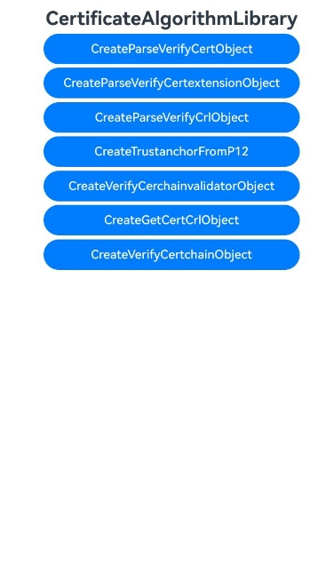

# 证书算法库

### 介绍

证书算法库框架是一个屏蔽了第三方算法库实现差异的证书算法框架，向应用提供证书、证书扩展域段、证书吊销列表的创建、解析及校验能力，此外还提供了证书链的校验能力。

本示例主要展示了证书算法库中证书对象的创建、证书扩展信息对象的创建、证书吊销列表对象的创建、证书链校验时从p12文件构造TrustAnchor对象数组、证书链校验器对象的创建和校验、证书集合及证书吊销列表集合对象的创建和获取、证书链对象的创建和校验的场景。该工程中展示的代码详细描述可查如下链接中业务扩展场景介绍部分。

- [证书对象的创建、解析和校验](https://gitcode.com/openharmony/docs/blob/master/zh-cn/application-dev/security/DeviceCertificateKit/create-parse-verify-cert-object.md)
- [证书扩展信息对象的创建、解析和校验](https://gitcode.com/openharmony/docs/blob/master/zh-cn/application-dev/security/DeviceCertificateKit/create-parse-verify-certextension-object.md)
- [证书吊销列表对象的创建、解析和校验](https://gitcode.com/openharmony/docs/blob/master/zh-cn/application-dev/security/DeviceCertificateKit/create-parse-verify-crl-object.md)
- [证书链校验时从p12文件构造TrustAnchor对象数组](https://gitcode.com/openharmony/docs/blob/master/zh-cn/application-dev/security/DeviceCertificateKit/create-trustanchor-from-p12.md)
- [证书链校验器对象的创建和校验](https://gitcode.com/openharmony/docs/blob/master/zh-cn/application-dev/security/DeviceCertificateKit/create-verify-cerchainvalidator-object.md)
- [证书集合及证书吊销列表集合对象的创建和获取](https://gitcode.com/openharmony/docs/blob/master/zh-cn/application-dev/security/DeviceCertificateKit/create-get-cert-crl-object.md)
- [证书链对象的创建和校验](https://gitcode.com/openharmony/docs/blob/master/zh-cn/application-dev/security/DeviceCertificateKit/create-verify-certchain-object.md)
- [使用系统预置CA证书校验证书链](https://gitcode.com/openharmony/docs/blob/master/zh-cn/application-dev/security/DeviceCertificateKit/verify-certchain-by-systemca.md)
- [证书CMS签名](https://gitcode.com/openharmony/docs/blob/master/zh-cn/application-dev/security/DeviceCertificateKit/create-cms-sign-object.md)
- [证书CMS封装](https://gitcode.com/openharmony/docs/blob/master/zh-cn/application-dev/security/DeviceCertificateKit/create-cms-enveloped-object.md)
- [证书CMS验签](https://gitcode.com/openharmony/docs/blob/master/zh-cn/application-dev/security/DeviceCertificateKit/create-cms-verify-object.md)
- [证书CMS解封装](https://gitcode.com/openharmony/docs/blob/master/zh-cn/application-dev/security/DeviceCertificateKit/create-cms-decapsulation-object.md)
- [证书PKCS12的创建和解析](https://gitcode.com/openharmony/docs/blob/master/zh-cn/application-dev/security/DeviceCertificateKit/create-parse-pkcs12.md)
- [证书链在线校验证书吊销状态](https://gitcode.com/openharmony/docs/blob/master/zh-cn/application-dev/security/DeviceCertificateKit/create-verify-cerchainvalidator-revocation-object.md)
- [证书链校验时下载缺失的中间CA证书](https://gitcode.com/openharmony/docs/blob/master/zh-cn/application-dev/security/DeviceCertificateKit/allow-download-Intermediate-Cert.md)
### 效果预览

| 首页效果图                                                   | 执行结果图                                                   |
| ------------------------------------------------------------ | ------------------------------------------------------------ |
|  |  |

### 使用说明

1. 运行Index主界面。
2. 页面呈现上述执行结果图效果，点击不同按钮可以跳转到不同功能页面，点击跳转页面中按钮可以执行对应操作，并更新文本内容。
3. 运行测试用例CertificateAlgorithmLibrary.test.ets文件对页面代码进行测试可以全部通过。

### 工程目录

```
entry/src/
 ├── main
 │   ├── ets
 │   │   ├── entryability
 │   │   ├── entrybackupability
 │   │   ├── pages
 │   │       ├── Index.ets               // 证书算法库示例代码
 │   │       ├── VerifyCertchainOnlineRevocationStatus.ets
 │   │       ├── CreateParsePkcs12.ets
 │   │       ├── CreateCmsOperator.ets
 │   │       ├── AllowDownloadIntermediateCert.ets
 │   │       ├── IgnoreNetworkUnreachable.ets
 │   │       ├── CreateOnlineCheckIntermediateCertificateonlyObject.ets
 │   │       ├── CreateOnlyCheckLeafCertRevocateObject.ets
 │   │       ├── CreateParsePkcs12Sync.ets
 │   │       ├── CreateParsePkcs12Async.ets
 │   │       ├── CreateCmsDecapsulationObject.ets
 │   │       ├── CreateCmsVerifyObject.ets
 │   │       ├── CreateCmsEnvelopedObject.ets
 │   │       ├── CreateCmsSignObjectSync.ets
 │   │       ├── CreateCmsSignObjectAsync.ets
 │   │       ├── VerifyCertchainBySystemca.ets
 │   │       ├── CreateGetCertCrlObject.ets
 │   │       ├── CreateParseVerifyCertextensionObject.ets
 │   │       ├── CreateParseVerifyCertObject.ets
 │   │       ├── CreateParseVerifyCrlObject.ets
 │   │       ├── CreateTrustanchorFromP12.ets
 │   │       ├── CreateVerifyCerchainvalidatorObject.ets
 │   │       ├── CreateVerifyCertchainObject.ets
 │   ├── module.json5
 │   └── resources
 ├── ohosTest
 │   ├── ets
 │   │   └── test
 │   │       ├── Ability.test.ets 
 │   │       ├── CertificateAlgorithmLibrary.test.ets  // 自动化测试代码
 │   │       └── List.test.ets
```

### 相关权限

不涉及。

### 依赖

不涉及。

### 约束与限制

1.本示例仅支持标准系统上运行, 支持设备：RK3568。

2.本示例为Stage模型，支持API23版本SDK，版本号：6.1.0.21，镜像版本号：OpenHarmony_6.1.0.21。

3.本示例需要使用DevEco Studio 6.0.1 Release(6.0.1.251)及以上版本才可编译运行。

### 下载

如需单独下载本工程，执行如下命令：

````
git init
git config core.sparsecheckout true
echo code/DocsSample/Security/DeviceCertificateKit/CertificateAlgorithmLibrary > .git/info/sparse-checkout
git remote add origin https://gitee.com/openharmony/applications_app_samples.git
git pull origin master
````