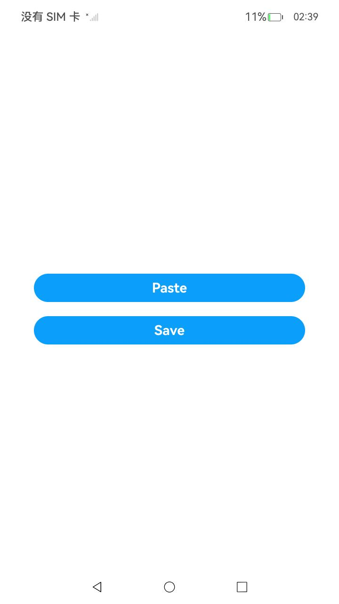
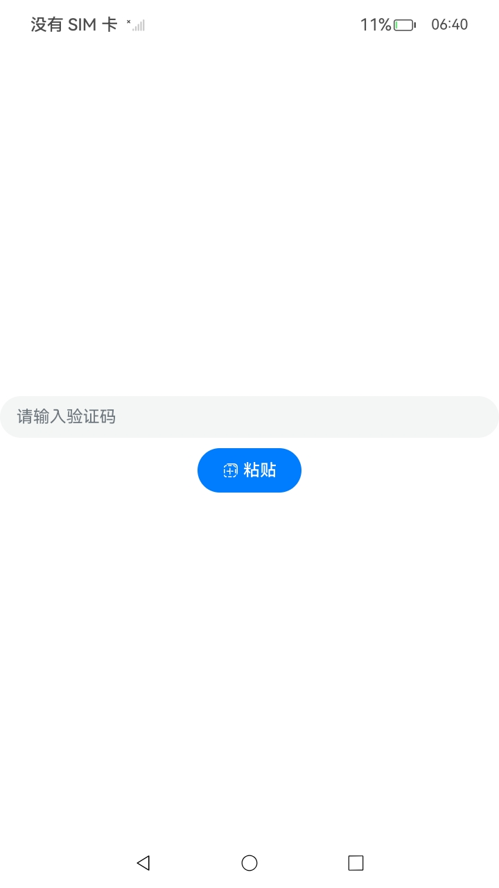
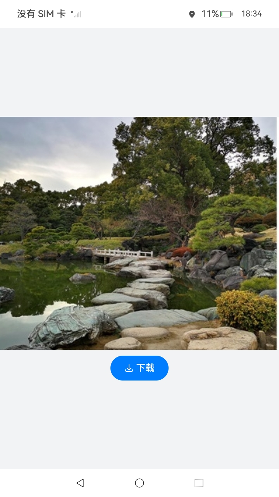

# 安全控件类型的UI控件

### 介绍

本示例提供了安全控件类型的UI控件，支撑应用开发者集成安全控件做临时授权场景，当用户实际点击了某种类型的安全控件时，会对应用进行相应的临时授权，减少权限弹窗对用户的干扰，同时提供更小的授权范围。

### 效果预览

|                 主页                  |                  Paste                  |                **Save**                |
|:-----------------------------------:|:---------------------------------------:| :------------------------------------: |
|       |         |  |

使用说明
1. 在主界面，点击“Paste”按钮，进入“Paste”界面，在文本输入框输入文字，全选剪切文字，点击“粘贴”按钮，获取剪贴板内容并显示在输入框中。

2. 在主界面，点击“Save”按钮，进入“Save”界面，点击“下载”按钮，将当前页面中的图片保存到本地的图库中。

### 工程目录

```
SecurityComponent
├──entry/src/main
│  ├──ets                                    
│  │  ├──entryability
│  │  │  └──EntryAbility.ets                        // 程序入口类
|  |  ├──pages                                      // 页面文件
│  │  │  └──Index.ets                               // 首页
│  │  └──securitycomponent                          // 组件文件
│  │     └──page  
│  │        ├──Paste.ets                            // 剪贴板安全控件界面
│  │        └──Save.ets                             // 媒体库安全控件界面
|  ├──resources                                     // 资源文件目录
│  │

```

### 具体实现

* 本示例分为剪贴板安全控件模块，媒体库安全控件模块。

  * 剪贴板安全控件模块

    * 使用PasteButton组件开发获取剪贴板信息功能，在其点击回调onclick事件中调用pasteboard.getSystemPasteboard().getData()将文本复制到剪贴板中，使用pasteData.getPrimaryText()得到剪贴板内容。
    * 接口参考：[@ohos.pasteboard](https://gitcode.com/openharmony/docs/blob/OpenHarmony-6.0-Release/zh-cn/application-dev/reference/apis-basic-services-kit/js-apis-pasteboard.md)
  * 媒体库安全控件模块
  
    * 使用SaveButton组件开发保存图片到媒体库功能，在其点击回调onclick事件中调用photoAccessHelper.getPhotoAccessHelper()得到媒体库图片管理器helper， helper.createAsset()得到保存到媒体库图片的uri，使用resourceManager.getMediaContent()得到存放在Resources/base/media文件下的test.jpg图片内容，调用fs.open()和fs.write()将图片内容通过得到的uri写到媒体库中，最后fs.close()关闭文件。
    * 接口参考：[@ohos.file.photoAccessHelper-f](https://gitcode.com/openharmony/docs/blob/OpenHarmony-6.0-Release/zh-cn/application-dev/reference/apis-media-library-kit/arkts-apis-photoAccessHelper-f.md)，[@ohos.file.photoAccessHelper-PhotoAccessHelper](https://gitcode.com/openharmony/docs/blob/OpenHarmony-6.0-Release/zh-cn/application-dev/reference/apis-media-library-kit/arkts-apis-photoAccessHelper-PhotoAccessHelper.md)，[@ohos.file.fs](https://gitcode.com/openharmony/docs/blob/OpenHarmony-6.0-Release/zh-cn/application-dev/reference/apis-core-file-kit/js-apis-file-fs.md)

### 相关权限

不涉及。

### 依赖

不涉及。

### 约束与限制

1. 本示例仅支持标准系统上运行，支持设备：RK3568，GPS定位功能仅支持部分机型。
2. 本示例为Stage模型，支持API20版本SDK，版本号：（6.0.0.38）。
3. 本示例已支持使DevEco Studio 6.0.0 Release(构建版本：6.0.0.868)编译运行。

### 下载

如需单独下载本工程，执行如下命令：

```
git init
git config core.sparsecheckout true
echo code/DocsSample/Security/SecurityComponent/ > .git/info/sparse-checkout
git remote add origin https://gitcode.com/openharmony/applications_app_samples.git
git pull origin master
```