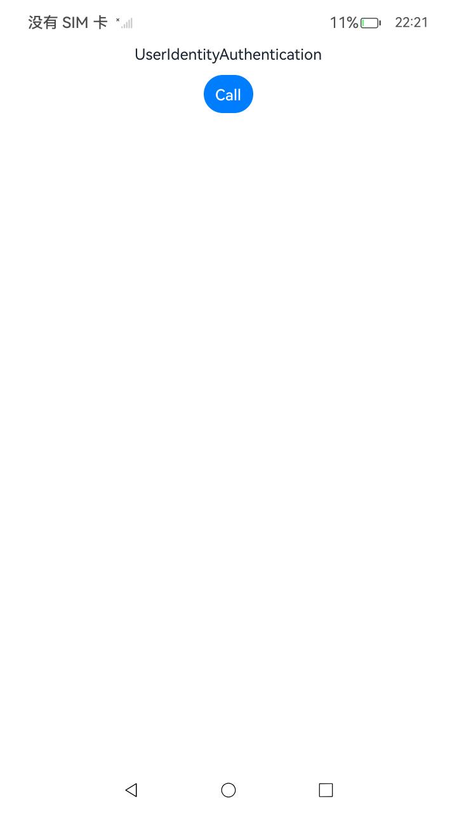
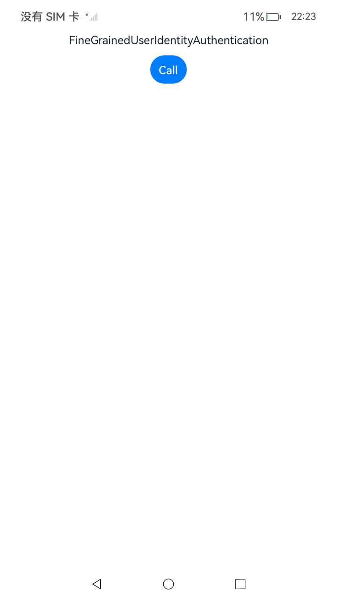

## 用户身份认证访问控制开发指导

### 介绍

1. 本工程主要实现了对以下指南文档中 https://docs.openharmony.cn/pages/v5.0/zh-cn/application-dev/security/UniversalKeystoreKit/huks-user-identity-authentication.md 示例代码片段的工程化，主要目标是实现指南中示例代码需要与sample工程文件同源。

#### UserIdentityAuthentication

##### 介绍

1. 本示例主要介绍实现用户身份认证访问控制，确保只有经过PIN认证的用户才能对加密数据进行操作。

##### 效果预览

| 主页                                                                      | 删除                                                                      |
| ------------------------------------------------------------------------- | ------------------------------------------------------------------------- |
|  |  |

使用说明

1. 点击Call按钮依据预先设定的参数（如 SM4 算法、PIN认证等）生成密钥。

## 细粒度用户身份认证访问控制开发指导

### 介绍

1. 本工程主要实现了对以下指南文档中 https://docs.openharmony.cn/pages/v5.0/zh-cn/application-dev/security/UniversalKeystoreKit/huks-refined-user-identity-authentication.md 示例代码片段的工程化，主要目标是实现指南中示例代码需要与sample工程文件同源。

#### FineGrainedUserIdentityAuthentication

##### 介绍

1. 本示例主要介绍细粒度用户身份认证访问控制，允许设置密钥在加密、解密、签名、验签、密钥协商、密钥派生的单个或多个场景时是否需要进行身份验证。

##### 效果预览

| 主页                                                                                 | 跳转页                                                                               |
| ------------------------------------------------------------------------------------ | ------------------------------------------------------------------------------------ |
|  |  |

使用说明

1. 点击Call 按钮生成一个基于 SM4 算法、支持PIN认证且在解密时需身份验证的密钥。

## 工程目录

```
entry/src/main/
|---ets
|---|---entryability
|---|---|---EntryAbility.ets
|---|---pages
|---|---|---Index.ets                                           // 首页
|---|---|---FineGrainedUserIdentityAuthentication.ets
|---|---|---UserIdentityAuthentication.ets
|---cpp
|---resources                                                   // 静态资源
|---ohosTest
|---|---ets
|---|---|---tests
|---|---|---|---AccessControl.test.ets                          // 自动化测试用例
```

## 相关权限

[ohos.permission.ACCESS_BIOMETRIC](https://docs.openharmony.cn/pages/v5.0/zh-cn/application-dev/security/AccessToken/permissions-for-all.md#ohospermissionaccessbiometric)

## 依赖

不涉及。

## 约束与限制

1. 本示例仅支持标准系统上运行，支持设备：RK3568。
2. 本示例支持API14版本SDK，SDK版本号(API Version 14 Release)。
3. 本示例需要使用DevEco Studio 版本号(5.0.1Release)才可编译运行。

## 下载

如需单独下载本工程，执行如下命令：

```
git init
git config core.sparsecheckout true
echo code/DocsSample/Security/UniversalKeystoreKit/KeyUsage/AccessControl > .git/info/sparse-checkout
git remote add origin https://gitee.com/openharmony/applications_app_samples.git
git pull origin master
```
