## 加解密(ArkTS)

### 介绍

1. 本工程主要实现了对以下指南文档中 https://docs.openharmony.cn/pages/v5.0/zh-cn/application-dev/security/UniversalKeystoreKit/huks-encryption-decryption-arkts.md 示例代码片段的工程化，主要目标是实现指南中示例代码需要与sample工程文件同源。

####  AES/CBC/PKCS7

##### 介绍

1. 本示例主要介绍使用AES算法加密，用例中选取的分组模式为CBC、填充模式为PKCS7时，必须要填参数IV。

##### 效果预览

| 主页                                                       | 删除                                                       |
| ---------------------------------------------------------- | ---------------------------------------------------------- |
| 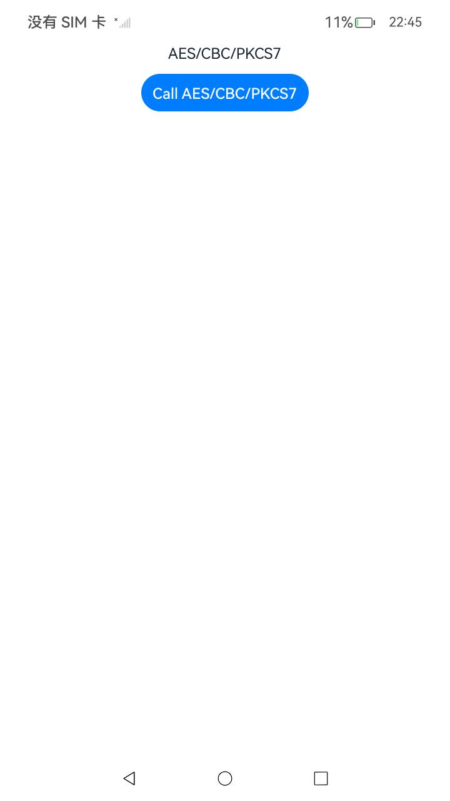 | 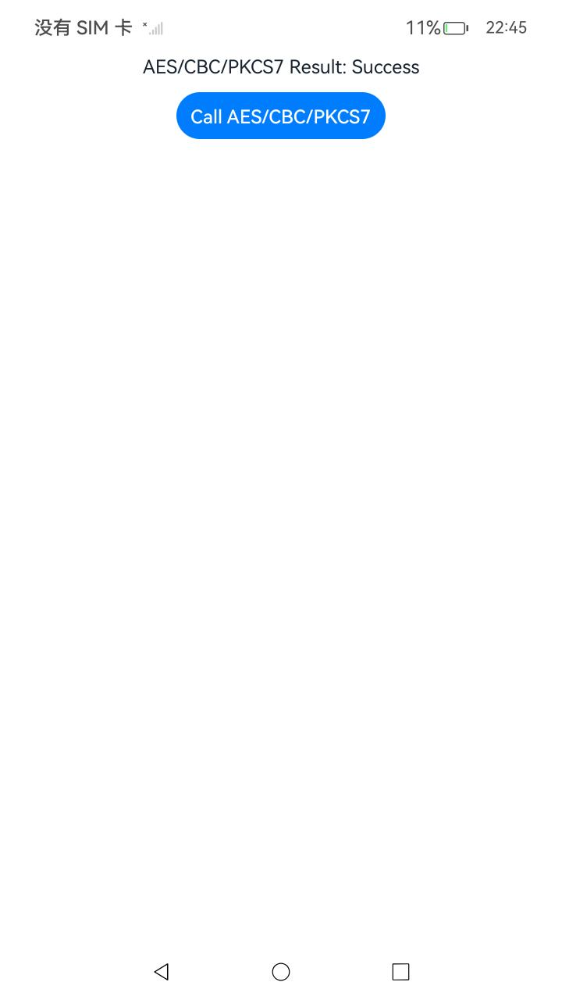 |

使用说明

1. 点击AES/CBC/PKCS7按钮生成密钥，加密数据并解密数据，删除密钥。

####  AES/GCM/NoPadding

##### 介绍

1. 本示例主要介绍使用AES算法加密，用例中选取的分组模式为GCM时，必须要填参数NONCE，AAD可选。

##### 效果预览

| 主页                                                         | 删除                                                         |
| ------------------------------------------------------------ | ------------------------------------------------------------ |
| 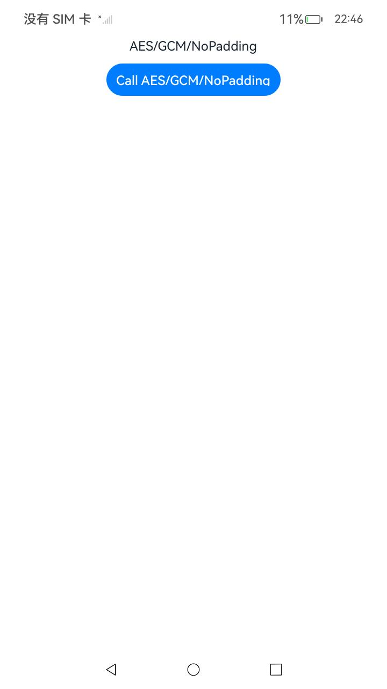 | 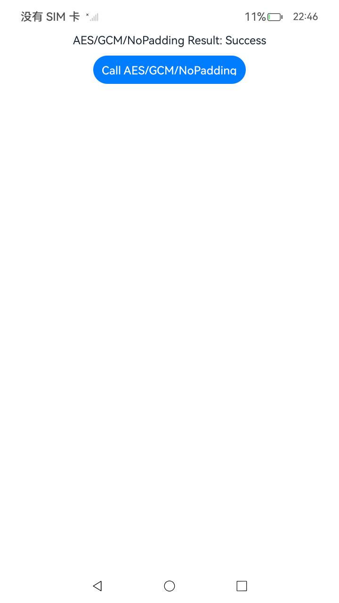 |

使用说明

1. 点击AES/GCM/NoPadding按钮生成密钥，加密数据并解密数据，删除密钥。

####  RSA/ECB/PKCS1_V1_5

##### 介绍

1. 本示例主要介绍使用RSA算法加密，需要选择其对应分组模式以及填充模式和摘要算法DIGEST。

##### 效果预览

| 主页                                                         | 删除                                                         |
| ------------------------------------------------------------ | ------------------------------------------------------------ |
| 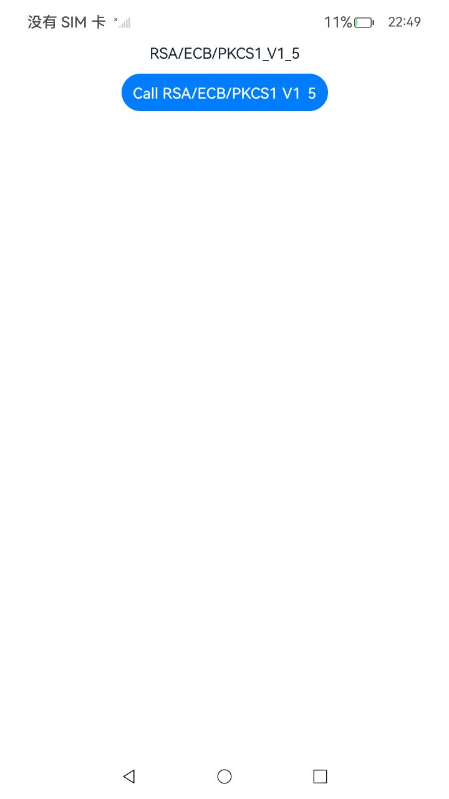 | 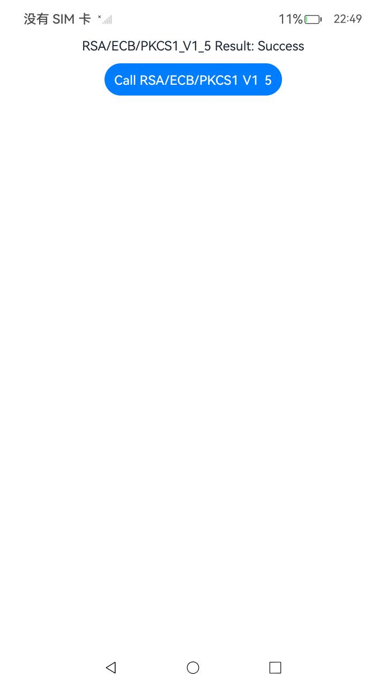 |

使用说明

1. 点击RSA/ECB/PKCS1_V1_5按钮生成密钥，加密数据并解密数据，删除密钥。

####  RSA/ECB/OAEP/SHA256

##### 介绍

1. 本示例主要介绍使用RSA算法加密，需要选择其对应分组模式以及填充模式和摘要算法DIGEST。

##### 效果预览

| 主页                                                         | 删除                                                         |
| ------------------------------------------------------------ | ------------------------------------------------------------ |
| 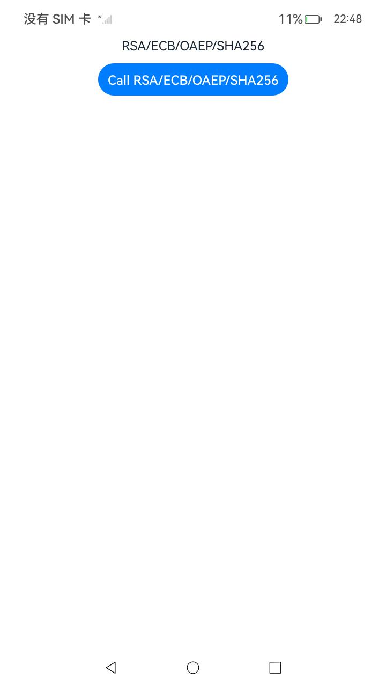 | 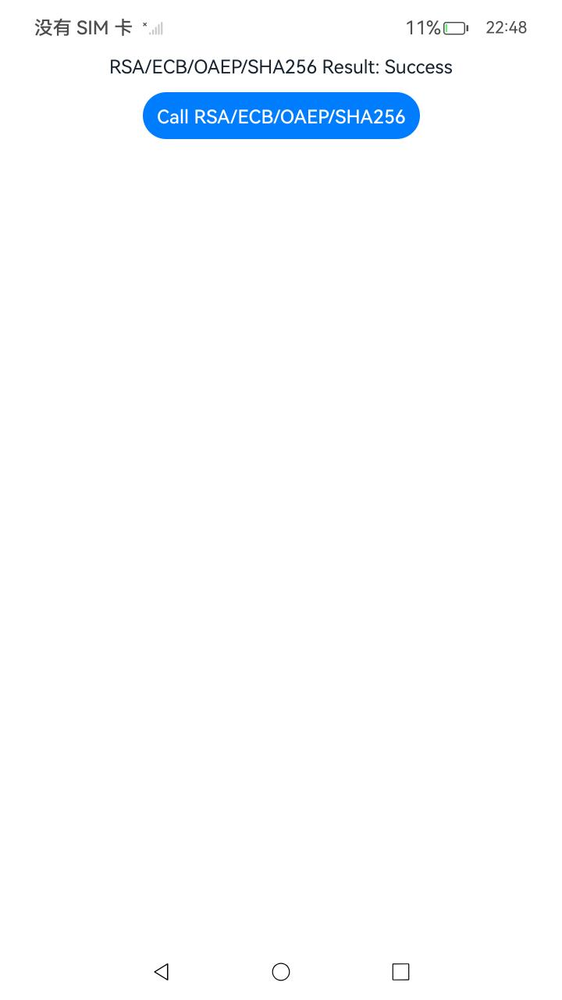 |

使用说明

1. 点击RSA/ECB/OAEP/SHA256按钮生成密钥，加密数据并解密数据，删除密钥。

####  SM2

##### 介绍

1. 本示例主要介绍使用SM2算法加密，摘要算法DIGEST需要指定为SM3。

##### 效果预览

| 主页                                               | 删除                                               |
| -------------------------------------------------- | -------------------------------------------------- |
| 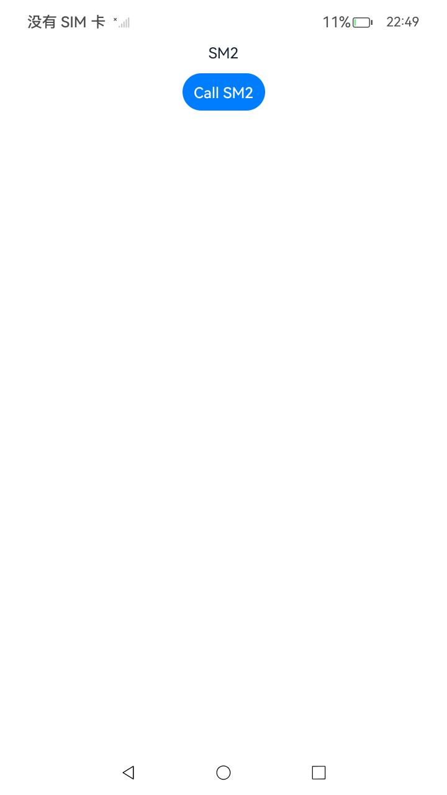 | 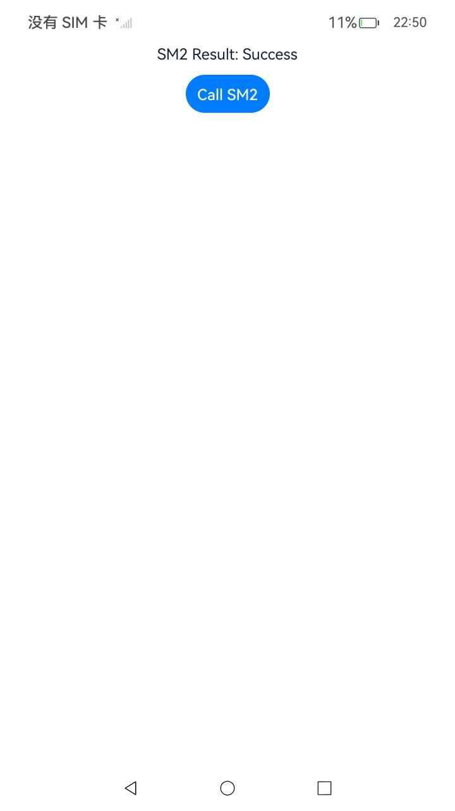 |

使用说明

1. 点击SM2按钮生成密钥，加密数据并解密数据，删除密钥。

## 加解密(C/C++)

### 介绍

1. 本工程实现了对以下 https://docs.openharmony.cn/pages/v5.0/zh-cn/application-dev/security/UniversalKeystoreKit/huks-encryption-decryption-ndk.md 示例代码片段的工程化，主要目标是实现指南中示例代码需要与sample工程文件同源。

#### Call C/C++

##### 介绍

1. 本示例主要介绍加解密，以AES 256密钥为例，完成加解密。

##### 效果预览

| 主页                                               |                                                    |
| -------------------------------------------------- | -------------------------------------------------- |
| 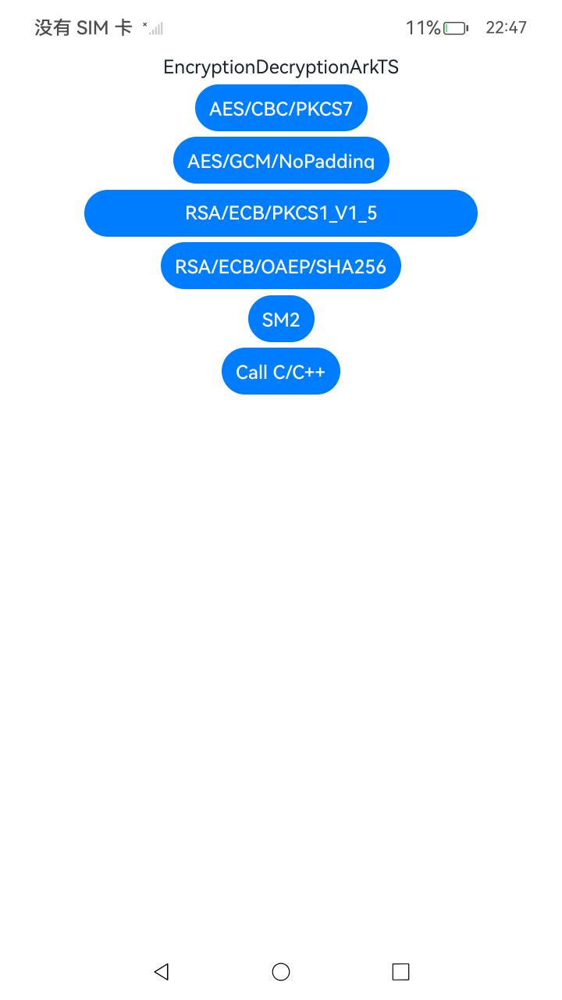 | 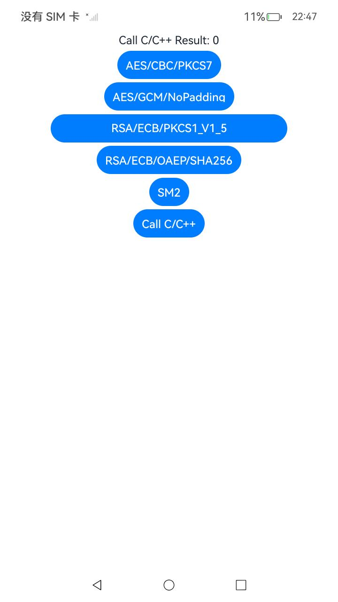 |

使用说明

1. 点击Call C/C++按钮生成密钥，加密数据并解密数据，删除密钥。

## 工程目录

```
entry/src/main/
|---ets
|---|---entryability
|---|---|---EntryAbility.ets
|---|---pages
|---|---|---AESCBCPKCS7.ets
|---|---|---AESGCMNoPadding.ets
|---|---|---Index.ets						// 首页
|---|---|---RSAECBOAEPSHA256.ets
|---|---|---RSAECBPKCS1_V1_5.ets
|---|---|---SM2.ets
|---cpp
|---resources								// 静态资源
|---ohosTest
|---|---ets
|---|---|---tests
|---|---|---|---EncryptionDecryption.test.ets        // 自动化测试用例
```


## 相关权限

无。

## 依赖

不涉及。

## 约束与限制

1. 本示例仅支持标准系统上运行，支持设备：RK3568。
2. 本示例支持API14版本SDK，SDK版本号(API Version 14 Release)。
3. 本示例需要使用DevEco Studio 版本号(5.0.1Release)才可编译运行。

## 下载

如需单独下载本工程，执行如下命令：

```
git init
git config core.sparsecheckout true
echo code/DocsSample/Security/UniversalKeystoreKit/KeyUsage/EncryptionDecryption > .git/info/sparse-checkout
git remote add origin https://gitee.com/openharmony/applications_app_samples.git
git pull origin master
```