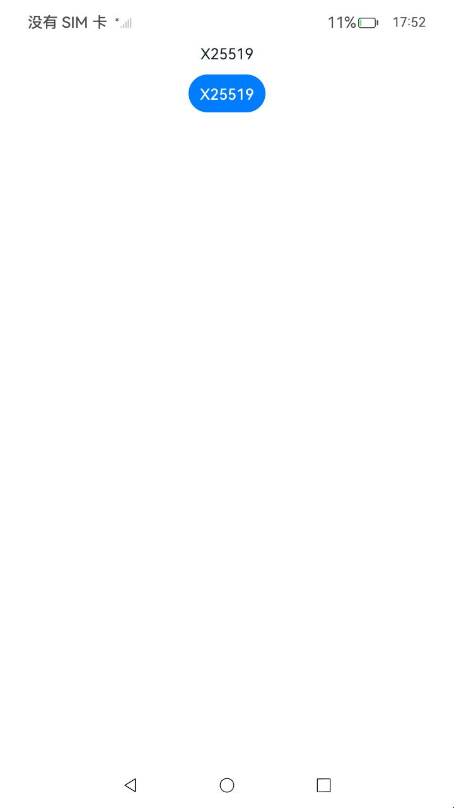
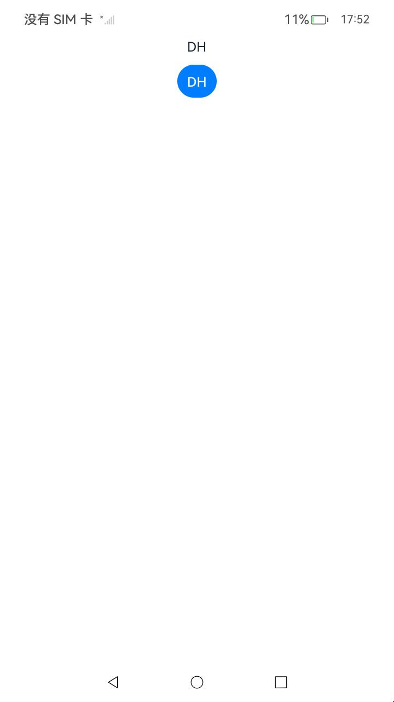

##  密钥协商(ArkTS)

### 介绍

1. 本工程主要实现了对以下指南文档中 https://docs.openharmony.cn/pages/v6.0/zh-cn/application-dev/security/UniversalKeystoreKit/huks-key-agreement-arkts.md 示例代码片段的工程化，主要目标是实现指南中示例代码需要与sample工程文件同源。

####  X25519

##### 介绍

1. 本示例主要介绍密钥协商，以协商密钥类型为X25519，并密钥仅在HUKS内使用为例，完成密钥协商。

##### 效果预览

| 主页                                                  | 执行结果                                              |
| ----------------------------------------------------- | ----------------------------------------------------- |
|  |  |

使用说明

1. 点击X25519按钮完成密钥协商。

####  DH

##### 介绍

1. 本示例主要介绍密钥协商，以协商密钥类型为DH密钥，并以密钥在HUKS内使用和返回给业务使用为例，完成密钥协商。

##### 效果预览

| 主页                                              | 执行结果                                          |
| ------------------------------------------------- | ------------------------------------------------- |
|  |  |

使用说明

1. 点击DH按钮完成密钥协商。

####  ECDH

##### 介绍

1. 本示例主要介绍密钥协商，以协商密钥类型为ECDH密钥，并密钥仅在HUKS内使用为例，完成密钥协商。

##### 效果预览

| 主页                                                   | 执行结果                                                |
|------------------------------------------------------|-----------------------------------------------------|
|  |  |

使用说明

1. 点击ECDH按钮完成密钥协商。

## 密钥协商(C/C++)

### 介绍

1. 本工程主要实现了对以下指南文档中 https://docs.openharmony.cn/pages/v6.0/zh-cn/application-dev/security/UniversalKeystoreKit/huks-key-agreement-ndk.md 示例代码片段的工程化，主要目标是实现指南中示例代码需要与sample工程文件同源。

#### Call C/C++ X25519

##### 介绍

1. 本示例主要介绍密钥协商，以X25519密钥为例，完成密钥协商。

##### 效果预览

| 主页                                                         | 执行结果                                                     |
|------------------------------------------------------------|----------------------------------------------------------|
|  |  |

使用说明

1. 点击Call C/C++ X25519按钮完成密钥协商。

#### Call C/C++ DH

##### 介绍

1. 本示例主要介绍密钥协商，以DH密钥为例，完成密钥协商。

##### 效果预览

| 主页                                                         | 执行结果                                                   |
|------------------------------------------------------------|--------------------------------------------------------|
|  |  |

使用说明

1. 点击Call C/C++ DH按钮完成密钥协商。

#### Call C/C++ ECDH

##### 介绍

1. 本示例主要介绍密钥协商，以ECDH密钥为例，完成密钥协商。

##### 效果预览

| 主页                                                         | 执行结果                                                     |
|------------------------------------------------------------|----------------------------------------------------------|
|  |  |

使用说明

1. 点击Call C/C++ ECDH按钮完成密钥协商。

## 工程目录

```
entry/src/main/
|---ets
|---|---entryability
|---|---|---EntryAbility.ets
|---|---pages
|---|---|---X25519.ets
|---|---|---DH.ets
|---|---|---ECDH.ets
|---|---|---Index.ets						// 首页
|---cpp
|---resources								// 静态资源
|---ohosTest
|---|---ets
|---|---|---tests
|---|---|---|---KeyExchange.test.ets        // 自动化测试用例
```


## 具体实现

本示例为密钥协商模块，通过调用[oh.security.huks](https://gitcode.com/openharmony/docs/blob/master/zh-cn/application-dev/reference/apis-universal-keystore-kit/js-apis-huks.md)接口实现密钥协商功能。主要流程包括：使用generateKeyItem生成密钥对，通过exportKeyItem导出公钥， 调用huks的initSession、updateSession和finishSession进行密钥协商。

## 相关权限

无。

## 依赖

不涉及。

## 约束与限制

1. 本示例仅支持标准系统上运行，支持设备：RK3568。
2. 本示例支持API20版本SDK，SDK版本号(API Version 20 Release)。
3. 本示例需要使用DevEco Studio 版本号(6.0.0Release)才可编译运行。

## 下载

如需单独下载本工程，执行如下命令：

```
git init
git config core.sparsecheckout true
echo code/DocsSample/Security/UniversalKeystoreKit/KeyUsage/KeyExchange > .git/info/sparse-checkout
git remote add origin https://gitcode.com/openharmony/applications_app_samples.git
git pull origin master
```