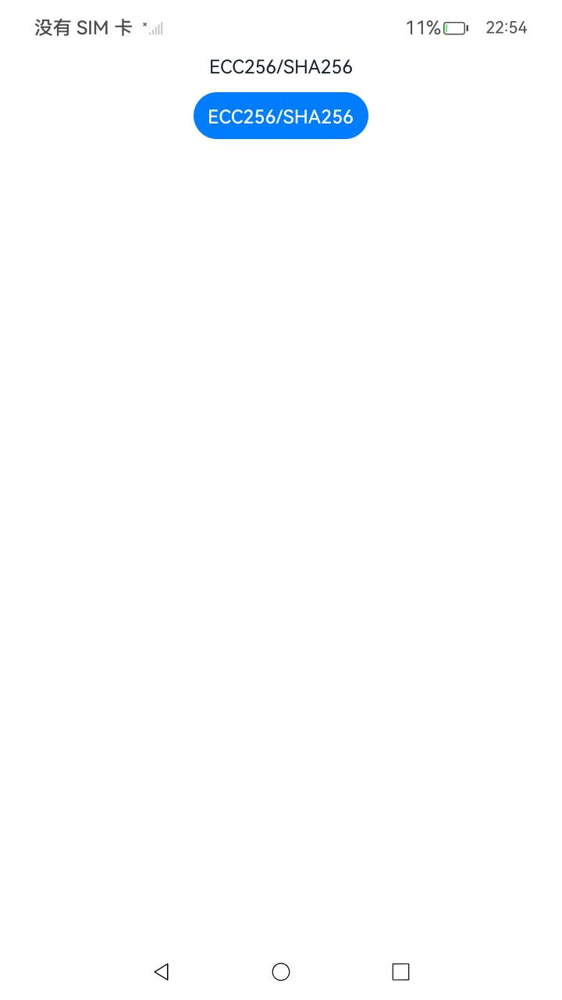
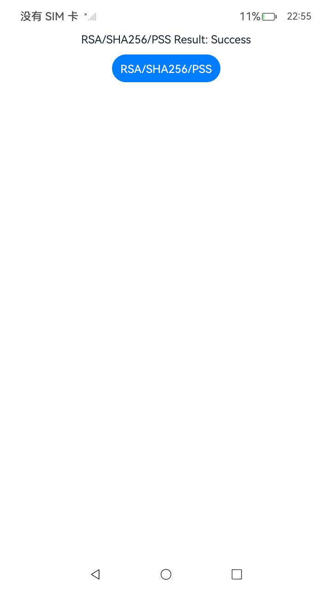
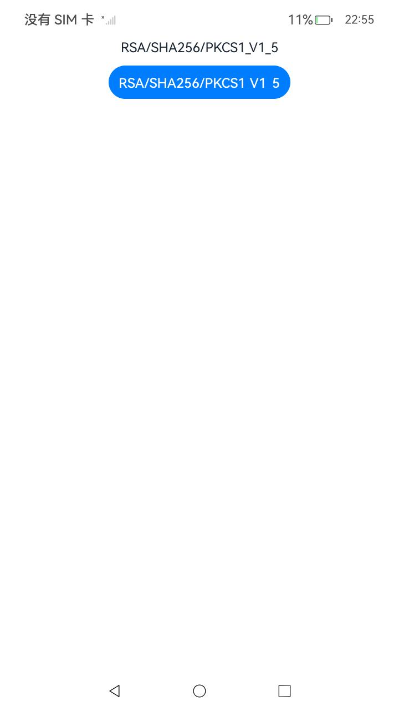
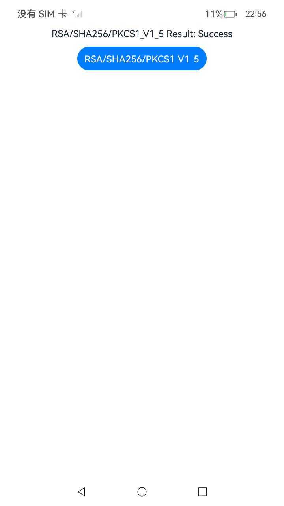

##  签名/验签(ArkTS)

### 介绍

1. 本工程主要实现了对以下指南文档中 https://docs.openharmony.cn/pages/v6.0/zh-cn/application-dev/security/UniversalKeystoreKit/huks-signing-signature-verification-arkts.md 示例代码片段的工程化，主要目标是实现指南中示例代码需要与sample工程文件同源。

####  ECC256/SHA256

##### 介绍

1. 本示例主要介绍密钥签名验签，以密钥签名验签类型ECC256/SHA256为例。

##### 效果预览

| 主页                                                 | 执行结果                                             |
| ---------------------------------------------------- | ---------------------------------------------------- |
|  |  |

##### 使用说明

1. 点击ECC256/SHA256按钮进行密钥签名验签。

####  SM2/SM3

##### 介绍

1. 本示例主要介绍密钥签名验签，以密钥签名验签类型SM2/SM3为例。

##### 效果预览

| 主页                                              | 执行结果                                          |
| ------------------------------------------------- | ------------------------------------------------- |
|  |  |

##### 使用说明

1. 点击SM2/SM3按钮进行密钥签名验签。

#### RSA/SHA256/PSS

##### 介绍

1. 本示例主要介绍密钥签名验签，以密钥签名验签类型RSA/SHA256/PSS为例。

##### 效果预览

| 主页                                              | 执行结果                                          |
| ------------------------------------------------- | ------------------------------------------------- |
|  |  |

##### 使用说明

1. 点击RSA/SHA256/PSS按钮进行密钥签名验签。

####  RSA/SHA256/PKCS1_V1_5

##### 介绍

1. 本示例主要介绍密钥签名验签，以密钥签名验签类型RSA/SHA256/PKCS1_V1_5为例。

##### 效果预览

| 主页                                                 | 执行结果                                             |
| ---------------------------------------------------- | ---------------------------------------------------- |
|  |  |

##### 使用说明

1. 点击RSA/SHA256/PKCS1_V1_5按钮进行密钥签名验签。

#### RSA/SHA384/PSS

##### 介绍

1. 本示例主要介绍密钥签名验签，以密钥算法为RSA2048、摘要算法为SHA384、填充模式为PSS的密钥为例。

##### 效果预览

| 主页                                                  | 执行结果                                                          |
| ----------------------------------------------------- |---------------------------------------------------------------|
|  |  |

##### 使用说明

1. 点击RSA/SHA384/PSS按钮进行密钥签名验签。

## 签名/验签(C/C++)

### 介绍

1. 本工程主要实现了对以下指南文档中 https://docs.openharmony.cn/pages/v6.0/zh-cn/application-dev/security/UniversalKeystoreKit/huks-signing-signature-verification-ndk.md 示例代码片段的工程化，主要目标是实现指南中示例代码需要与sample工程文件同源。
2. 本工程在主页面提供了多个C++函数调用按钮，可以直接在主页面测试各种签名验签算法的C++实现。

#### Call C++ RSA/SHA384/PSS

##### 介绍

1. 本示例主要介绍密钥签名验签，以密钥算法为RSA2048、摘要算法为SHA384、填充模式为PSS的密钥为例。

##### 效果预览

| 效果图                                               |
|---------------------------------------------------|
|  |

##### 使用说明

1. 点击Call C++ RSA/SHA384/PSS按钮完成密钥签名验签。

#### Call C++ ECC256/SHA256

##### 介绍

1. 本示例主要介绍密钥签名验签，以密钥算法为ECC256、摘要算法为SHA256的密钥为例。

##### 效果预览

| 效果图                                               |
|---------------------------------------------------|
|  |

##### 使用说明

1. 点击Call C++ ECC256/SHA256按钮完成密钥签名验签。

#### Call C++ SM2/SM3

##### 介绍

1. 本示例主要介绍密钥签名验签，以密钥算法为SM2、摘要算法为SM3的密钥为例。

##### 效果预览

| 效果图                                               |
|---------------------------------------------------|
|  |

##### 使用说明

1. 点击Call C++ SM2/SM3按钮完成密钥签名验签。

#### Call C++ SM2/NoDigest

##### 介绍

1. 本示例主要介绍密钥签名验签，以密钥算法为SM2、摘要算法由业务自己做SM3摘要的密钥为例。

##### 效果预览

| 效果图                                               |
|---------------------------------------------------|
|  |

##### 使用说明

1. 点击Call C++ SM2/NoDigest按钮完成密钥签名验签。

#### Call C++ RSA/SHA256/PSS

##### 介绍

1. 本示例主要介绍密钥签名验签，以密钥算法为RSA2048、摘要算法为SHA256、填充模式为PSS的密钥为例。

##### 效果预览

| 效果图                                               |
|---------------------------------------------------|
|  |

##### 使用说明

1. 点击Call C++ RSA/SHA256/PSS按钮完成密钥签名验签。

#### Call C++ RSA/SHA256/PKCS1_V1_5

##### 介绍

1. 本示例主要介绍密钥签名验签，以密钥算法为RSA2048、摘要算法为SHA256、填充模式为PKCS1_V1_5的密钥为例。

##### 效果预览

| 效果图                                               |
|---------------------------------------------------|
|  |

##### 使用说明

1. 点击Call C++ RSA/SHA256/PKCS1_V1_5按钮完成密钥签名验签。

## 工程目录

```
entry/src/main/
|---ets
|---|---entryability
|---|---|---EntryAbility.ets
|---|---pages
|---|---|---ECC256SHA256.ets                      // ECC256/SHA256签名验签页面
|---|---|---SM2SM3.ets                            // SM2/SM3签名验签页面
|---|---|---RSASHA256PSS.ets                      // RSA/SHA256/PSS签名验签页面
|---|---|---RSASHA256PKCS1_V1_5.ets               // RSA/SHA256/PKCS1_V1_5签名验签页面
|---|---|---RSA2048SHA384PSS.ets                  // RSA/SHA384/PSS签名验签页面
|---|---|---Index.ets                             // 首页
|---cpp
|---|---CMakeLists.txt                            // CMake配置文件
|---|---napi_init.cpp                             // NAPI函数注册
|---|---ecc_sha256_sign_verify.cpp                // ECC256/SHA256 C++实现
|---|---rsa_sha384_pss_sign_verify.cpp            // RSA/SHA384/PSS C++实现
|---|---sm2_sm3_sign_verify.cpp                   // SM2/SM3 C++实现
|---|---sm2_nodigest_sign_verify.cpp              // SM2/NoDigest C++实现
|---|---rsa_sha256_pss_sign_verify.cpp            // RSA/SHA256/PSS C++实现
|---|---rsa_sha256_pkcs1_v1_5_sign_verify.cpp     // RSA/SHA256/PKCS1_V1_5 C++实现
|---|---types
|---|---|---libentry
|---|---|---|---index.d.ts                        // TypeScript声明文件
|---resources                                     // 静态资源
|---ohosTest
|---|---ets
|---|---|---test
|---|---|---|---SigningVerification.test.ets      // 自动化测试用例
```

## 功能特性

### ArkTS页面实现（5个）

本工程提供了5个独立的签名验签页面，涵盖常用的签名算法：

1. **ECC256/SHA256** - 椭圆曲线数字签名算法
2. **SM2/SM3** - 国密签名算法
3. **RSA/SHA256/PSS** - RSA签名（PSS填充）
4. **RSA/SHA256/PKCS1_V1_5** - RSA签名（PKCS1填充）
5. **RSA/SHA384/PSS** - RSA签名（SHA384+PSS填充）

### C++实现（6个）

本工程提供了6个C++签名验签函数，可通过主页面按钮直接调用：

1. **RSA/SHA384/PSS** - 高安全性RSA签名
2. **ECC256/SHA256** - 高效椭圆曲线签名
3. **SM2/SM3** - 国密签名算法
4. **SM2/NoDigest** - 业务自行摘要的SM2签名
5. **RSA/SHA256/PSS** - 标准RSA签名（PSS填充）
6. **RSA/SHA256/PKCS1_V1_5** - 传统RSA签名（PKCS1填充）

## 相关权限

无。

## 依赖

不涉及。

## 约束与限制

1. 本示例仅支持标准系统上运行，支持设备：RK3568。
2. 本示例支持API20版本SDK，SDK版本号(API Version 20 Release)。
3. 本示例需要使用DevEco Studio 版本号(6.0.0Release)才可编译运行。
4. RSA算法密钥生成需要较长时间（约2-4秒），测试时需注意延迟设置。

## 下载

如需单独下载本工程，执行如下命令：

```
git init
git config core.sparsecheckout true
echo code/DocsSample/Security/UniversalKeystoreKit/KeyUsage/SigningVerification > .git/info/sparse-checkout
git remote add origin https://gitcode.com/openharmony/applications_app_samples.git
git pull origin master
```