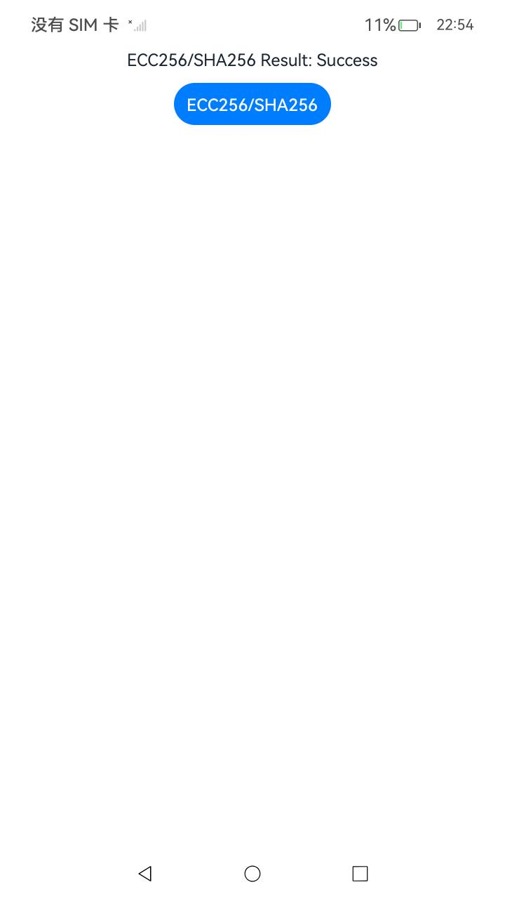
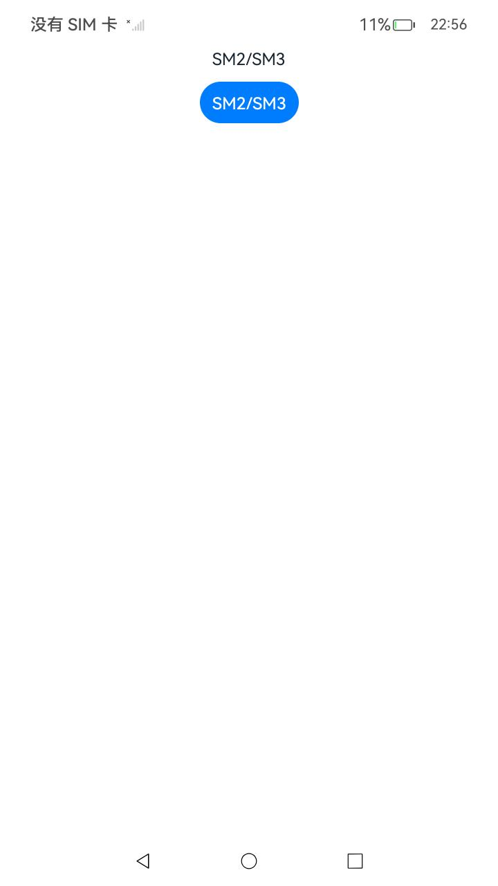
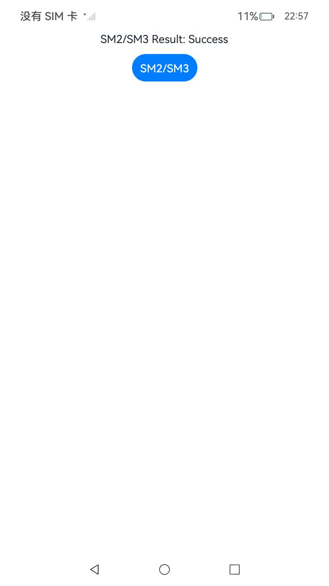
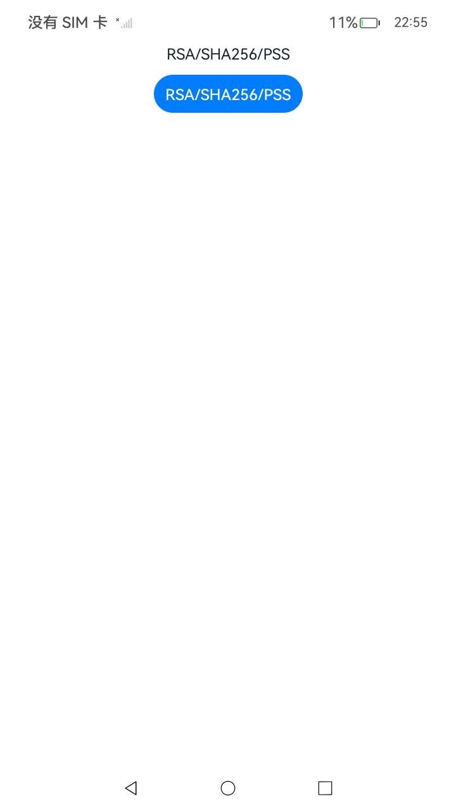
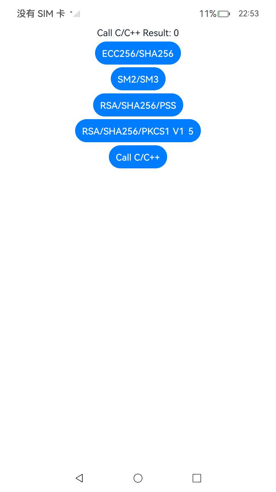

##  签名/验签(ArkTS)

### 介绍

1. 本工程主要实现了对以下指南文档中 https://docs.openharmony.cn/pages/v5.0/zh-cn/application-dev/security/UniversalKeystoreKit/huks-signing-signature-verification-arkts.md 示例代码片段的工程化，主要目标是实现指南中示例代码需要与sample工程文件同源。

####  ECC256/SHA256

##### 介绍

1. 本示例主要介绍密钥签名验签，以密钥签名验签类型ECC256/SHA256为例。

##### 效果预览

| 主页                                                 | 执行结果                                             |
| ---------------------------------------------------- | ---------------------------------------------------- |
|  |  |

使用说明

1. 点击ECC256/SHA256按钮进行密钥签名验签。

####  SM2/SM3

##### 介绍

1. 本示例主要介绍密钥签名验签，以密钥签名验签类型SM2/SM3为例。

##### 效果预览

| 主页                                              | 执行结果                                          |
| ------------------------------------------------- | ------------------------------------------------- |
|  |  |

使用说明

1. 点击SM2/SM3按钮进行密钥签名验签。

#### RSA/SHA256/PSS

##### 介绍

1. 本示例主要介绍密钥签名验签，以密钥签名验签类型RSA/SHA256/PSS为例。

##### 效果预览

| 主页                                              | 执行结果                                          |
| ------------------------------------------------- | ------------------------------------------------- |
|  |  |

使用说明

1. 点击RSA/SHA256/PSS按钮进行密钥签名验签。

####  RSA/SHA256/PKCS1_V1_5

##### 介绍

1. 本示例主要介绍密钥签名验签，以密钥签名验签类型RSA/SHA256/PKCS1_V1_5为例。

##### 效果预览

| 主页                                                 | 执行结果                                             |
| ---------------------------------------------------- | ---------------------------------------------------- |
|  |  |

使用说明

1. 点击RSA/SHA256/PKCS1_V1_5按钮进行密钥签名验签。

## 签名/验签(C/C++)

### 介绍

1. 本工程主要实现了对以下指南文档中 https://docs.openharmony.cn/pages/v5.0/zh-cn/application-dev/security/UniversalKeystoreKit/huks-signing-signature-verification-ndk.md 示例代码片段的工程化，主要目标是实现指南中示例代码需要与sample工程文件同源。

#### Call C/C++

##### 介绍

1. 本示例主要介绍密钥签名验签，以密钥算法为RSA2048、摘要算法为SHA384、填充模式为PSS的密钥为例。

##### 效果预览

| 主页                                              | 执行结果                                          |
| ------------------------------------------------- | ------------------------------------------------- |
|  |  |

使用说明

1. 点击Call C/C++按钮完成密钥签名验签。

## 工程目录

```
entry/src/main/
|---ets
|---|---entryability
|---|---|---EntryAbility.ets
|---|---pages
|---|---|---ECC256SHA256.ets
|---|---|---RSASHA256PKCS1_V1_5.ets
|---|---|---RSASHA256PSS.ets
|---|---|---SM2SM3.ets
|---|---|---Index.ets						// 首页
|---cpp
|---resources								// 静态资源
|---ohosTest
|---|---ets
|---|---|---tests
|---|---|---|---SigningVerification.test.ets        // 自动化测试用例
```


## 相关权限

无。

## 依赖

不涉及。

## 约束与限制

1. 本示例仅支持标准系统上运行，支持设备：RK3568。
2. 本示例支持API14版本SDK，SDK版本号(API Version 14 Release)。
3. 本示例需要使用DevEco Studio 版本号(5.0.1Release)才可编译运行。

## 下载

如需单独下载本工程，执行如下命令：

```
git init
git config core.sparsecheckout true
echo code/DocsSample/Security/UniversalKeystoreKit/KeyUsage/SigningVerification > .git/info/sparse-checkout
git remote add origin https://gitee.com/openharmony/applications_app_samples.git
git pull origin master
```