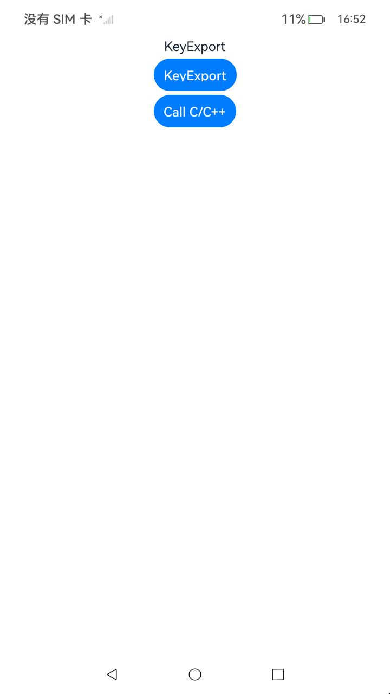

## 密钥导出(ArkTS)

### 介绍

1. 本工程主要实现了对以下指南文档中 https://docs.openharmony.cn/pages/v5.0/zh-cn/application-dev/security/UniversalKeystoreKit/huks-export-key-arkts.md 示例代码片段的工程化，主要目标是实现指南中示例代码需要与sample工程文件同源。

#### KeyExport

##### 介绍

1. 本示例主要介绍密钥导出，业务需要获取持久化存储的非对称密钥的公钥时使用，轻量级设备仅支持RSA公钥导出。

##### 效果预览

| 主页                                                     | 公钥导出                                                 |
| -------------------------------------------------------- | -------------------------------------------------------- |
|  |  |

使用说明

1. 点击Call KeyExport按钮调用接口exportKeyItem，在outData字段中获取以标准的X.509规范的DER格式封装的公钥明文。

## 密钥导出(C/C++)

### 介绍

1. 本工程主要实现了对以下指南文档中 https://docs.openharmony.cn/pages/v5.0/zh-cn/application-dev/security/UniversalKeystoreKit/huks-export-key-ndk.md 示例代码片段的工程化，主要目标是实现指南中示例代码需要与sample工程文件同源。

#### Call C/C++

##### 介绍

1. 本示例主要介绍密钥导出，业务需要获取持久化存储的非对称密钥的公钥时使用，轻量级设备仅支持RSA公钥导出。

##### 效果预览

| 主页                                               | 公钥导出                                           |
| -------------------------------------------------- | -------------------------------------------------- |
|  |  |

使用说明

1. 点击Call C/C++按钮调用接口OH_Huks_GetKeyItemParamSet，从参数key中导出以标准的X.509规范的DER格式封装的公钥。

## 工程目录

```
entry/src/main/
|---ets
|---|---entryability
|---|---|---EntryAbility.ets
|---|---pages
|---|---|---KeyExport.ets
|---|---|---Index.ets						// 首页
|---cpp
|---resources								// 静态资源
|---ohosTest
|---|---ets
|---|---|---tests
|---|---|---|---KeyExport.test.ets          // 自动化测试用例
```

## 相关权限

无。

## 依赖

不涉及。

## 约束与限制

1. 本示例仅支持标准系统上运行，支持设备：RK3568。
2. 本示例支持API14版本SDK，SDK版本号(API Version 14 Release)。
3. 本示例需要使用 DevEco Studio 版本号(5.0.1Release)才可编译运行。

## 下载

如需单独下载本工程，执行如下命令：

```
git init
git config core.sparsecheckout true
echo code/DocsSample/Security/UniversalKeystoreKit/OtherOperations/KeyExport > .git/info/sparse-checkout
git remote add origin https://gitee.com/openharmony/applications_app_samples.git
git pull origin master
```
